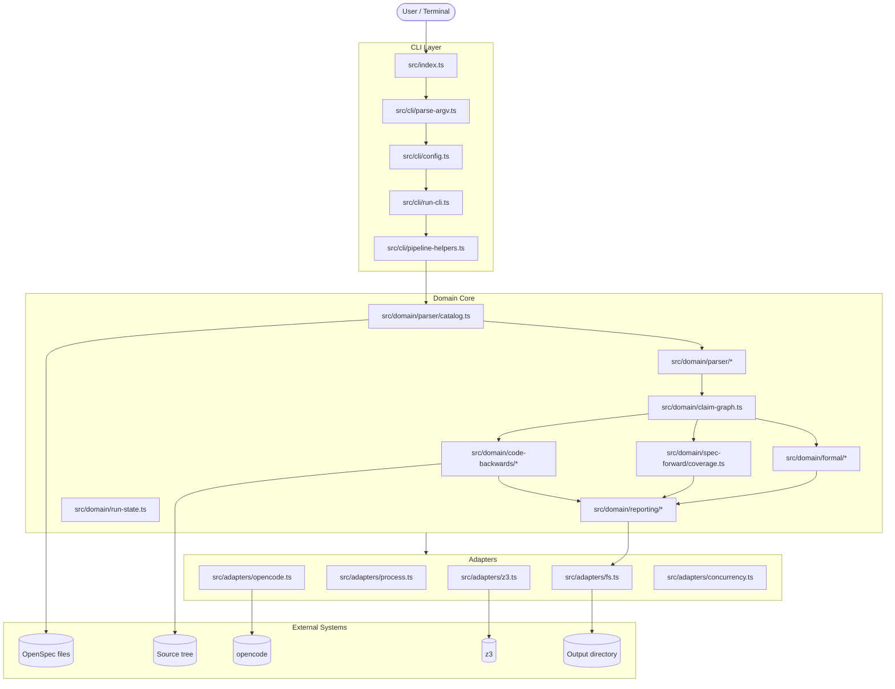
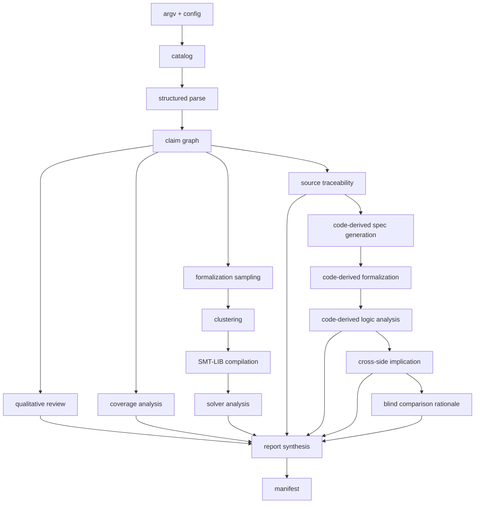
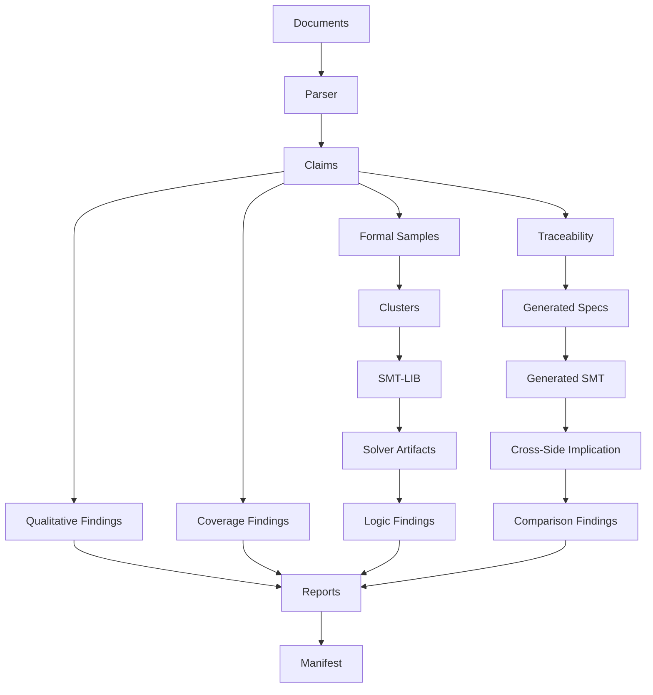
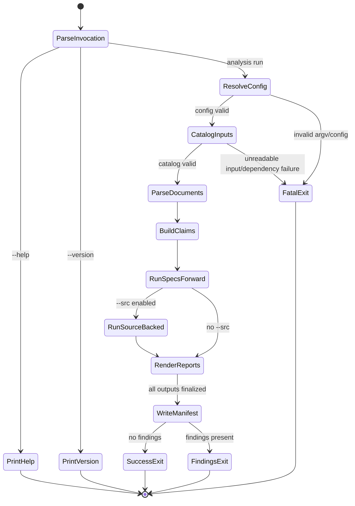
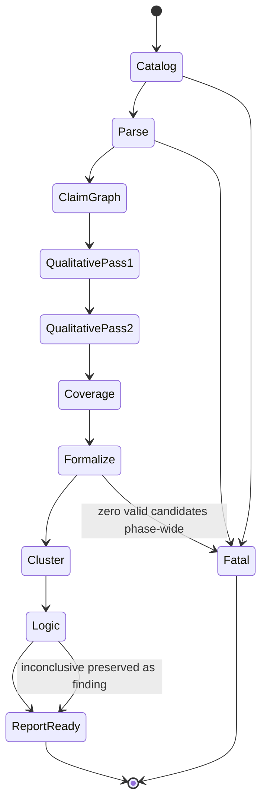
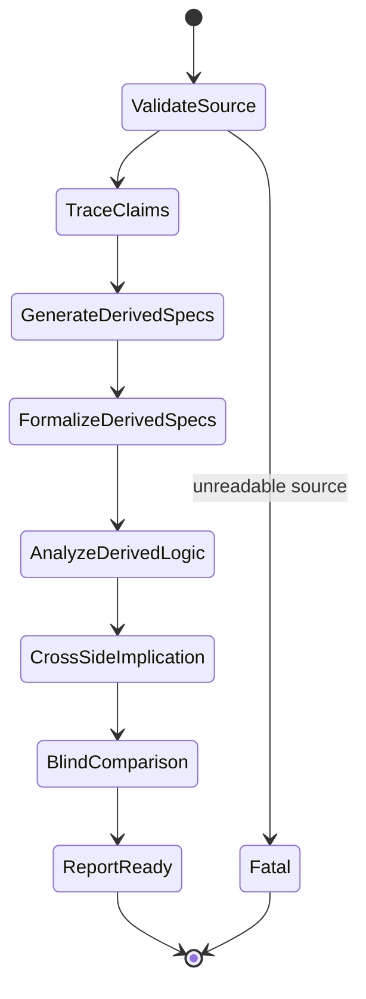
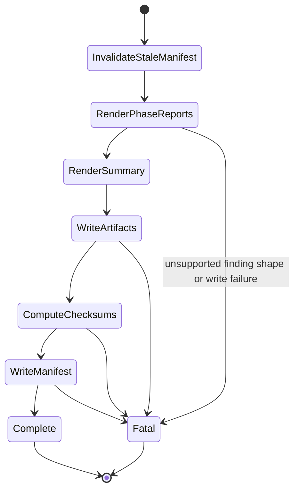
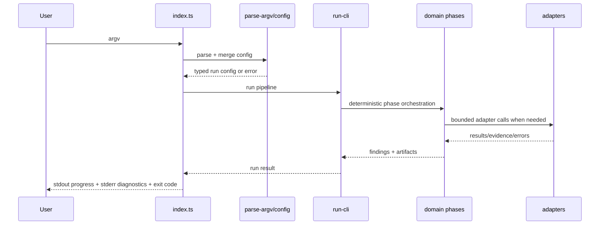

# Spec-Check -- Technical Design

> **Living document** -- maintained alongside OpenSpec artifacts, code, and tests.
> Complements [`docs/lfm.md`](docs/lfm.md), [`docs/spec_traceability.md`](docs/spec_traceability.md), [`docs/typescript_style.md`](docs/typescript_style.md), and the normative specs under [`openspec/specs/`](openspec/specs/).

---

## Table of Contents

1. [Overview](#1-overview)
2. [Scope and Boundaries](#2-scope-and-boundaries)
3. [Architecture](#3-architecture)
4. [Domain Model](#4-domain-model)
5. [Preconditions, Postconditions, and Invariants](#5-preconditions-postconditions-and-invariants)
6. [State Machines](#6-state-machines)
7. [Interaction Protocols](#7-interaction-protocols)
8. [Failure Modes and Error Model](#8-failure-modes-and-error-model)
9. [Safety and Liveness Claims](#9-safety-and-liveness-claims)
10. [Quality Attributes](#10-quality-attributes)
11. [Verification Strategy](#11-verification-strategy)
12. [Distribution and Packaging](#12-distribution-and-packaging)
13. [Security and Trust Boundaries](#13-security-and-trust-boundaries)
14. [Operational Concerns](#14-operational-concerns)
15. [Forward Evolution](#15-forward-evolution)
16. [Command and Interaction Summary](#16-command-and-interaction-summary)
17. [Relationship to Other Documents](#17-relationship-to-other-documents)
18. [Maintenance Rules](#18-maintenance-rules)

---

## 1. Overview

### 1.1 What Spec-Check Is

`spec-check` is a local TypeScript CLI for analyzing OpenSpec repositories that use the `srs-driven` schema. It reviews proposal, design, capability spec, and optional task artifacts; translates requirement claims into formal artifacts; runs solver-backed consistency checks; and, when `--src` is provided, compares specification intent against code-derived guarantees.

### 1.2 Why It Exists

The tool exists to catch defects in specifications before implementation and to preserve evidence for every conclusion. The project assumes that agent-assisted development can produce plausible code faster than trustworthy assurance artifacts. `spec-check` exists to close that gap.

### 1.3 Core Design Challenge

`spec-check` is not a generic document linter and not a full formal verifier of implementation. Its design problem is to combine:

- deterministic parsing and claim normalization
- LLM-backed qualitative review and formalization sampling
- solver-backed contradiction and completeness analysis
- optional source-backed traceability and code-backwards comparison
- evidence preservation strong enough for audit and review

The central challenge is preserving trust while crossing two nondeterministic boundaries: `opencode` and `z3`.

### 1.4 Design Philosophy

The project applies the lightweight formal methods posture described in [`docs/lfm.md`](docs/lfm.md): explicit invariants, bounded work, inspectable intermediate artifacts, and layered verification. The implementation deliberately separates:

- deterministic core logic in `src/domain/`
- side-effecting adapters in `src/adapters/`
- CLI orchestration in `src/cli/`

The product goal is justified confidence, not opaque automation.

### 1.5 Relevant Capability Specs

| Capability | Purpose |
|---|---|
| [`catalog-and-parse`](openspec/specs/catalog-and-parse/spec.md) | catalog inputs, resolve active specs, parse structure, preserve unparsed evidence |
| [`claim-graph-and-coverage`](openspec/specs/claim-graph-and-coverage/spec.md) | normalize claims, assign obligations, detect coverage gaps and contradictions |
| [`formalization-and-logic-analysis`](openspec/specs/formalization-and-logic-analysis/spec.md) | formalize claims, cluster interpretations, compile SMT-LIB, run logic analysis |
| [`source-traceability-and-code-backwards`](openspec/specs/source-traceability-and-code-backwards/spec.md) | trace claims to code, generate code-derived specs, formalize them, compare both sides |
| [`reporting-and-evidence`](openspec/specs/reporting-and-evidence/spec.md) | preserve evidence, render reports, enforce manifest-last completion |
| [`spec-traceability`](openspec/specs/spec-traceability/spec.md) | repository test-harness traceability conventions and canonical identifier handling |

---

## 2. Scope and Boundaries

### 2.1 In Scope

- local CLI operation on one repository at a time
- OpenSpec `srs-driven` artifacts: `proposal.md`, `design.md`, active `spec.md`, optional `tasks.md`
- deterministic cataloging, parsing, claim extraction, and coverage analysis
- LLM-backed qualitative review and formalization sampling through `opencode`
- solver-backed SMT analysis through `z3`
- optional `--src` source-backed analysis and code-backwards comparison
- Markdown reports, preserved intermediate artifacts, and manifest-based completion

### 2.2 Out of Scope

- arbitrary Markdown schemas or arbitrary requirements formats
- mutation of specs, tasks, or source as part of analysis
- hosted or continuously running service operation
- monorepo-scale optimization, distributed execution, or incremental resume
- proof of whole-program correctness

### 2.3 Capacity Targets

The design target remains small repositories:

- up to roughly 10 spec files
- low hundreds of requirements and scenarios
- modest single-package or small multi-module source trees

### 2.4 Source-of-Truth Boundaries

| Concern | Authoritative Source | Consequence |
|---|---|---|
| proposal and design intent | active OpenSpec documents | upstream meaning comes from specs, not code |
| capability behavior | active `openspec/specs/**/spec.md` plus at most one in-dev delta per capability | archived specs are excluded from active analysis |
| code-backed guarantees | declared `--src` tree only | no out-of-scope evidence is admitted |
| final completion state | manifest written last in output directory | manifest absence means incomplete run |
| traceability identifiers | canonical bracketed identifiers in OpenSpec specs | tests and source must align to those identifiers |

### 2.5 Thin-Wrapper Boundaries

- `opencode` is used for qualitative analysis, formalization, code-derived generation, and blind comparison.
- `z3` is used for implication, satisfiability, contradiction, and completeness checks.
- the filesystem adapter owns output confinement, atomic writes, and checksums.

---

## 3. Architecture

### 3.1 High-Level Architecture Diagram



The core architectural split is deliberate:

- the **CLI layer** resolves invocation shape and orchestrates phases
- the **domain layer** owns deterministic parsing, normalization, validation, compilation, and report assembly
- the **adapter layer** owns subprocesses, path confinement, atomic writes, and environment interaction

### 3.2 Pipeline Architecture



### 3.3 Component Descriptions

| Component | Responsibility | Key Invariant |
|---|---|---|
| `src/index.ts` | entrypoint, stderr/stdout rendering, exit-code mapping | no business logic beyond routing |
| `src/cli/parse-argv.ts` | parse flags and positional inputs | validation is local and deterministic |
| `src/cli/config.ts` | load and merge JSON config | CLI flags override config values |
| `src/cli/run-cli.ts` | phase orchestration and fatal-error propagation | pipeline progresses in ordered phases only |
| `src/domain/parser/*` | line-oriented parsing for proposal, design, spec, and task files | every line is classified or preserved as evidence |
| `src/domain/claim-graph.ts` | normalize claims and obligations | no claim enters graph without provenance |
| `src/domain/spec-forward/coverage.ts` | detect missing coverage, contradictions, drift, and reference issues | deterministic given same claim graph |
| `src/domain/spec-forward/qualitative.ts` | LLM-backed review passes | responses are schema-validated before use |
| `src/domain/formal/*` | formalization, validation, clustering, SMT compilation, solver logic | no solver conclusion from invalid formalization |
| `src/domain/code-backwards/*` | traceability, generated specs, generated formalization, cross-side compare | blind boundary preserves independence from original requirement text |
| `src/domain/reporting/*` | report rendering and manifest creation | manifest is written last |
| `src/adapters/fs.ts` | confined paths, atomic writes, hashing | no write escapes output directory |
| `src/adapters/opencode.ts` | `opencode` subprocess integration | argv-only execution; structured response handling |
| `src/adapters/z3.ts` | solver invocation and result capture | stdout/stderr and timeouts preserved verbatim |

### 3.4 Design Principles

- keep the deterministic core inspectable
- preserve evidence rather than summarize it away
- fail explicitly when required evidence-producing phases fail
- prefer bounded work over open-ended search or retry
- keep source-backed analysis optional and scope-confined
- treat ambiguity as a first-class finding, not a nuisance

---

## 4. Domain Model

### 4.1 Core Entities

| Entity | Meaning | Authority |
|---|---|---|
| Document | proposal, design, spec, or task file | filesystem input |
| Capability | logical behavior group represented by one active spec | OpenSpec catalog |
| Requirement | capability-level behavioral obligation | spec document |
| Scenario | concrete testable behavioral case | spec document |
| Claim | normalized semantic statement from any artifact | claim graph |
| Finding | surfaced issue with severity, provenance, rationale, and evidence | analysis phases |
| Formalization Sample | one candidate logic encoding of a claim | formalization phase |
| Equivalence Cluster | set of mutually implying samples | clustering phase |
| Solver Artifact | SMT-LIB, query, model, unsat core, timeout, unknown, or error output | solver phase |
| Traceability Identifier | canonical bracketed identifier linking specs, tests, and source | spec corpus |
| Code-Derived Specification | generated spec describing code-backed guarantees | code-backwards phase |
| Manifest | completion record of output files and checksums | reporting phase |

### 4.2 Conceptual Data Flow



### 4.3 Branded and Structured Types

The implementation uses explicit domain types to prevent accidental confusion across trust boundaries. Important examples include:

- `OutputDirPath`
- `RelativePath`
- `SmtlibFilePath`
- `ClaimId`
- `CapabilityName`
- `SanitizedClaimId`
- `ModelName`

These types are defined in [`src/domain/branded.ts`](src/domain/branded.ts) and constructed only through validated functions.

### 4.4 Evidence Model

Every durable conclusion is evidence-backed. Evidence may include:

- original source snippets and headings
- parser-preserved unmatched lines
- raw `opencode` responses
- validated logic IR samples
- compiled SMT-LIB text
- solver stdout/stderr, models, unsat cores, and timeouts
- source trace links
- cross-side implication queries and results

The evidence contract is stronger than “explainability”; it is preservation.

---

## 5. Preconditions, Postconditions, and Invariants

### 5.1 Global Preconditions

- at least one readable input artifact exists
- the repository follows the `srs-driven` OpenSpec structure closely enough to parse
- `opencode` is available for LLM-backed phases
- `z3` is available for solver-backed phases
- when `--src` is provided, the source directory is readable and intended for analysis

### 5.2 Global Postconditions

- all successful runs produce a bounded set of output artifacts under the configured output directory
- all surfaced findings retain provenance and supporting evidence
- skipped optional phases are explained in reporting
- manifest presence indicates a complete run; manifest absence indicates incomplete output

### 5.3 System-Wide Invariants

| ID | Invariant | How Maintained |
|---|---|---|
| I-1 | inputs are read-only | no write path targets spec, task, or source inputs |
| I-2 | no claim exists without provenance | claim-graph validation rejects orphaned claims |
| I-3 | no final verdict rests on unpreserved LLM output | raw responses are attached as evidence |
| I-4 | solver inputs and outputs are preserved verbatim | `z3` adapter and reporting persistence |
| I-5 | findings never silently disappear | `run-state` accumulates monotonically |
| I-6 | all writes remain under output directory | `resolveConfinedOutputPath()` |
| I-7 | manifest is the final completion marker | stale manifest removed on start; manifest written last |
| I-8 | blind comparison boundary is preserved | generation/comparison prompts omit original requirement text |
| I-9 | parser never silently drops content | unmatched lines become evidence and findings |
| I-10 | identical deterministic inputs produce identical deterministic outputs | pure domain functions + determinism tests |

### 5.4 Per-Phase Contracts

| Phase | Preconditions | Postconditions |
|---|---|---|
| CLI/config | argv readable; optional config JSON readable | resolved immutable run config |
| catalog | input paths readable | active document catalog and capability resolution |
| parse | UTF-8 documents | typed parsed models plus structural findings |
| claim graph | parsed structure exists | typed claims with obligation and provenance |
| qualitative | claim graph exists; `opencode` available | schema-validated findings with preserved raw responses |
| coverage | upstream and downstream claims available | gap/drift/contradiction findings |
| formalization | eligible claims exist; `opencode` available | valid samples, ambiguity findings, SMT inputs |
| solver | representative formalizations exist; `z3` available | contradiction/gap/inconclusive findings |
| source traceability | `--src` enabled and readable | supported/weak/missing trace results |
| code-backwards | sufficient source evidence exists | generated specs, generated SMT, comparison findings |
| reporting | at least one phase completed | report set plus manifest on complete run |

---

## 6. State Machines

### 6.1 Top-Level Run Lifecycle



### 6.2 Specs-Forward Pipeline



### 6.3 Source-Backed Pipeline



### 6.4 Reporting Lifecycle



---

## 7. Interaction Protocols

### 7.1 CLI Dispatch



### 7.2 Formalization Boundary

Protocol rules:

- prompts are fenced so analyzed content is not promoted to instruction position
- `opencode` responses must be schema-valid before entering the core model
- invalid responses consume bounded retries
- all valid and invalid samples are preserved as evidence

### 7.3 Solver Boundary

Protocol rules:

- compiled SMT-LIB excludes solver commands until query execution time
- implication queries contain exactly one `(check-sat)`
- per-spec logic analysis uses a two-phase strategy: satisfiability first, unsat-core extraction only on contradiction
- solver stdout/stderr, timeout, unknown, and error diagnostics are persisted verbatim

### 7.4 Code-Backwards Blind Boundary

Protocol rules:

- code-derived generation receives source-scoped evidence and capability-name suggestions only
- it does not receive original requirement text, proposal text, or design text
- cross-side implication operates on formal artifacts, not mixed claim text
- blind comparison adds rationale; solver implication remains the primary classifier

---

## 8. Failure Modes and Error Model

### 8.1 Major Failure Modes

| Failure Mode | Why It Matters |
|---|---|
| false negative analysis | undermines trust in the dependability case |
| material nondeterministic divergence | prevents stable review and regression checking |
| evidence loss | conclusions become unauditable |
| missing dependency | may create misleading partial analysis |
| parser loss | silently removes possible requirements or constraints |
| blind-boundary violation | invalidates code-backwards methodology |
| premature manifest | makes partial output look complete |

### 8.2 Error Hierarchy

The implementation models a structured error hierarchy in [`src/domain/errors.ts`](src/domain/errors.ts):

- `ArgumentError`
- `ConfigError`
- `DependencyError`
- `CatalogError`
- `AdapterError`
- `ValidationError`
- `QualitativeError`
- `FormalizationError`
- `PipelineError`
- `OutputError`

### 8.3 Exit Codes

| Code | Meaning |
|---|---|
| `0` | completed without findings |
| `1` | completed with findings |
| `2` | argument error |
| `3` | config error |
| `4` | dependency error |
| `5` | catalog error |
| `6` | adapter error |
| `7` | validation error |
| `8` | qualitative error |
| `9` | formalization error |
| `10` | pipeline error |
| `11` | output error |

### 8.4 Error Rendering Contract

Fatal diagnostics are rendered on stderr beginning with:

```text
[spec-check] <Category>: <message>
```

Stdout is reserved for JSON progress events.

---

## 9. Safety and Liveness Claims

### 9.1 Safety Claims

- specs, tasks, and source files are never mutated
- no output write escapes the configured output directory
- no final finding is rendered without provenance and evidence
- no invalid formalization sample reaches clustering or solver analysis
- no archived change spec participates in active analysis
- no original requirement text crosses into code-derived generation or blind comparison input
- no partial run leaves a valid final manifest

### 9.2 Liveness Claims

- informational commands (`--help`, `--version`) terminate without running analysis
- each external call is bounded by timeout and bounded retry policy
- every valid phase emits progress events on start and completion, and failure emits a failed event
- successful runs eventually produce a summary report and manifest
- source-backed analysis proceeds capability-by-capability even when individual generated claims are ambiguous or partially unsupported

### 9.3 Boundaries on Liveness

Liveness is bounded, not absolute. The system intentionally prefers explicit failure over indefinite retry or silent degradation.

---

## 10. Quality Attributes

### 10.1 Reliability

- required evidence-producing phases fail hard when dependencies are unavailable or outputs are unusable
- findings are preserved monotonically across later phases
- malformed findings are suppressed and surfaced as defects instead of rendered as if trustworthy

### 10.2 Observability

- every finding carries provenance and rationale
- every completed run emits phase progress
- all significant intermediate artifacts can be inspected after the run
- manifest checksums support post-run integrity checks

### 10.3 Security

- subprocesses are invoked with argv arrays, never shell interpolation
- prompt fencing treats analyzed text as untrusted content
- identifier sanitization prevents SMT-LIB collisions
- output-path confinement blocks traversal and out-of-tree writes

### 10.4 Bounded Responsiveness

- LLM-backed calls use bounded retries and timeouts
- solver queries use per-query timeouts
- pairwise analysis is bounded by `--pair-budget`

### 10.5 Determinism

- parser, claim graph, coverage analysis, run state, and report assembly are deterministic
- cached or fixed boundary responses should produce byte-identical outputs
- uncached runs may differ in wording or sample details, but should remain stable in finding categories and affected claim identifiers

### 10.6 Maintainability

- capability specs map directly to domain submodules
- current codebase layout is phase-oriented and test-rich
- branded types, `Result` handling, and assertion helpers keep trust boundaries explicit

---

## 11. Verification Strategy

The repository already reflects the intended assurance pyramid.

### 11.1 Verification Layers

| Layer | Purpose | Representative Paths |
|---|---|---|
| capability specs | normative requirements | `openspec/specs/**/spec.md` |
| contract tests | exact API and module behavior | `test/contract/` |
| property tests | invariants and determinism properties | `test/property/` |
| invariant tests | repository-wide safety/liveness rules | `test/invariant/` |
| integration tests | multi-phase pipeline behavior | `test/integration/` |
| determinism tests | stable output and phase behavior | `test/determinism/` |
| oracle/golden tests | expected logic encodings and examples | `test/oracle/`, `test/fixtures/` |

### 11.2 Important Verified Areas

- CLI parsing and config merge
- parser structure, EARS recognition, and unmatched-line preservation
- claim provenance and obligation assignment
- coverage-gap, contradiction, and drift detection
- formalization schema validation and clustering behavior
- SMT-LIB sanitization, implication query construction, and Z3 integration
- report naming, manifest integrity, and output confinement
- traceability, generated spec boundaries, and cross-side classification

### 11.3 Traceability in Tests

The repository also includes explicit traceability support under `test/support/spec-trace*` and the spec defined in [`openspec/specs/spec-traceability/spec.md`](openspec/specs/spec-traceability/spec.md).

---

## 12. Distribution and Packaging

### 12.1 Runtime and Tooling

- Node.js `>=20`
- TypeScript
- `vitest`
- `fast-check`
- `esbuild`

These are defined in [`package.json`](package.json).

### 12.2 Distribution Forms

| Form | Path |
|---|---|
| npm package binary | `bin.spec-check -> dist/spec-check.js` |
| compiled output | `dist/spec-check.js` |
| bundled parity check | `npm run smoke:parity` |

### 12.3 Packaging Contract

- `npm run build` compiles TypeScript
- `npm run bundle` creates the single-file bundle
- `npm run smoke:parity` checks build and bundle parity expectations

---

## 13. Security and Trust Boundaries

### 13.1 Trust Boundaries

| Boundary | Risk | Mitigation |
|---|---|---|
| spec/task/source content -> prompts | prompt injection | fenced prompt construction in `src/domain/fence.ts` and prompt modules |
| claim text -> SMT identifiers | syntax collision | sanitization in `src/domain/formal/smtlib.ts` |
| subprocess invocation | shell injection / drift | argv-only adapters in `src/adapters/process.ts`, `opencode.ts`, `z3.ts` |
| filesystem writes | path traversal | confined relative-path resolution in `src/adapters/fs.ts` |
| source-backed comparison | requirement leakage into derived side | blind boundary rules in `derive.ts` and `blind-compare.ts` |

### 13.2 Security Posture

`spec-check` is read-only with respect to analyzed inputs. Its main security responsibilities are preventing unsafe execution, preventing trust-boundary confusion, and keeping outputs confined and auditable.

---

## 14. Operational Concerns

### 14.1 Output Structure

Common artifacts include:

- `report_1.1.md`
- `report_1.2.md`
- `report_1.3.md`
- `report_1.logic.md`
- `report_2.trace.md`
- `report_2.logic.md`
- `report_2.compare.md`
- `report_summary.md`
- `smt/`
- `gen_specs/`
- `gen_specs_smt/`
- `manifest.json` or equivalent manifest path used by the reporting layer

### 14.2 Progress and Diagnostics

- stdout emits one JSON progress event per line
- stderr carries human diagnostics
- interrupted runs may leave intermediate artifacts but not a manifest

### 14.3 Performance Controls

- bounded `opencode` retry counts
- solver timeouts
- pair-budget enforcement for quadratic comparisons
- repository scope limitations as a v1 design constraint

### 14.4 Current Repository Layout

```text
src/
  index.ts
  version.ts
  cli/
  domain/
    parser/
    spec-forward/
    formal/
    code-backwards/
    reporting/
    prompts/
  adapters/
test/
  contract/
  property/
  invariant/
  integration/
  determinism/
  oracle/
  support/
openspec/
  specs/
```

---

## 15. Forward Evolution

- broader schema support should be added behind new catalog/parser branches, not by weakening current deterministic parsing rules
- richer formal analyses should reuse the claim graph and logic IR instead of bypassing them
- larger-scale repository support will likely require explicit caching and resume semantics, which are intentionally absent in v1
- additional evidence types should be additive in reporting, not destructive to existing report contracts
- if source-backed analysis grows, the blind-boundary rules must remain explicit and testable

---

## 16. Command and Interaction Summary

### 16.1 CLI Surface

`spec-check [INPUTS...] [--output DIR] [--src DIR] [--caps FILE] [--z3 PATH] [--config FILE] [--pair-budget N] [--help] [--version]`

### 16.2 Behavioral Summary

| Invocation | Result |
|---|---|
| `--help` | prints help and exits `0` |
| `--version` | prints version and exits `0` |
| inputs only | runs specs-forward pipeline |
| inputs + `--src` | runs specs-forward plus source-backed pipeline |
| malformed args | fails before analysis |
| missing dependency | fails before dependent phase |

---

## 17. Relationship to Other Documents

### 17.1 Normative vs Explanatory

- the normative behavioral contract lives in [`openspec/specs/`](openspec/specs/)
- this document explains the design that ties those specs to the current implementation and test strategy
- [`pasture/concept.md`](pasture/concept.md) is useful background, but where it differs from current specs or code, the active specs and implementation win

### 17.2 Archived Change Relationship

This document incorporates and supersedes the archived change artifacts:

- [`openspec/changes/archive/2026-06-18-spec-check-core/proposal.md`](openspec/changes/archive/2026-06-18-spec-check-core/proposal.md)
- [`openspec/changes/archive/2026-06-18-spec-check-core/design.md`](openspec/changes/archive/2026-06-18-spec-check-core/design.md)

It preserves their intent while updating terminology and structure to match the current repository.

---

## 18. Maintenance Rules

- keep this document aligned with `openspec/specs/`, not just historical proposals
- when implementation changes phase boundaries, update the architecture, state machines, and interaction protocols sections together
- when new report names, directories, or exit codes change, update this doc in the same change as the code and tests
- prefer references to real repository paths over abstract descriptions
- do not use this document to introduce behavior that is not also reflected in the normative specs or tests
- if archived concept/design text conflicts with current code or active specs, update the archived interpretation here and keep the conflict explicit
