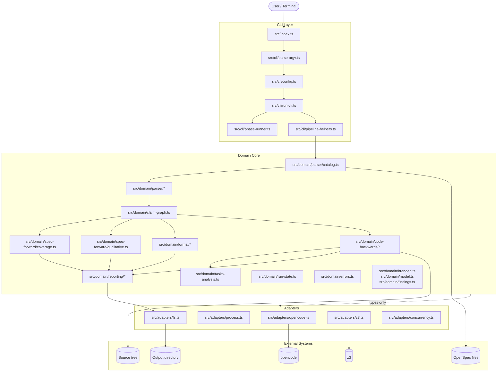
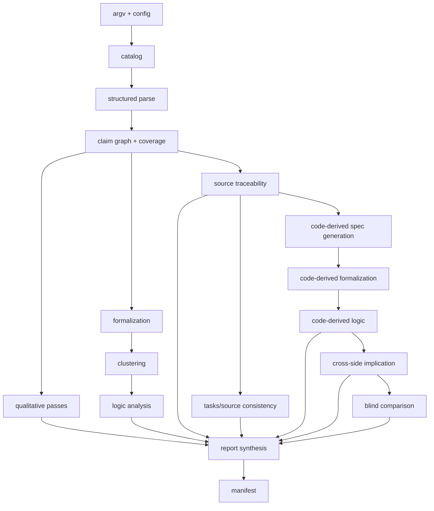
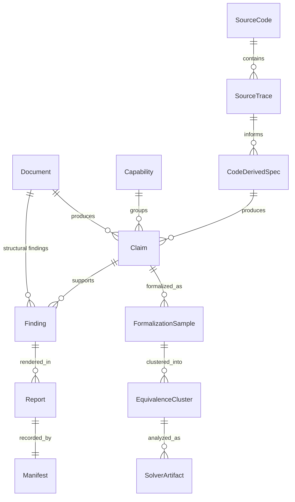
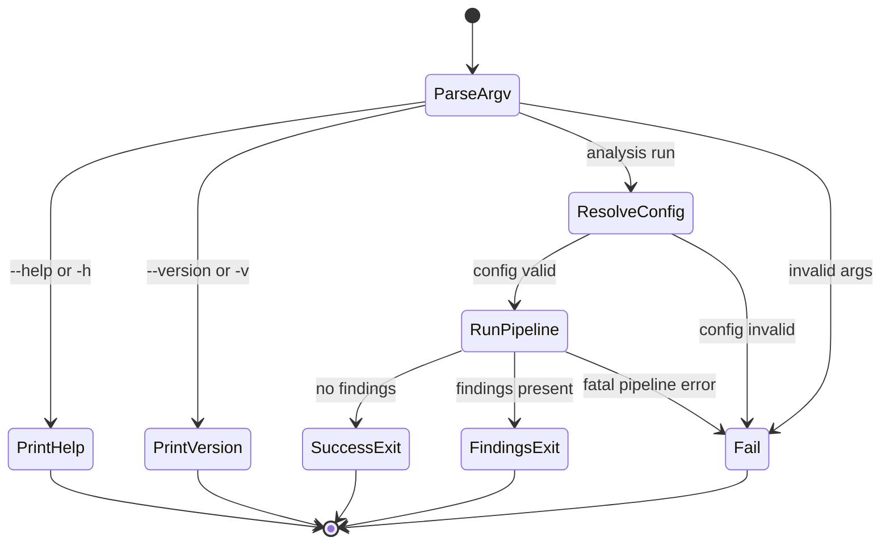
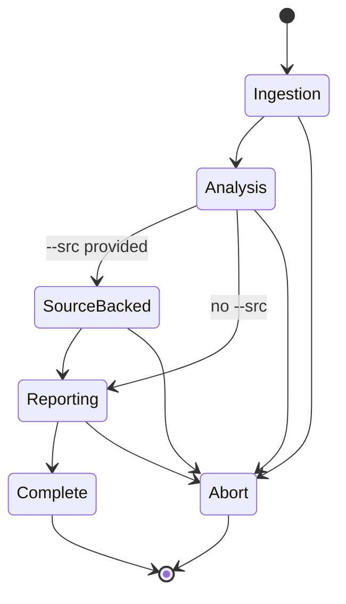
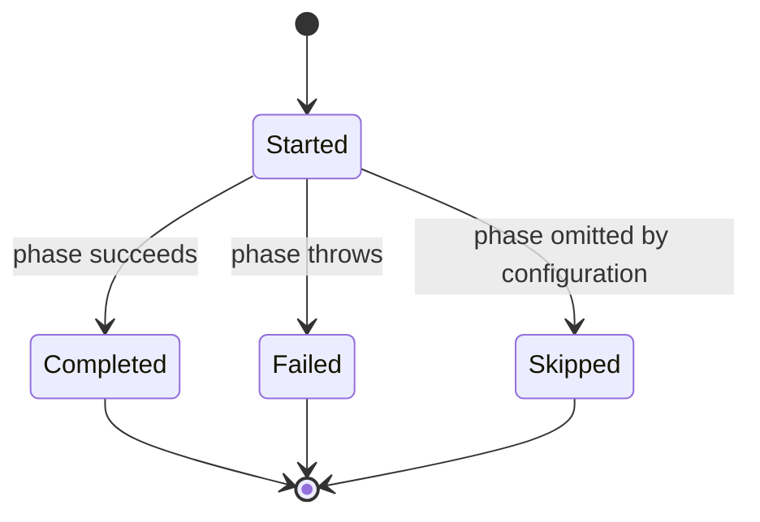
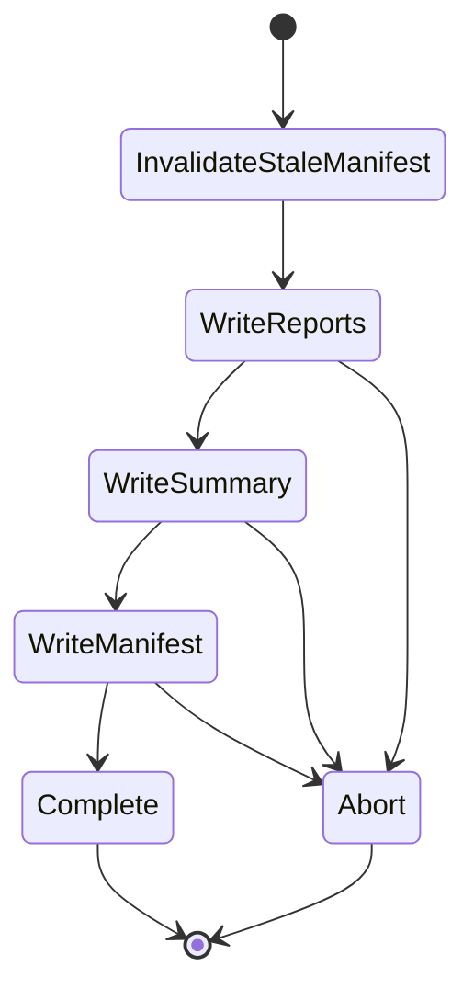
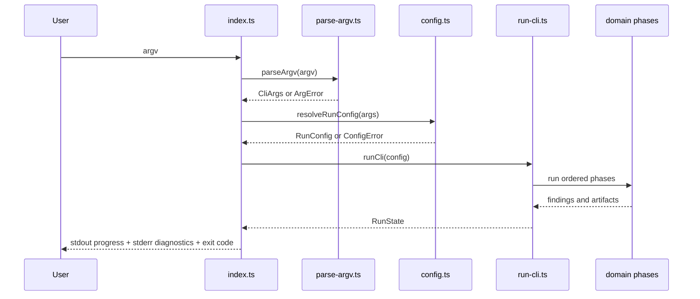

# spec-check -- Technical Design

> **Living document** -- maintained alongside OpenSpec artifacts, code, and tests.
> Complements [`docs/lfm.md`](docs/lfm.md) (assurance posture), [`docs/spec_traceability.md`](docs/spec_traceability.md) (traceability contract), [`docs/typescript_style.md`](docs/typescript_style.md) (implementation style), and the normative specs under [`openspec/specs/`](openspec/specs/).

---

## Table of Contents

1. [Overview](#1-overview)
2. [Scope and Boundaries](#2-scope-and-boundaries)
3. [Architecture](#3-architecture)
4. [Domain Model](#4-domain-model)
5. [Preconditions, Postconditions, and Invariants](#5-preconditions-postconditions-and-invariants)
6. [State Machines](#6-state-machines)
7. [Interaction Protocols](#7-interaction-protocols)
8. [Failure Modes and Error Model](#8-failure-modes-and-error-model)
9. [Safety and Liveness Claims](#9-safety-and-liveness-claims)
10. [Quality Attributes](#10-quality-attributes)
11. [Verification Strategy](#11-verification-strategy)
12. [Distribution and Packaging](#12-distribution-and-packaging)
13. [Security and Trust Boundaries](#13-security-and-trust-boundaries)
14. [Operational Concerns](#14-operational-concerns)
15. [Forward Evolution](#15-forward-evolution)
16. [Pipeline and Output Summary](#16-pipeline-and-output-summary)
17. [Relationship to Other Documents](#17-relationship-to-other-documents)
18. [Maintenance Rules](#18-maintenance-rules)

---

## 1. Overview

### 1.1 What spec-check Is

`spec-check` is a local TypeScript CLI for analyzing OpenSpec repositories that follow the `srs-driven` artifact structure. It catalogs proposal, design, capability spec, and optional task documents; parses them into typed structures; normalizes claims; runs LLM-backed qualitative and formalization phases; runs solver-backed logic checks; and, when `--src` is provided, compares specification intent against code-derived guarantees.

### 1.2 Why It Exists

The tool exists to catch defects in specifications before implementation and to preserve enough evidence that a reviewer can inspect why each conclusion was reached. It assumes that agent-assisted development can produce plausible code and plausible requirements quickly, but not necessarily trustworthy assurance artifacts. `spec-check` exists to narrow that trust gap.

### 1.3 Core Design Challenge

`spec-check` is not a generic Markdown linter and not a whole-program verifier. Its design problem is to combine:

- deterministic parsing and claim normalization
- loss-aware evidence preservation
- LLM-backed qualitative review and formalization
- solver-backed contradiction, implication, and completeness analysis
- optional source-backed traceability and code-backwards comparison
- report generation strong enough to support audit and review

The central trust challenge is preserving confidence while crossing two nondeterministic boundaries:

- `opencode`, which introduces model-response variability
- `z3`, which introduces resource-bounded logical outcomes such as `unknown` and `timeout`

### 1.4 Design Philosophy

This project applies **lightweight formal methods** as described in [`docs/lfm.md`](docs/lfm.md): important properties are expressed as preconditions, postconditions, and invariants; the core pipeline is decomposed into explicit state transitions; and the verification pyramid (specs, property tests, contract tests, integration tests, determinism checks, traceability) provides layered assurance.

The design is centered on:

- deterministic core transformations between input and report boundaries
- explicit preconditions for each pipeline phase and trust boundary crossing
- explicit postconditions for successful and failed runs
- invariants over provenance, evidence preservation, confinement, and append-only findings
- bounded work rather than unbounded retries or open-ended search
- preserving uncertainty honestly instead of collapsing it into false confidence

The goal is not a proof of the entire system. The goal is justified confidence: important design claims are explicit, tied to code and specs, and re-checked as the project evolves.

### 1.5 Relevant Capability Specs

| Capability | Purpose |
|---|---|
| [`catalog-and-parse`](openspec/specs/catalog-and-parse/spec.md) | input discovery, CLI validation, structured parsing, loss-aware preservation |
| [`claim-graph-and-coverage`](openspec/specs/claim-graph-and-coverage/spec.md) | claim normalization, obligation levels, coverage gaps, contradiction detection |
| [`formalization-and-logic-analysis`](openspec/specs/formalization-and-logic-analysis/spec.md) | formalization sampling, validation, clustering, SMT-LIB compilation, solver analysis |
| [`source-traceability-and-code-backwards`](openspec/specs/source-traceability-and-code-backwards/spec.md) | source tracing, code-derived specs, cross-side implication, blind comparison |
| [`reporting-and-evidence`](openspec/specs/reporting-and-evidence/spec.md) | report rendering, manifest semantics, output confinement, evidence structure |
| [`spec-traceability`](openspec/specs/spec-traceability/spec.md) | canonical identifiers and test/spec traceability conventions |

---

## 2. Scope and Boundaries

### 2.1 In Scope

- local CLI analysis of one repository at a time
- OpenSpec artifacts recognized by the current catalog: `proposal.md`, `design.md`, `spec.md`, and `tasks.md`
- deterministic cataloging, parsing, claim extraction, and coverage analysis
- LLM-backed qualitative review and claim formalization via `opencode`
- solver-backed satisfiability, contradiction, implication, and incompleteness checks via `z3`
- optional source-backed analysis under a declared `--src` tree
- Markdown reports, generated SMT artifacts, generated code-derived specs, and manifest-based completion
- first-class use of canonical requirement and scenario identifiers

### 2.2 Out of Scope

- mutation of specification artifacts or source files as part of analysis
- arbitrary Markdown schemas or arbitrary requirements formats
- whole-program correctness proofs
- hosted or continuously running service operation
- distributed execution, content-addressed caching, or incremental resume in the current implementation
- monorepo-scale capacity targets

### 2.3 Goals and Non-Goals

#### Goals

- provide a deterministic, inspectable analysis pipeline from repository artifacts to findings and evidence
- isolate nondeterminism to explicit tool boundaries so reviewers can tell what is deterministic versus model- or solver-dependent
- ensure every meaningful finding retains provenance and supporting evidence
- support both specs-forward and optional source-backed analysis without conflating their evidence models
- preserve completion semantics through manifest-last output behavior

#### Non-Goals

- support arbitrary OpenSpec schemas in the current version
- silently degrade through failed critical phases while still claiming trustworthy output
- turn the tool into a hosted multi-user control plane
- optimize for very large repositories before the assurance model is stable

### 2.4 Source-of-Truth Boundaries

| Concern | Authoritative Source | Consequence |
|---|---|---|
| proposal and design intent | committed OpenSpec documents | upstream meaning comes from artifacts, not inferred code behavior |
| capability behavior | active `openspec/specs/**/spec.md` plus at most one selected in-development delta per capability | archived changes are excluded from active analysis |
| code-backed guarantees | declared `--src` tree only | no out-of-scope implementation evidence is admitted |
| run completion | `manifest.json` written last | manifest absence means the run is incomplete |
| canonical identifiers | bracketed identifiers in active specs and traced tests/source | traceability depends on consistent identifier use |

### 2.5 Nondeterministic Boundaries

- **`opencode` boundary**: qualitative analysis, claim formalization, code-derived generation, code-derived formalization, blind comparison
- **`z3` boundary**: clustering implication checks, per-spec logic analysis, code-derived logic analysis, cross-side implication

Everything else is intended to be deterministic transformation, validation, grouping, persistence, or rendering.

### 2.6 Thin-Wrapper Boundaries

- `src/adapters/opencode.ts` owns `opencode` subprocess execution and response parsing
- `src/adapters/z3.ts` owns Z3 subprocess execution and result classification
- `src/adapters/fs.ts` owns output confinement and atomic writes
- `src/adapters/process.ts` owns argv-based process execution without shell interpolation

---

## 3. Architecture

### 3.1 High-Level Architecture Diagram



The architecture is layered:

- the **CLI layer** parses invocation shape, resolves config, sequences phases, and maps outcomes to stdout, stderr, and exit codes
- the **domain layer** owns deterministic reasoning: parsing, normalization, validation, clustering decisions, solver orchestration logic, report assembly, and invariants
- the **adapter layer** owns side effects: filesystem operations, subprocess execution, and bounded concurrency

This split matters for assurance. The more the decision logic is isolated from side-effecting boundaries, the easier it is to specify, test, and evolve safely.

### 3.2 Pipeline Architecture



### 3.3 Component Descriptions

| Component | Responsibility | Key Invariant |
|---|---|---|
| `src/index.ts` | entrypoint, help/version handling, stderr/stdout rendering, exit-code mapping | no business logic beyond invocation resolution and outcome rendering |
| `src/cli/parse-argv.ts` | parse raw argv into `CliArgs` | parsing is deterministic and does not throw |
| `src/cli/config.ts` | merge CLI, config file, and defaults into `RunConfig` | CLI values override config file values |
| `src/cli/run-cli.ts` | orchestrate ingestion, analysis, source-backed phases, and reporting | phase order is explicit and fixed |
| `src/cli/phase-runner.ts` | emit started/completed/failed progress events and mark completed phases | each phase emits exactly one started event and one terminal event |
| `src/domain/parser/catalog.ts` | discover documents, exclude archives, resolve active deltas | active catalog is deterministic given the same filesystem state |
| `src/domain/parser/*` | parse proposal, design, spec, and task files | lines are classified or preserved as unparsed evidence |
| `src/domain/claim-graph.ts` | normalize parsed structures into typed claims | no claim exists without provenance |
| `src/domain/spec-forward/coverage.ts` | detect coverage gaps, contradictions, and reference issues | deterministic for the same claim graph |
| `src/domain/spec-forward/qualitative.ts` | run qualitative review passes | model responses are validated before use |
| `src/domain/formal/*` | formalize claims, validate samples, cluster interpretations, compile SMT-LIB, run logic analysis | no solver conclusion from unvalidated formalization |
| `src/domain/code-backwards/*` | trace source, derive specs, formalize derived claims, compare both sides | original requirement text is excluded from code-derived generation |
| `src/domain/tasks-analysis.ts` | compare task-evidence claims against traced identifiers | task/source findings are derived deterministically |
| `src/domain/reporting/*` | render reports, compute manifest entries, invalidate stale manifest | manifest is written last |
| `src/adapters/fs.ts` | path confinement, atomic writes, checksums | no write escapes the output directory |
| `src/adapters/opencode.ts` | `opencode` subprocess calls with retries and payload extraction | argv-only execution and schema validation |
| `src/adapters/z3.ts` | Z3 subprocess calls with timeout and result classification | result is always classified as sat/unsat/timeout/unknown/error |

### 3.4 Design Principles

- keep the deterministic core inspectable
- preserve evidence instead of summarizing it away
- reject invalid input before crossing LLM, solver, or filesystem boundaries
- bound retries, concurrency, and pairwise cost explicitly
- treat parser loss, provenance gaps, and unsupported structures as surfaced defects
- keep completion semantics explicit through manifest-last writes

### 3.5 Current Implementation Notes

- `--caps` is parsed and included in resolved config, but is not currently consumed by the main pipeline.
- output-write failures currently bubble out as generic pipeline failures at the top level; the error taxonomy includes `OutputError`, but current reporting code does not yet consistently wrap write failures into that category.

---

## 4. Domain Model

### 4.1 Conceptual Entity-Relationship Diagram



### 4.2 Primary Domain Entities

| Entity | Meaning | Authority | Key Invariants |
|---|---|---|---|
| Document | proposal, design, capability spec, or task file | input filesystem | read-only input; never mutated |
| Capability | logical behavior group resolved from active spec paths | catalog | at most one active delta per capability in the catalog |
| Requirement | capability-level behavioral obligation extracted from a spec | parsed spec | may carry a canonical identifier |
| Scenario | concrete behavioral case extracted from a spec | parsed spec | may carry a canonical identifier |
| Claim | normalized semantic unit derived from parsed artifacts | claim graph builder | always carries provenance |
| Finding | surfaced issue or observation with severity, rationale, and evidence | analysis phases | must satisfy reporting shape invariants |
| Formalization Sample | candidate logic encoding for a claim | formalization phase | schema-validated before acceptance |
| Equivalence Cluster | group of mutually compatible samples for one claim | clustering phase | representative chosen deterministically |
| Solver Artifact | SMT-LIB query and captured solver stdout/stderr | logic and implication phases | persisted under confined output paths |
| Source Trace | mapping from canonical identifier to supporting files | source-trace phase | evidence level classified from file locations |
| Code-Derived Specification | generated behavioral spec inferred from source | code-backwards pipeline | generated without original requirement text |
| Manifest | completion record of written output files and checksums | reporting phase | written last |

### 4.3 Conceptual Data Flow

```text
Documents
  -> Catalog
  -> Structured Parse
  -> Claims
  -> Qualitative Findings
  -> Coverage Findings
  -> Formalization Samples
  -> Clusters
  -> SMT-LIB
  -> Solver Findings
  -> Reports
  -> Manifest

Source Tree
  -> Source Traces
  -> Code-Derived Specs
  -> Code-Derived Formalization
  -> Code-Derived Logic
  -> Cross-Side Implication
  -> Blind Comparison
  -> Reports
```

### 4.4 Branded Types and Encoding Constraints

The implementation uses branded types to reduce accidental confusion across trust boundaries.

| Type | Meaning | Validation Rule | Construction |
|---|---|---|---|
| `OutputDirPath` | output root directory | treated as output root by adapter layer | `toOutputDirPath()` |
| `RelativePath` | path inside output root | intended to remain under output root | `toRelativePath()` |
| `SmtlibFilePath` | SMT-LIB artifact path | ends in `.smt2` | `toSmtlibFilePath()` |
| `ClaimId` | canonical claim identifier | `[A-Z][A-Z0-9]*(-[A-Z0-9]+)+` | `toClaimId()` after validation |
| `CapabilityName` | capability path name | lowercase kebab-case by convention | `toCapabilityName()` |
| `SanitizedClaimId` | SMT-safe identifier | SMT-safe identifier string | `toSanitizedClaimId()` |
| `ModelName` | LLM model name | non-empty string by convention | `toModelName()` |
| `SmtlibContent` | SMT-LIB text content | SMT-LIB string content | `toSmtlibContent()` |

Relevant code: [`src/domain/branded.ts`](src/domain/branded.ts)

### 4.5 Canonical Identifier Rules

The parser and traceability code recognize bracketed canonical identifiers of the form:

```text
[A-Z][A-Z0-9]*(-[A-Z0-9]+)+
```

Examples:

- `[CAT-PARSE-EARS]`
- `[STC-CROSS-IMPLY]`

These identifiers connect:

- spec requirements and scenarios
- source references discovered during traceability
- tests using the traceability helpers

Relevant code: [`src/domain/parser/shared.ts`](src/domain/parser/shared.ts), [`src/domain/code-backwards/trace.ts`](src/domain/code-backwards/trace.ts)

### 4.6 Evidence Model

Every durable conclusion is intended to be evidence-backed. Evidence may include:

- source file paths and provenance headings
- preserved unparsed lines from parser output
- generated SMT-LIB files
- solver stdout and stderr captures
- cross-side implication query artifacts
- source-trace file evidence
- manifest entries with SHA-256 checksums

Current implementation note:

- qualitative passes preserve raw LLM response objects in memory (`rawResponses`), but the current pipeline does not persist them as standalone output artifacts.

### 4.7 Data Invariants

| ID | Invariant | Enforced By | Failure Mode |
|---|---|---|---|
| D-1 | every claim has provenance | claim-graph construction | finding / defect |
| D-2 | catalog excludes archived changes from active analysis | catalog filtering | archived docs absent from active catalog |
| D-3 | at most one active delta spec is selected per capability | catalog conflict resolution | warning finding for skipped conflicts |
| D-4 | canonical identifiers must match the parser pattern when recognized | parser/shared validation | structural or traceability finding |
| D-5 | findings are append-only across the run | `addFindings()` | invariant failure in development |
| D-6 | manifest entries are checksummed from rendered content | `buildManifestEntries()` | checksum mismatch would be a bug |
| D-7 | all output paths are confined under the output root | `resolveConfinedOutputPath()` | precondition failure |
| D-8 | manifest is written after reports and output artifacts | reporting orchestration | incomplete run has no manifest |

---

## 5. Preconditions, Postconditions, and Invariants

### 5.1 System-Wide Invariants

| ID | Invariant | How Maintained |
|---|---|---|
| I-1 | input specs, tasks, and source files are never mutated | no write paths target inputs |
| I-2 | no claim enters the core model without provenance | claim-graph construction |
| I-3 | no shell interpolation in subprocess calls | argv-based process execution |
| I-4 | findings are append-only | `src/domain/run-state.ts` |
| I-5 | all writes remain confined to the configured output directory | `src/adapters/fs.ts` |
| I-6 | the manifest is the completion marker and is written last | reporting phase ordering |
| I-7 | progress events are structured JSON lines on stdout | `src/domain/progress.ts` |
| I-8 | identical deterministic inputs produce identical deterministic intermediate results | pure parser/claim/coverage/report logic |
| I-9 | source-backed generation does not receive original requirement text | prompt and pipeline structure |
| I-10 | solver results are preserved as artifacts for the phases that invoke Z3 | logic and cross-implication artifact writes |

### 5.2 Per-Phase Contracts

| Phase | Preconditions | Postconditions | Error Outcomes |
|---|---|---|---|
| argv parse | process argv readable | typed `CliArgs` or parse error | `ArgumentError` |
| config resolution | optional config file readable and valid JSON | immutable `RunConfig` | `ConfigError` |
| dependencies | required binaries on PATH | `opencode` and `z3` availability confirmed | `DependencyError` |
| catalog | at least one readable input path | active catalog built; archived docs excluded | `CatalogError` |
| parse | cataloged documents readable UTF-8 | typed parsed models plus structural findings | uncaught read failures propagate |
| claim graph + coverage | parsed specs available | claims normalized; coverage findings computed | deterministic findings |
| qualitative | `opencode` available | two qualitative finding sets returned | `QualitativeError` |
| formalization | eligible claims exist; `opencode` available | validated samples, candidates, and findings produced | `FormalizationError` on unrecoverable phase failure |
| clustering | candidates available; `z3` available | representatives selected and ambiguity findings emitted | adapter or pipeline failure if Z3 path fails unexpectedly |
| logic | grouped representatives available | solver artifacts and logic findings produced | adapter or pipeline failure |
| source trace | `--src` provided | trace findings and trace map produced | pipeline failure on root read error |
| code-backwards | source trace output available | generated specs, generated formal artifacts, comparison findings | pipeline failure on hard phase break |
| reporting | earlier phases completed | reports written and manifest written last | currently tends to surface as `PipelineError` |

### 5.3 Global Preconditions

- at least one readable input artifact exists
- the repository follows the `srs-driven` conventions closely enough to admit structured parsing
- `opencode` is available for LLM-backed phases
- `z3` is available for solver-backed phases
- when `--src` is provided, the source directory is readable and intended for analysis

### 5.4 Global Postconditions

- successful runs write a bounded set of reports and artifacts under the output directory
- all surfaced findings include provenance, rationale, and evidence fields after reporting normalization
- incomplete runs do not leave a fresh manifest that can be mistaken for successful completion
- successful no-finding runs exit `0`; successful runs with findings exit `1`

---

## 6. State Machines

State transitions are implemented implicitly through typed phase sequencing rather than one central runtime state-machine library. The important flows are still explicit enough to model and test.

### 6.1 Top-Level CLI Lifecycle

Relevant code: [`src/index.ts`](src/index.ts)



#### Invariants

- help and version do not run analysis
- argument errors fail before config resolution or pipeline execution
- exit codes come only from the structured success/findings/error contract

### 6.2 Pipeline Lifecycle

Relevant code: [`src/cli/run-cli.ts`](src/cli/run-cli.ts)



#### Invariants

- ingestion phases always precede analysis phases
- source-backed work never runs without a resolved `--src`
- reporting is last and writes the manifest after report generation

### 6.3 Progress Event Lifecycle

Relevant code: [`src/cli/phase-runner.ts`](src/cli/phase-runner.ts), [`src/domain/progress.ts`](src/domain/progress.ts)



Current implementation note:

- `PhaseStatus` includes `skipped`, and summary reporting can describe skipped scope, but the main phase runner currently emits `started`, `completed`, and `failed`; skipped phases are represented indirectly by configuration and summary output rather than explicit runtime skip events.

### 6.4 Reporting Completion Lifecycle

Relevant code: [`src/domain/reporting/render.ts`](src/domain/reporting/render.ts), [`src/domain/reporting/manifest.ts`](src/domain/reporting/manifest.ts)



#### Invariants

- stale manifest is removed before analysis begins
- manifest is written only after report writes finish
- interruption before manifest write leaves evidence artifacts without claiming completion

---

## 7. Interaction Protocols

### 7.1 CLI Dispatch Flow



### 7.2 `opencode` Boundary

Relevant code: [`src/adapters/opencode.ts`](src/adapters/opencode.ts)

Protocol rules:

- calls are executed as `opencode run --model <name> --format json <prompt>` using argv arrays
- stdout is treated as either direct JSON or newline-delimited JSON events
- `type:"error"` events are treated as failures
- `type:"text"` payloads are concatenated and parsed as the model payload
- invalid JSON or schema mismatch consumes retry budget
- retries are bounded per call

### 7.3 Formalization to Z3 Boundary

Relevant code: [`src/adapters/z3.ts`](src/adapters/z3.ts), [`src/domain/formal/logic-analysis.ts`](src/domain/formal/logic-analysis.ts)

Protocol rules:

- SMT-LIB is piped to Z3 via stdin using `z3 -in`
- results are classified as `sat`, `unsat`, `timeout`, `unknown`, or `error`
- when Z3 emits `(error ...)` lines, the result is treated as `error` regardless of later verdict lines
- per-spec logic analysis uses a two-phase approach: satisfiability first, unsat-core extraction only on contradiction

### 7.4 Source Traceability Boundary

Relevant code: [`src/domain/code-backwards/trace.ts`](src/domain/code-backwards/trace.ts)

Protocol rules:

- the source tree is enumerated under the declared `--src` root
- file scanning uses bounded concurrency
- oversized files are skipped with warning findings
- recognized identifiers are matched back to claims from the claim graph
- unknown identifiers in source are surfaced as findings

### 7.5 Code-Backwards Generation Boundary

Relevant code: [`src/domain/code-backwards/derive.ts`](src/domain/code-backwards/derive.ts)

Protocol rules:

- code-derived generation receives source-scoped evidence and optional capability-name suggestions
- it does not receive original requirement text, proposal text, or design text
- generated specs are written under `gen_specs/`
- failures in this phase become findings or higher-level phase failures depending on where they surface

### 7.6 Cross-Side Implication Boundary

Relevant code: [`src/domain/code-backwards/cross-implication.ts`](src/domain/code-backwards/cross-implication.ts)

Protocol rules:

- original and generated formal artifacts are compared via bidirectional implication queries
- forward and reverse implication checks run in parallel for a pair
- aggregate capability-level comparison always runs for matched capabilities
- pairwise comparison is bounded by `pairBudget`
- greedy matching is deterministic once pair classifications are computed

---

## 8. Failure Modes and Error Model

### 8.1 Major Failure Modes

| Failure Mode | Why It Matters |
|---|---|
| false negative analysis | undermines the product's core value |
| parser loss or structural drift | can hide requirements from later phases |
| provenance loss | conclusions become unauditable |
| invalid model response accepted as truth | contaminates downstream logic |
| malformed SMT-LIB or solver rejection | leaves a gap in the formal reasoning layer |
| blind-boundary violation | invalidates code-backwards methodology |
| premature manifest | makes partial output look complete |
| uncontrolled pairwise explosion | turns code-backwards comparison into unbounded cost |

### 8.2 Error Categories and Exit Codes

Relevant code: [`src/domain/errors.ts`](src/domain/errors.ts)

| Exit Code | Category | Meaning |
|---|---|---|
| `0` | -- | completed without findings |
| `1` | FindingsPresent | completed with one or more findings |
| `2` | `ArgumentError` | invalid CLI arguments |
| `3` | `ConfigError` | config loading or validation failure |
| `4` | `DependencyError` | required binary missing |
| `5` | `CatalogError` | input discovery or read failure |
| `6` | `AdapterError` | adapter-layer failure |
| `7` | `ValidationError` | schema or structure validation failure |
| `8` | `QualitativeError` | qualitative review phase failure |
| `9` | `FormalizationError` | formalization phase failure |
| `10` | `PipelineError` | orchestration or unexpected runtime failure |
| `11` | `OutputError` | output failure category defined in taxonomy |

Current implementation note:

- although `OutputError` exists in the taxonomy, many write-time failures currently bubble into the generic top-level pipeline failure path instead of being normalized to exit code `11`.

### 8.3 Error Rendering Contract

Fatal diagnostics are rendered on stderr beginning with:

```text
[spec-check] <Category>: <message>
```

Stdout is reserved for JSON progress events.

### 8.4 Failure Control and Recovery

- reject invalid argv and config before pipeline execution
- fail early when `opencode` or `z3` is unavailable
- preserve parser loss as findings rather than discarding content silently
- retry model calls within bounded budgets
- classify solver `unknown` and `timeout` as inconclusive rather than successful
- remove stale manifests at run start so failed reruns are not mistaken for complete old runs

### 8.5 Signal and Interruption Semantics

The design intends manifest absence to be the primary indicator of incomplete runs. If execution stops after some artifacts are written but before the manifest is written, the output directory may contain partial evidence artifacts but not a completion marker.

---

## 9. Safety and Liveness Claims

### 9.1 Safety Claims

- input documents and source files are never mutated
- no output write escapes the configured output directory
- no report is rendered from unsupported finding shapes without normalization
- no solver conclusion is drawn from unvalidated formalization samples
- no archived change spec participates in the active catalog
- no code-derived generation prompt receives original requirement text
- no incomplete run should leave a fresh manifest claiming success

### 9.2 Liveness Claims

- help and version terminate without running the analysis pipeline
- each executed phase emits started and terminal progress events
- successful deterministic phases complete once their finite inputs are processed
- model-backed and solver-backed phases complete when their dependencies respond within bounded time and retry limits
- successful runs eventually produce reports and a manifest

### 9.3 Boundaries on Liveness

Liveness is bounded, not absolute. The system prefers explicit failure over indefinite retry or misleading partial success.

---

## 10. Quality Attributes

| Attribute | Target | How Achieved |
|---|---|---|
| Reliability | no silent evidence or finding loss | append-only run state, explicit failure boundaries |
| Observability | reviewer can inspect what happened | progress events, reports, solver artifacts, manifest |
| Security | safe subprocesses and confined writes | argv-only execution, prompt fencing, path confinement |
| Bounded Responsiveness | avoid runaway cost | bounded retries, concurrency caps, `pairBudget` |
| Determinism | stable core behavior between tool boundaries | deterministic parser, claim graph, coverage, report assembly |
| Maintainability | changes localize to phases and layers | phase-oriented code layout and small adapters |
| Testability | core logic testable without external tools | domain/adapter separation |

---

## 11. Verification Strategy

The project follows the verification pyramid described in [`docs/lfm.md`](docs/lfm.md).

### 11.1 Verification Layers

| Layer | Purpose | Representative Paths |
|---|---|---|
| capability specs | normative requirements | `openspec/specs/**/spec.md` |
| contract tests | exact module and boundary behavior | `test/contract/` |
| property tests | invariants and determinism properties | `test/property/` |
| invariant tests | repository-wide safety/liveness assertions | `test/invariant/` |
| integration tests | end-to-end or multi-phase behavior | `test/integration/` |
| determinism tests | repeated-run stability | `test/determinism/` |
| oracle/golden tests | expected logic encodings and fixtures | `test/oracle/`, `test/fixtures/` |

### 11.2 Important Verified Areas

- CLI parsing and config resolution
- catalog discovery and archive exclusion
- parser structure and unparsed-line preservation
- claim provenance and obligation assignment
- coverage gaps and contradiction detection
- formalization validation and clustering
- SMT-LIB sanitization and implication query construction
- source traceability and blind-boundary enforcement
- reporting, manifest semantics, and output confinement

### 11.3 Traceability in Tests

The repository includes explicit spec traceability support under `test/support/spec-trace*`. Contract and property tests reference canonical spec identifiers to tie executable evidence back to the normative specs.

---

## 12. Distribution and Packaging

### 12.1 Runtime and Tooling

- Node.js `>=20`
- TypeScript
- `vitest`
- `fast-check`
- `esbuild`

Defined in [`package.json`](package.json).

### 12.2 Distribution Forms

| Form | Path |
|---|---|
| npm binary | `bin.spec-check -> dist/spec-check.js` |
| bundled artifact | `dist/spec-check.js` |
| parity check | `npm run smoke:parity` |

### 12.3 Packaging Contract

- `npm run build` compiles TypeScript
- `npm run bundle` creates the bundled entrypoint
- `npm run smoke:parity` checks source and bundle behavior together

Relevant code: [`build/esbuild.ts`](build/esbuild.ts)

Current implementation note:

- the current bundle configuration enables sourcemaps (`sourcemap: true`), so the design should not claim source maps are excluded from distribution artifacts.

---

## 13. Security and Trust Boundaries

### 13.1 Trust Boundaries

| Boundary | Risk | Mitigation |
|---|---|---|
| spec/task/source content -> prompts | prompt injection | fenced prompt construction and separation of instruction from analyzed content |
| claim text -> SMT identifiers | syntax collision | sanitization and branded SMT content/path handling |
| subprocess invocation | shell injection | argv-only process execution |
| filesystem writes | path traversal | confined relative-path resolution |
| source-backed comparison | requirement leakage into generated side | blind-boundary rules in code-backwards pipeline |

### 13.2 Security Posture

`spec-check` is read-only with respect to analyzed inputs. Its main security responsibilities are preventing unsafe execution, preventing trust-boundary confusion, and keeping generated outputs confined and inspectable.

---

## 14. Operational Concerns

### 14.1 Output Structure

Common output artifacts include:

- `report_1.1.md`
- `report_1.2.md`
- `report_1.3.md`
- `report_1.logic.md`
- `report_2.trace.md` when `--src` is used
- `report_2.logic.md` when `--src` is used
- `report_2.compare.md` when `--src` is used
- `report_summary.md`
- `manifest.json`
- `smt/`
- `smt/original/`
- `gen_specs/`
- `gen_specs_smt/`
- `cross_implication/`
- `cross_implication_aggregate/`

### 14.2 Progress and Diagnostics

- stdout emits one JSON progress event per line
- stderr carries normalized diagnostics for fatal errors
- interrupted runs may leave intermediate artifacts but should not leave a new manifest

### 14.3 Performance Controls

- bounded `opencode` retry counts
- per-query Z3 timeouts
- bounded LLM formalization concurrency
- bounded traceability file-read concurrency
- bounded pairwise cross-implication via `--pair-budget`

### 14.4 Current Repository Layout

```text
src/
  index.ts
  version.ts
  cli/
  domain/
    parser/
    spec-forward/
    formal/
    code-backwards/
    reporting/
    prompts/
  adapters/
build/
test/
  contract/
  property/
  invariant/
  integration/
  determinism/
  oracle/
  support/
openspec/
  specs/
docs/
```

---

## 15. Forward Evolution

### 15.1 Expected Evolution Paths

- support broader schemas behind new catalog/parser branches rather than weakening current deterministic parsing
- make `--caps` either a first-class pipeline selector or remove it from the CLI surface
- normalize output-write failures into `OutputError` consistently
- extend evidence persistence for LLM-backed phases if review workflows require standalone raw-response artifacts
- grow source-backed analysis carefully without weakening the blind boundary

### 15.2 Key Risks

| Risk | Mitigation |
|---|---|
| LLM dependence blocks critical phases | bounded retries, explicit phase failure |
| strict failure posture frustrates users seeking partial results | preserve diagnostics and partial artifacts without claiming completion |
| specialized parsing drifts from schema conventions | loss-aware parsing plus structural findings |
| evidence preservation increases disk output | accepted as part of the assurance contract |
| source-backed comparison overstates confidence | maintain explicit source scope and blind-boundary rules |

---

## 16. Pipeline and Output Summary

### 16.1 CLI Surface

```text
spec-check <input...> [--output <dir>] [--src <dir>] [--model <name>] [--caps <path>] [--z3 <path>] [--config <path>] [--pair-budget <n>]
spec-check --help
spec-check --version
```

### 16.2 Resolved Defaults

| Setting | Default |
|---|---|
| output directory | `spec-check-output` |
| model | `github-copilot/gpt-5.4` |
| pair budget | `200` |
| Z3 path | `z3` on PATH |

### 16.3 Specs-Forward Pipeline

| Step | Output | Description |
|---|---|---|
| qualitative pass 1 | `report_1.1.md` | qualitative review findings |
| qualitative pass 2 | `report_1.2.md` | design/property-oriented review findings |
| coverage analysis | `report_1.3.md` | cross-artifact coverage and contradiction findings |
| logic analysis | `report_1.logic.md` and `smt/` artifacts | solver-backed findings and preserved artifacts |
| summary | `report_summary.md` | aggregate counts and skipped-scope summary |

### 16.4 Source-Backed Pipeline

| Step | Output | Description |
|---|---|---|
| source traceability | `report_2.trace.md` | trace and task/source consistency findings |
| code-derived spec generation | `gen_specs/` | generated capability specs |
| code-derived formalization | `gen_specs_smt/` | SMT-LIB for generated claims |
| code-derived logic | `report_2.logic.md` | logic findings over generated claims |
| cross-side implication and blind comparison | `report_2.compare.md`, `cross_implication/`, `cross_implication_aggregate/` | comparative findings and evidence |

### 16.5 Completion Semantics

| Artifact | Description |
|---|---|
| `manifest.json` | completion record listing produced files and checksums; written last |

---

## 17. Relationship to Other Documents

| Document | Relationship |
|---|---|
| [`openspec/specs/`](openspec/specs/) | normative behavior for the project |
| [`docs/lfm.md`](docs/lfm.md) | assurance posture and verification framing |
| [`docs/spec_traceability.md`](docs/spec_traceability.md) | identifier and test-traceability contract |
| [`docs/typescript_style.md`](docs/typescript_style.md) | implementation style guidance |
| archived core change under [`openspec/changes/archive/2026-06-18-spec-check-core/`](openspec/changes/archive/2026-06-18-spec-check-core/) | historical baseline |
| [`pasture/concept.md`](pasture/concept.md) | older concept material; superseded by active specs and current implementation |

---

## 18. Maintenance Rules

This is a living document.

Update it when:

- CLI flags, defaults, or exit semantics change
- pipeline phase ordering changes
- report names or output artifact layout changes
- trust boundaries or blind-boundary rules change
- evidence preservation rules change
- manifest semantics or output confinement rules change
- source-backed behavior changes materially
- the implementation closes or introduces known design/code gaps such as `--caps` usage or `OutputError` normalization

Maintenance guidance:

- prefer current code and active specs over historical aspirations
- keep conceptual sections aligned with the `devbox`-style living-document format, but do not invent behavior not present in code or specs
- when behavior is partially implemented or inconsistent, record that explicitly as a current implementation note
- update architecture, state-machine, and output sections together when phase boundaries move
