# spec-check -- Technical Design

> **Living document** -- maintained alongside OpenSpec artifacts, code, and tests.
> Complements [`docs/lfm.md`](docs/lfm.md) (assurance posture), [`docs/spec_traceability.md`](docs/spec_traceability.md) (traceability contract), [`docs/typescript_style.md`](docs/typescript_style.md) (implementation style), and the normative specs under [`openspec/specs/`](openspec/specs/).

---

## Table of Contents

1. [Overview](#1-overview)
2. [Scope and Boundaries](#2-scope-and-boundaries)
3. [Architecture](#3-architecture)
4. [Domain Model](#4-domain-model)
5. [Preconditions, Postconditions, and Invariants](#5-preconditions-postconditions-and-invariants)
6. [State Machines](#6-state-machines)
7. [Interaction Protocols](#7-interaction-protocols)
8. [Failure Modes and Error Model](#8-failure-modes-and-error-model)
9. [Safety and Liveness Claims](#9-safety-and-liveness-claims)
10. [Quality Attributes](#10-quality-attributes)
11. [Verification Strategy](#11-verification-strategy)
12. [Distribution and Packaging](#12-distribution-and-packaging)
13. [Security and Trust Boundaries](#13-security-and-trust-boundaries)
14. [Operational Concerns](#14-operational-concerns)
15. [Forward Evolution](#15-forward-evolution)
16. [Pipeline and Output Summary](#16-pipeline-and-output-summary)
17. [Relationship to Other Documents](#17-relationship-to-other-documents)
18. [Maintenance Rules](#18-maintenance-rules)

---

## 1. Overview

### 1.1 What spec-check Is

`spec-check` is a local TypeScript CLI that analyzes OpenSpec specification artifacts -- proposals, designs, capability specs, and optional task files -- to catch defects, ambiguity, contradictions, and missing assumptions before implementation begins. When a source directory is provided, it optionally compares original specification intent against code-derived guarantees using solver-backed formal analysis.

This project is strongly influenced by [AWS's Requirements Analysis tool](https://kiro.dev/blog/deep-spec-analysis/) and by [Midspiral's claimcheck](https://midspiral.com/blog/claimcheck-narrowing-the-gap-between-proof-and-intent/).

### 1.2 Why It Exists

Agent-assisted development can produce plausible code faster than developers can produce trustworthy evidence. `spec-check` supports evidence-based dependability cases through the full software development lifecycle by surfacing specification defects early enough that developers can correct them before they spread. The product value comes from surfacing evidence, assumptions, counterexamples, and residual uncertainty -- not from opaque verdicts.

### 1.3 Core Design Challenge

`spec-check` is not a generic document linter and not a full formal verifier of implementation. Its design problem is to combine:

- deterministic parsing and claim normalization
- LLM-backed qualitative review and formalization sampling
- solver-backed contradiction and completeness analysis
- optional source-backed traceability and code-backwards comparison
- evidence preservation strong enough for audit and review

The central challenge is preserving trust while crossing two nondeterministic boundaries: `opencode` and `z3`.

### 1.4 Design Philosophy

This project applies **lightweight formal methods** ([`docs/lfm.md`](docs/lfm.md)): critical properties are expressed as preconditions, postconditions, and invariants in code; the verification pyramid (formal models, property-based tests, contract tests, integration tests) provides layered assurance; and the design treats lightweight formal methods as practical engineering discipline rather than a separate research artifact.

The design is centered on:

- preconditions for every pipeline phase and boundary crossing
- postconditions that describe the observable outcome after success or failure
- invariants over evidence preservation, provenance propagation, determinism, and output confinement
- failure modes that are explicit rather than hidden behind opaque summaries
- safety properties that forbid bad things from happening (false success, evidence loss, prompt injection)
- liveness properties that describe when bounded progress is expected

The goal is not a proof of the whole system. The goal is justified confidence: the design claims are explicit, mechanically checkable, traceable into the capability specs, and re-checked in tests as the system evolves.

### 1.5 Relevant Capability Specs

| Capability | Purpose |
|---|---|
| [`catalog-and-parse`](openspec/specs/catalog-and-parse/spec.md) | input discovery, CLI validation, structured parsing, EARS extraction, loss-aware evidence |
| [`claim-graph-and-coverage`](openspec/specs/claim-graph-and-coverage/spec.md) | claim normalization, obligation levels, coverage gaps, contradiction detection |
| [`formalization-and-logic-analysis`](openspec/specs/formalization-and-logic-analysis/spec.md) | formalization sampling, equivalence clustering, SMT-LIB compilation, per-spec solver analysis |
| [`source-traceability-and-code-backwards`](openspec/specs/source-traceability-and-code-backwards/spec.md) | source tracing, code-derived specs, cross-side implication, blind comparison |
| [`reporting-and-evidence`](openspec/specs/reporting-and-evidence/spec.md) | report rendering, evidence preservation, manifest semantics, output confinement |
| [`spec-traceability`](openspec/specs/spec-traceability/spec.md) | canonical identifier discovery, test harness integration, coverage enforcement |

---

## 2. Scope and Boundaries

### 2.1 In Scope

- local TypeScript CLI that analyzes OpenSpec artifacts using the `srs-driven` schema
- a specs-forward pipeline that evaluates `proposal.md`, `design.md`, active capability `spec.md` files, and optional `tasks.md` for ambiguity, contradiction, incompleteness, and traceability gaps
- a formalization pipeline that translates claims into typed logic IR and SMT-LIB artifacts for solver-backed analysis
- optional source-backed analysis: traceability, code-derived spec generation, code-derived formalization, solver-backed cross-side implication, and blind LLM comparison
- output artifacts, evidence preservation, progress signaling, failure behavior, manifest-based completion semantics
- first-class support for canonical requirement and scenario identifiers
- traceability infrastructure that keeps specs, tests, and evidence connected
- v1 targets small repositories: up to 10 spec files, low hundreds of requirements and scenarios total, modest single-package or small multi-module source trees

### 2.2 Out of Scope

- support for arbitrary Markdown conventions or arbitrary OpenSpec schemas
- full formal verification of the entire implementation
- mutation of specs, source files, or tasks as part of analysis
- cloud-hosted, multi-tenant, or continuously running service operation
- incremental resume, distributed execution, or content-addressed caching in v1
- monorepo-scale capacity targets

### 2.3 Goals and Non-Goals

#### Goals

- build a deterministic analysis pipeline that converts OpenSpec artifacts into typed claims, findings, reports, and preserved evidence
- keep nondeterminism at explicit boundaries so reviewers can distinguish deterministic processing from model- or solver-dependent behavior
- preserve enough intermediate structure that every meaningful finding can be traced back to its source artifact and supporting evidence
- support both specs-forward and optional source-backed analysis without conflating their evidence models
- make canonical spec identifiers and traced verification first-class inputs to the design

#### Non-Goals

- support arbitrary spec schemas or arbitrary Markdown conventions in v1
- build a hosted service, daemon, or multi-user workflow
- optimize for monorepo-scale scanning or very large input catalogs in the initial version
- provide incremental resume or cache-coordination semantics in v1
- turn the tool into a full formal verification system for the entire implementation

### 2.4 Source-of-Truth Boundaries

| Concern | Authoritative Source | Consequence |
|---|---|---|
| specification intent | committed OpenSpec artifacts (proposal, design, spec files) | the tool reads but never mutates specification inputs |
| capability behavior | active `openspec/specs/**/spec.md` plus at most one in-dev delta per capability | archived specs are excluded from active analysis |
| code-derived guarantees | source directory and its tests/contracts | code-derived analysis is bounded to the declared `--src` scope |
| analysis conclusions | preserved evidence under the output directory | no final verdict rests on an unpreserved opaque LLM response |
| run completion | manifest file written last in output directory | manifest absence means incomplete run |
| traceability identifiers | canonical bracketed identifiers in OpenSpec specs | tests and source must align to those identifiers |

### 2.5 Nondeterministic Boundaries

| Boundary | Tool | Used By |
|---|---|---|
| qualitative review | `opencode` | qualitative pass 1 and pass 2 |
| formalization sampling | `opencode` | per-claim logic IR generation |
| code-derived spec generation | `opencode` | blind generation from source evidence |
| code-derived formalization | `opencode` | formalization of generated specs |
| blind comparison | `opencode` | explanatory rationale for cross-side classification |
| equivalence clustering | `z3` | pairwise implication checks between samples |
| per-spec logic analysis | `z3` | satisfiability, contradiction, completeness |
| code-derived logic analysis | `z3` | internal consistency of code-derived formalizations |
| cross-side implication | `z3` | bidirectional original-vs-derived classification |

All other processing between these boundaries is modeled as deterministic transformation, validation, or report assembly.

### 2.6 Thin-Wrapper Boundaries

- `opencode` is used for qualitative analysis, formalization, code-derived generation, and blind comparison
- `z3` is used for implication, satisfiability, contradiction, and completeness checks
- the filesystem adapter owns output confinement, atomic writes, and checksums

---

## 3. Architecture

### 3.1 High-Level Architecture Diagram

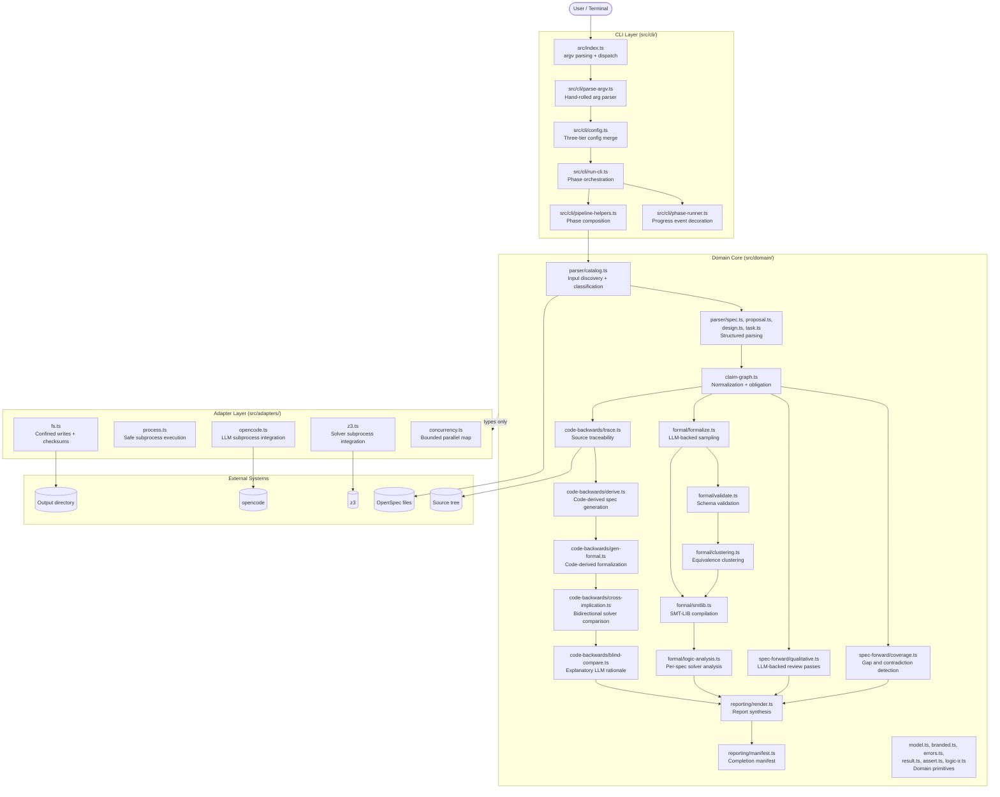

### 3.2 Pipeline Architecture

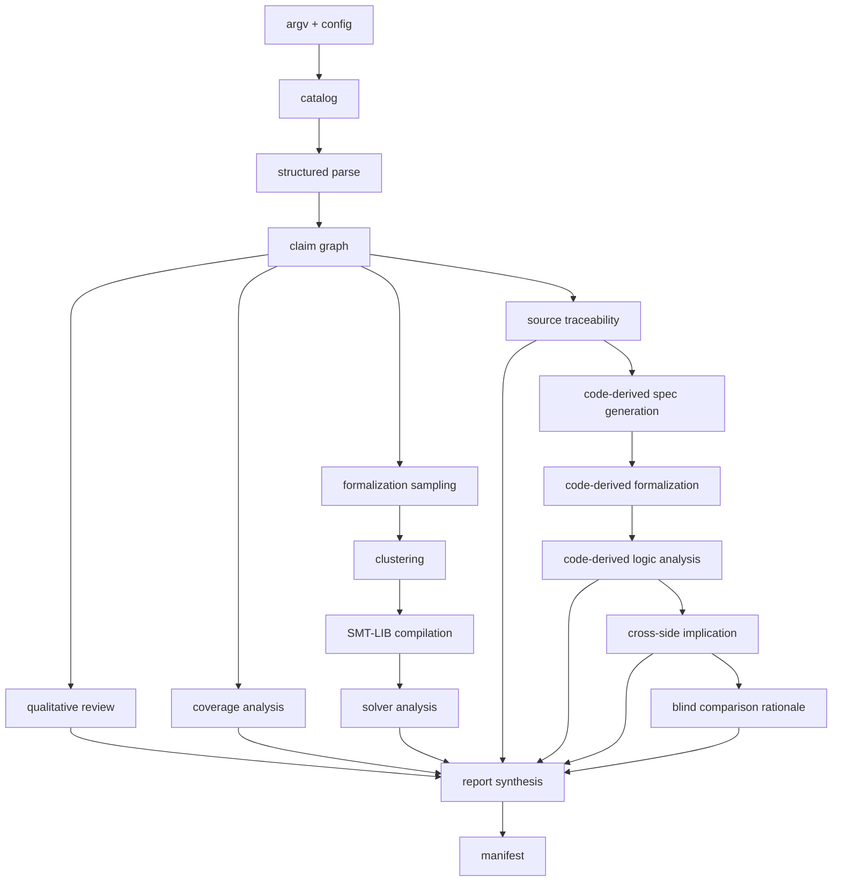

The core architectural split is deliberate:

- The **CLI layer** parses argv, loads config, validates paths, selects modes, and coordinates exit behavior.
- The **domain layer** owns deterministic reasoning: parsing, claim normalization, coverage analysis, formalization validation, clustering, logic analysis coordination, report assembly, and all type definitions.
- The **adapter layer** owns side effects: filesystem operations, `opencode` subprocess execution, `z3` subprocess execution, and child-process management.

This split matters for assurance. The more the decision logic is isolated from the side-effecting mechanics, the easier it is to express invariants, encode state machines, and mechanically test the behavior that matters. The domain depends on the adapter layer only through types, never through calls.

### 3.3 Component Descriptions

| Component | Responsibility | Key Invariant |
|---|---|---|
| **Entry point** ([`src/index.ts`](src/index.ts)) | Parse argv into typed `CliArgs`, dispatch to pipeline or informational output, write stdout/stderr, set exit code | No business logic; only routing and I/O |
| **Argument parser** ([`src/cli/parse-argv.ts`](src/cli/parse-argv.ts)) | Hand-rolled argv parsing with `Result<CliArgs, ArgError>` return | Pure function; exhaustive `FlagKey` switch + `assertNever`; never throws |
| **Config resolver** ([`src/cli/config.ts`](src/cli/config.ts)) | Three-tier merge: CLI flags > config file > built-in defaults | Resolved `RunConfig` is immutable once analysis begins |
| **Pipeline orchestrator** ([`src/cli/run-cli.ts`](src/cli/run-cli.ts)) | Phase-group decomposition into ingestion, analysis, source, reporting | Pipeline progresses in ordered phases only; `PipelineAbortError` for unrecoverable failures |
| **Phase runner** ([`src/cli/phase-runner.ts`](src/cli/phase-runner.ts)) | Progress event decoration: exactly one `started` and one `completed`/`failed` event per phase | Generic decorator; no phase-specific knowledge |
| **Catalog** ([`src/domain/parser/catalog.ts`](src/domain/parser/catalog.ts)) | Resolve input set, classify documents, handle delta/final conflicts | Deterministic given the same inputs; at most one finalized + one delta spec per capability |
| **Structured parsers** ([`src/domain/parser/`](src/domain/parser/)) | Line-oriented parsing for proposal, design, spec, and task documents | Every input line is either classified or preserved as unparsed evidence |
| **Claim graph builder** ([`src/domain/claim-graph.ts`](src/domain/claim-graph.ts)) | Normalize parsed content into typed claims with provenance and obligation | No claim exists without provenance; extraction is deterministic |
| **Qualitative analysis** ([`src/domain/spec-forward/qualitative.ts`](src/domain/spec-forward/qualitative.ts)) | Package parsed content for LLM-backed review passes; validate response schemas | `opencode` responses are schema-validated before acceptance; exactly 2 passes on success |
| **Coverage analysis** ([`src/domain/spec-forward/coverage.ts`](src/domain/spec-forward/coverage.ts)) | Compare proposal/design claims against capability specs | Deterministic given the same claim graph; no LLM or solver dependency |
| **Formalization** ([`src/domain/formal/formalize.ts`](src/domain/formal/formalize.ts)) | Request LLM-backed formalization samples; validate against logic IR schema | Invalid samples rejected, not silently admitted; three-phase strategy (batch, retry, additional) |
| **Validation** ([`src/domain/formal/validate.ts`](src/domain/formal/validate.ts)) | Structural validation of untrusted LLM-produced formalization samples | Deterministic, side-effect free; validates variables, functions, sorts, and assertion syntax |
| **Clustering** ([`src/domain/formal/clustering.ts`](src/domain/formal/clustering.ts)) | Solver-backed pairwise implication to group equivalent formalizations | Pair enumeration is deterministic; BFS-based connected components; ambiguity is a finding |
| **SMT-LIB compilation** ([`src/domain/formal/smtlib.ts`](src/domain/formal/smtlib.ts)) | Compile logic IR into solver-ready SMT-LIB text | Output never includes `(check-sat)` -- caller appends; identifier sanitization ensures valid symbols |
| **Logic analysis** ([`src/domain/formal/logic-analysis.ts`](src/domain/formal/logic-analysis.ts)) | Per-spec combined solver analysis with two-phase approach | Solver inputs and outputs persisted verbatim; default 30s timeout per query |
| **Source traceability** ([`src/domain/code-backwards/trace.ts`](src/domain/code-backwards/trace.ts)) | Scan source tree for canonical identifiers; relate to claim graph | Scanning confined to declared source directory; 1 MiB per-file limit |
| **Code-derived generation** ([`src/domain/code-backwards/derive.ts`](src/domain/code-backwards/derive.ts)) | EARS-preferring specs per capability from source evidence, blind to original text | Original requirement text never crosses the generation boundary |
| **Code-derived formalization** ([`src/domain/code-backwards/gen-formal.ts`](src/domain/code-backwards/gen-formal.ts)) | Same formalization pipeline applied to code-derived specs | Same schema validation and clustering as specs-forward; artifacts written to `gen_specs_smt/` |
| **Cross-side implication** ([`src/domain/code-backwards/cross-implication.ts`](src/domain/code-backwards/cross-implication.ts)) | Bidirectional solver-backed implication between original and code-derived formalizations | Primary strength classifier; greedy matching is deterministic; all queries persisted |
| **Blind comparison** ([`src/domain/code-backwards/blind-compare.ts`](src/domain/code-backwards/blind-compare.ts)) | Explanatory LLM rationale for formal classification | Code-derived side never receives original requirement text |
| **Report rendering** ([`src/domain/reporting/render.ts`](src/domain/reporting/render.ts)) | Render Markdown reports; replace malformed findings with `reporting.unsupported_verdict` defects | Reports never contain findings without provenance |
| **Manifest** ([`src/domain/reporting/manifest.ts`](src/domain/reporting/manifest.ts)) | Build entries with SHA-256 checksums; write atomically; invalidate stale manifests at run start | Manifest is the final file written |
| **Filesystem adapter** ([`src/adapters/fs.ts`](src/adapters/fs.ts)) | Path confinement, atomic writes (temp + rename), SHA-256 checksums | All writes confined to configured output directory; `precondition` throws on traversal |
| **Process adapter** ([`src/adapters/process.ts`](src/adapters/process.ts)) | Generic `execFile` wrapper with argv arrays, timeout handling, stdin piping | No shell interpolation; `shell: false`; ENOENT on spawn rejects the promise |
| **`opencode` adapter** ([`src/adapters/opencode.ts`](src/adapters/opencode.ts)) | `opencode` subprocess with NDJSON event stream parsing, bounded retries | Bounded retries (default 3); invalid responses consume a retry; default 120s timeout |
| **`z3` adapter** ([`src/adapters/z3.ts`](src/adapters/z3.ts)) | SMT-LIB piped via stdin, stdout/stderr capture, exit classification | Results classified as sat/unsat/timeout/unknown/error; error lines override any verdict; default 30s timeout |
| **Concurrency adapter** ([`src/adapters/concurrency.ts`](src/adapters/concurrency.ts)) | Bounded-concurrency parallel map with deterministic output ordering | `precondition(concurrency >= 1)`; first-error semantics; results preserve input order |

### 3.4 Design Principles

- Make important invariants explicit.
- Keep the core deterministic and push nondeterminism to the edges.
- Reject invalid input before crossing LLM, solver, or filesystem boundaries.
- Bound all waits and surface timeouts explicitly.
- Treat parser loss, unsupported references, and provenance gaps as surfaced defects rather than invisible degradation.
- Preserve evidence for every conclusion; no final verdict rests on an opaque unpreserved response.
- Keep packaging and traceability in the product contract.

---

## 4. Domain Model

### 4.1 Conceptual Entity-Relationship Diagram

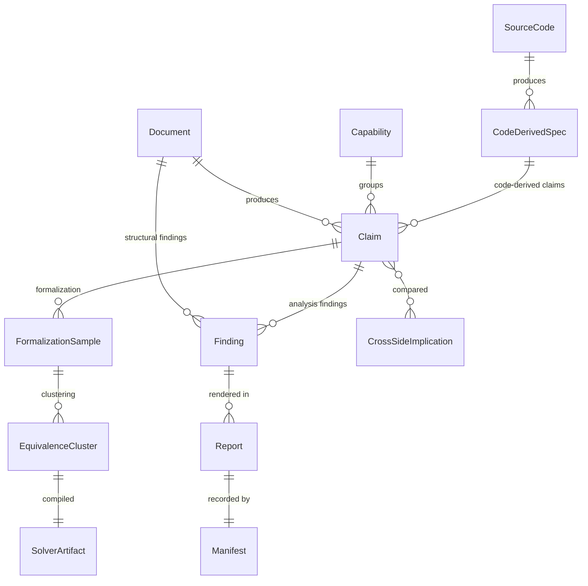

### 4.2 Primary Domain Entities

| Entity | Meaning | Authority | Key Invariants |
|---|---|---|---|
| Document | A proposal, design, capability spec, or task file | input filesystem | read-only; never mutated by analysis; classified by basename |
| Capability | A logical behavior group represented by one spec file and its purpose | active catalog | resolved from finalized specs plus at most one in-development delta; lexicographically first delta wins on conflict |
| Requirement | A capability-level behavioral obligation in EARS format | parsed spec file | must carry a canonical bracketed identifier; classified into one of 8 EARS types |
| Scenario | A concrete, testable behavioral case that refines a requirement | parsed spec file | must carry a canonical bracketed identifier |
| Claim | A normalized statement derived from requirements, scenarios, properties, or code | claim graph builder | always carries provenance and obligation level; extraction order is deterministic |
| Finding | An analysis result with severity, rationale, provenance, and evidence | analysis phases | never exists without provenance; never silently removed; category is dot-separated hierarchical |
| Formalization Sample | One candidate formal encoding of a claim as logic IR | LLM-backed formalization | schema-validated before acceptance; variables, functions, sorts, and assertion syntax all checked |
| Equivalence Cluster | A group of mutually implying formalization samples | solver-backed clustering | BFS-based connected components; represents one interpretation of a claim |
| Solver Artifact | Generated SMT-LIB file, model, unsat core, timeout result, or error diagnostic | solver analysis | persisted verbatim under the output directory |
| Code-Derived Specification | EARS-preferring behavioral spec generated from source evidence, blind to original text | code-derived generation | persisted as Markdown in `gen_specs/` |
| Cross-Side Implication Result | Solver-backed classification (same, stronger, weaker, different, uncertain) | cross-side analysis | primary strength classifier; queries persisted verbatim |
| Report | Human-readable Markdown artifact summarizing one analysis pass | reporting phase | never contains findings without provenance; malformed findings replaced with defect markers |
| Manifest | Completion record listing all produced output files with SHA-256 checksums | reporting phase | written last; stale manifest removed at run start; presence marks completed run |
| Traceability Identifier | Canonical bracketed identifier linking claims to tests and source evidence | spec files and test harness | `[A-Z][A-Z0-9]*(-[A-Z0-9]+)+` format |

### 4.3 Conceptual Relationships

```text
Document ──────────────────────────────────────────┐
  (proposal, design, spec, task)                   │
       │                                           │
       v                                           │
  Structured Parser ──> Unparsed Lines (evidence)  │
       │                                           │
       v                                           │
     Claim ───────────────────────────────┐        │
  (requirement, scenario, property,       │        │
   assumption, invariant, failure mode)   │        │
       │                                  │        │
       ├──> Formalization Sample ─────────┤        │
       │        │                         │        │
       │        v                         │        │
       │   Equivalence Cluster            │        │
       │        │                         │        │
       │        v                         │        │
       │   Solver Artifact                │        │
       │        │                         │        │
       v        v                         v        │
     Finding <────────────────────────────┘        │
       │                                           │
       v                                           │
     Report <──────────────────────────────────────┘
       │
       v
    Manifest

Source Code ─────────────────────────────────────────────────┐
  (implementation, verified contracts, traced tests)         │
       │                                                     │
       v                                                     │
  Code-Derived Specification ─────────────────────────┐      │
  (EARS-preferring, per capability, blind to specs)   │      │
       │                                              │      │
       v                                              │      │
  Code-Derived Formalization ─────────────────────────┤      │
  (same pipeline: sampling, validation, clustering)   │      │
       │                                              │      │
       v                                              │      │
  Cross-Side Implication ─────────────────────────────┤      │
  (bidirectional solver checks: original vs derived)  │      │
       │                                              v      │
       v                                                     │
     Finding <───────────────────────────────────────────────┘
  (same, stronger, weaker, different, uncertain)
       │
       v
     Report
```

### 4.4 EARS Requirement Format

All spec.md files define verifiable behavior using EARS format and RFC 2119 keywords:

| Pattern | Template | When to use |
|---|---|---|
| Ubiquitous | `THE <system> SHALL <response>.` | Always active |
| State-driven | `WHILE <precondition>, THE <system> SHALL <response>.` | Active in a continuous state |
| Event-driven | `WHEN <trigger>, THE <system> SHALL <response>.` | Discrete event causes behavior |
| Unwanted-behavior | `IF <trigger>, THEN THE <system> SHALL <response>.` | Error/failure mitigation |
| Complex | `WHILE <precondition>, WHEN <trigger>, THE <system> SHALL <response>.` | Both state and event required |
| Optional | `WHERE <feature is included>, THE <system> SHALL <response>.` | Optional/configurable behavior |
| Conditional | `IF <condition>, THE <system> SHALL <response>.` | Conditional without unwanted behavior |
| Non-EARS | Free-form with justification | When EARS is insufficient (> 3 preconditions, mathematical, tabular) |

RFC 2119: SHALL/MUST = absolute requirement (mandatory), SHOULD = recommended (advisory), MAY = optional (informational).

EARS classification priority in the parser: complex before event/state-driven; unwanted-behavior before conditional; optional before ubiquitous. This ordering prevents ambiguous matches.

Relevant code: [`src/domain/parser/spec.ts`](src/domain/parser/spec.ts)

### 4.5 Claim Kinds and Obligation Derivation

The claim graph builder extracts claims from parsed artifacts in a fixed order: proposal, then design, then specs, then tasks.

| Claim Kind | Source | Obligation Derivation |
|---|---|---|
| `requirement` | spec requirements | RFC 2119 keyword: SHALL → mandatory, SHOULD → advisory, MAY → informational |
| `scenario` | spec scenarios | always mandatory |
| `proposal_property` | proposal sections | mapped by section heading (e.g., Preconditions → mandatory, Context → informational) |
| `design_property` | design sections | informational |
| `assumption` | proposal sections | informational |
| `invariant` | proposal sections | mandatory |
| `failure_mode` | proposal sections | advisory |
| `task_evidence` | completed task items only | informational |

Relevant code: [`src/domain/claim-graph.ts`](src/domain/claim-graph.ts)

### 4.6 Branded Types and Encoding Constraints

The domain uses compile-time branded types to prevent accidental interchange of semantically distinct values that share the same runtime representation:

| Type | Brand | Validation Rule | Construction |
|---|---|---|---|
| `OutputDirPath` | `"OutputDirPath"` | Absolute directory path | `toOutputDirPath()` |
| `RelativePath` | `"RelativePath"` | No `/` prefix, no `..` traversal | `toRelativePath()` |
| `SmtlibFilePath` | `"SmtlibFilePath"` | Relative path with `.smt2` extension | `toSmtlibFilePath()` |
| `ClaimId` | `"ClaimId"` | `[A-Z][A-Z0-9]*(-[A-Z0-9]+)+` | `toClaimId()` |
| `CapabilityName` | `"CapabilityName"` | Lowercase kebab-case, non-empty | `toCapabilityName()` |
| `SanitizedClaimId` | `"SanitizedClaimId"` | `^[A-Za-z_][A-Za-z0-9_]*$` (SMT-LIB safe) | `sanitizeIdentifier()` |
| `ModelName` | `"ModelName"` | Non-empty string | `toModelName()` |
| `SmtlibContent` | `"SmtlibContent"` | SMT-LIB formula text (not a path) | `toSmtlibContent()` |

Branded values are constructed only through validated construction functions at trust boundaries. Interior code passes branded values through without casting. The `as` casts are confined to `to*()` factory functions.

**Encoding:** Input artifacts are read as UTF-8 text with line ending normalization to LF. Logic artifacts are emitted as ASCII-safe SMT-LIB files with sanitized identifiers and reversible mapping comments. The manifest is UTF-8 JSON.

Relevant code: [`src/domain/branded.ts`](src/domain/branded.ts)

### 4.7 Evidence Model

Every durable conclusion is evidence-backed. Evidence may include:

- original source snippets and headings with `LineProvenance` (file + 1-based line number)
- parser-preserved unmatched lines
- raw `opencode` responses (both valid and invalid)
- validated logic IR samples
- compiled SMT-LIB text
- solver stdout/stderr, models, unsat cores, and timeouts
- source trace links with evidence level classification (primary, secondary, supporting)
- cross-side implication queries and results
- blind comparison rationale

The evidence contract is stronger than "explainability"; it is preservation. Every finding carries mandatory `evidence` alongside `provenance`, `rationale`, `severity`, `category`, and `description`.

Relevant code: [`src/domain/findings.ts`](src/domain/findings.ts)

### 4.8 Data Invariants

| ID | Invariant | Enforced By | Failure Mode |
|----|-----------|-------------|--------------|
| **D-1** | Every claim has provenance linking it to a source file and heading | Claim graph builder; `detectOrphanClaims()` | Orphan finding emitted |
| **D-2** | Claims carry obligation level (mandatory, advisory, informational) | EARS keyword extraction + section-heading mapping | Derived from SHALL/SHOULD/MAY or section policy |
| **D-3** | Canonical identifiers follow `[A-Z][A-Z0-9]*(-[A-Z0-9]+)+` format | `parseCanonicalIdentifier()` in shared parser | Structural finding |
| **D-4** | Findings include severity, category, provenance, description, rationale, and evidence | Finding shape definition; report rendering validation | Malformed findings replaced with `reporting.unsupported_verdict` defects |
| **D-5** | Findings are never silently removed by later phases | `addFindings()` postcondition in `RunState` | Monotonic accumulation; length postcondition check |
| **D-6** | SMT-LIB identifiers use only sanitized characters | `sanitizeIdentifier()` with hex escaping | Reversible mapping comments preserved |
| **D-7** | Parser output is deterministic given the same input content | Module-level invariant; no I/O-dependent state | Property tests |
| **D-8** | The manifest is the last file written | `invalidateStaleManifest()` at run start; `writeManifest()` at run end | Manifest absence signals incomplete run |
| **D-9** | Compiled SMT-LIB never includes `(check-sat)` | `compileSmtlib()` and `compileSpecSmtlib()` | Caller appends solver commands at query time |
| **D-10** | Claim extraction order is deterministic: proposal → design → specs → tasks | `buildClaimGraph()` iteration order | Property tests |

**Spec references:** [`catalog-and-parse`](openspec/specs/catalog-and-parse/spec.md) -- `[CAT-PARSE-DETERMINISM]`, `[CAT-PRESERVE-LOSS]`; [`claim-graph-and-coverage`](openspec/specs/claim-graph-and-coverage/spec.md); [`reporting-and-evidence`](openspec/specs/reporting-and-evidence/spec.md) -- `[RAE-FINDING-SHAPE]`, `[RAE-FINDINGS-IMMUTABLE]`, `[RAE-ATOMIC-MANIFEST]`.

---

## 5. Preconditions, Postconditions, and Invariants

### 5.1 System-Wide Invariants

| ID | Invariant | How Maintained |
|----|-----------|----------------|
| **I-1** | Input specs, task files, and source files are never mutated | Read-only access throughout all phases |
| **I-2** | No final verdict relies on a single opaque LLM response without preserved evidence | Schema validation at boundaries; full response preservation |
| **I-3** | Every LLM response used by the system is schema-validated before it influences downstream phases | Adapter-level validation with bounded retries; `validateFormalizationSample()` for logic IR |
| **I-4** | Solver inputs and outputs are persisted verbatim | Adapter-level persistence via `writeOutputAtomic()` |
| **I-5** | Findings are never silently erased by later phases | `addFindings()` in `RunState` with monotonic length postcondition |
| **I-6** | Re-running with identical inputs and fixed/cached LLM responses produces identical outputs | Deterministic core between nondeterministic boundaries; deterministic extraction order |
| **I-7** | All writes remain confined to the configured output directory | `resolveConfinedOutputPath()` with `precondition` assertion in filesystem adapter |
| **I-8** | No shell interpolation in subprocess calls | `shell: false` in `process.ts`; argv-based `execFile`, never `exec` |
| **I-9** | Prompt construction fences document content; analyzed spec text is never elevated into system-level instruction position | `sanitizeForCodeFence()` in `fence.ts`; fenced prompt construction in qualitative and formalization modules |
| **I-10** | The resolved run configuration is immutable once analysis begins | CLI layer freezes `RunConfig` before pipeline starts |

### 5.2 Per-Phase Contracts

| Phase | Preconditions | Postconditions | Error Outcomes |
|-------|---------------|----------------|----------------|
| CLI validation | Process can read argv | Valid args produce resolved `RunConfig`; invalid args exit with code `2` | `ArgumentError`, `ConfigError` |
| Dependency check | Resolved config available | `opencode` and `z3` confirmed on PATH | `DependencyError` |
| Catalog | At least one input path resolves to readable artifacts | Catalog identifies every document and its classification; archived specs excluded; delta conflicts surfaced as findings | `CatalogError` |
| Structured parsing | Cataloged documents are readable UTF-8 | Each document produces a typed model; all lines classified or preserved as unparsed evidence | Structural findings with provenance |
| Claim graph | At least one document parsed with recognizable structure | Every recognized element normalized into a typed claim with provenance | Orphaned claims surfaced as defects |
| Qualitative analysis | Claim graph has at least one claim; `opencode` available | Schema-validated findings from exactly 2 LLM passes with severity, rationale, provenance, and evidence | `QualitativeError` after bounded retries |
| Coverage analysis | Claims from proposal/design and at least one spec | Missing coverage, contradictions, unsupported references, and task inconsistencies reported | Deterministic; no external dependencies |
| Formalization | Eligible claims (requirements and scenarios) exist; `opencode` available | Each claim produces validated logic IR and compiled SMT-LIB artifacts | `FormalizationError` after bounded retries |
| Clustering | Formalization samples exist; `z3` available | Equivalence clusters with representative selection; ambiguity surfaced as findings | `AdapterError` on solver failure |
| Logic analysis | Representative formalizations exist; `z3` available | Obligation-aware contradiction, completeness, and gap detection; evidence persisted verbatim | `AdapterError` on solver failure |
| Source traceability | `--src` provided and readable | Each claim traced to source evidence or gap finding emitted; evidence levels classified | `CatalogError` on unreadable source |
| Code-derived generation | Source evidence available per capability | EARS-preferring specs generated blind to original text; written to `gen_specs/` | `AdapterError` on LLM failure |
| Code-derived formalization | Generated specs available | Formalized claims with SMT-LIB artifacts written to `gen_specs_smt/` | `FormalizationError`, `AdapterError` |
| Code-derived logic analysis | Code-derived formalizations available; `z3` available | Internal consistency check of code-derived formalizations | `AdapterError` on solver failure |
| Cross-side implication | Both original and code-derived formalizations available; `z3` available | Bidirectional solver-backed classification per matched pair; greedy matching with deterministic tiebreaking | `AdapterError` on solver failure |
| Blind comparison | Cross-side results available; `opencode` available | Explanatory rationale for each classification; blind boundary preserved | `AdapterError` on LLM failure |
| Reporting | At least one phase completed | Phase reports, synthesized summary, and manifest written atomically | `OutputError` on write failure |

### 5.3 Global Preconditions

- At least one input specification artifact exists and is readable.
- The analyzed project follows the `srs-driven` artifact conventions closely enough to admit structured parsing.
- Required local dependencies for the selected analysis mode are available: `opencode` for LLM-backed phases and `z3` for solver-backed phases.
- When `--src` is used, the source directory is readable, within the intended project scope, and not a parent of the output directory.

### 5.4 Global Postconditions

- The tool produces a bounded, evidence-preserving set of reports and intermediate artifacts under the output directory.
- Every surfaced finding includes provenance and enough supporting evidence for a reviewer to inspect the basis of the conclusion.
- When analysis completes successfully, a manifest is written last and identifies the produced artifacts with SHA-256 checksums.
- When source-backed analysis is requested, the output includes traceability or comparison results that explain the relationship between spec intent and code-derived guarantees.
- Successful runs exit with code `0` (no findings) or `1` (findings present).
- Skipped optional phases are explained in reporting.
- Manifest presence indicates a complete run; manifest absence indicates incomplete output.

**Spec references:** [`catalog-and-parse`](openspec/specs/catalog-and-parse/spec.md), [`claim-graph-and-coverage`](openspec/specs/claim-graph-and-coverage/spec.md), [`formalization-and-logic-analysis`](openspec/specs/formalization-and-logic-analysis/spec.md), [`reporting-and-evidence`](openspec/specs/reporting-and-evidence/spec.md).

---

## 6. State Machines

State machines are implemented using discriminated unions with exhaustive switch statements and `assertNever` guards.

### 6.1 Top-Level Run Lifecycle

Relevant code: [`src/index.ts`](src/index.ts), [`src/cli/run-cli.ts`](src/cli/run-cli.ts)

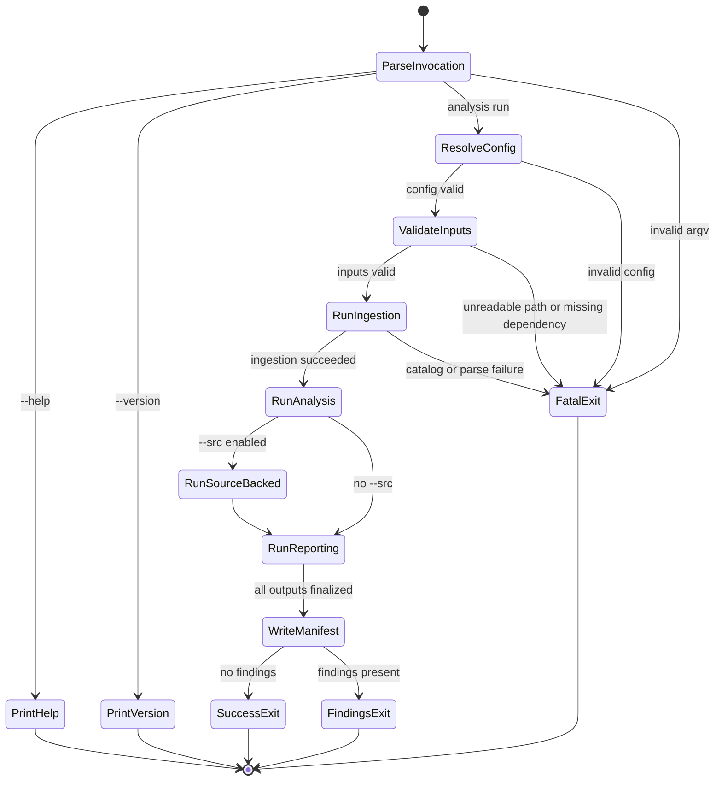

#### Decision Table

| Invocation Shape | Action | Side Effects |
|---|---|---|
| `--help` | print help text to stdout | none; exit `0` |
| `--version` | print version to stdout | none; exit `0` |
| valid inputs | run full analysis pipeline | output directory populated |
| invalid argv | report error to stderr | exit `2` |
| invalid config | report error to stderr | exit `3` |
| missing dependency | report error to stderr | exit `4` |

#### Invariants

| ID | Invariant |
|---|---|
| TL-1 | Help and version do not run analysis or contact external tools |
| TL-2 | Invalid arguments produce exit code `2` before any output is written |
| TL-3 | CLI flags take precedence over config file values |
| TL-4 | `PipelineAbortError` carries `ErrorCategory` for exit code mapping |

#### Safety and Liveness

- Safety: informational commands never cross LLM, solver, or filesystem boundaries.
- Liveness: informational commands terminate immediately on local process success paths.

**Spec reference:** [`catalog-and-parse`](openspec/specs/catalog-and-parse/spec.md) -- `[CAT-CLI-ARGS]`, `[CAT-CLI-CONFIG]`.

### 6.2 Ingestion Pipeline

Relevant code: [`src/cli/run-cli.ts`](src/cli/run-cli.ts) (`runIngestionPhases`), [`src/domain/parser/`](src/domain/parser/)

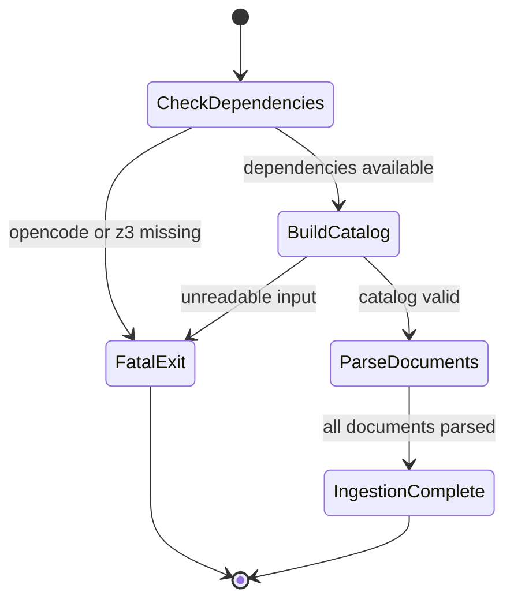

#### Decision Table

| Condition | Action | Outcome |
|---|---|---|
| `opencode` not on PATH | `DependencyError` | exit `4` |
| `z3` not on PATH | `DependencyError` | exit `4` |
| input path unreadable | `CatalogError` | exit `5` |
| multiple deltas for same capability | surface finding; keep lexicographically first | catalog with conflict findings |
| document parsed successfully | typed model + structural findings | proceed to claim graph |

#### Invariants

| ID | Invariant |
|---|---|
| ING-1 | Dependency check runs before any external tool invocation |
| ING-2 | Catalog is deterministic given the same input paths and filesystem state |
| ING-3 | Delta conflict resolution is deterministic: lexicographically first delta wins |
| ING-4 | Every input line is either classified into a typed model or preserved as unparsed evidence |

### 6.3 Specs-Forward Analysis Pipeline

Relevant code: [`src/cli/run-cli.ts`](src/cli/run-cli.ts) (`runAnalysisPhases`), [`src/cli/pipeline-helpers.ts`](src/cli/pipeline-helpers.ts)

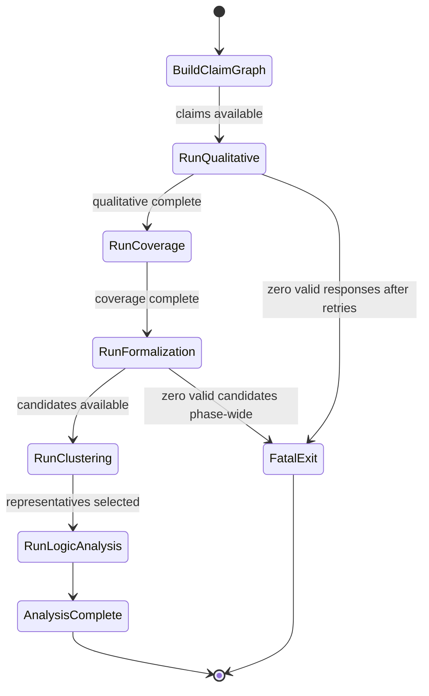

#### Decision Table

| Phase | Success Condition | Failure Condition | Failure Contract |
|---|---|---|---|
| claim graph | at least one claim extracted | no recognizable structure | findings emitted |
| qualitative pass 1 | schema-valid LLM response | exhausted retries | `QualitativeError` |
| qualitative pass 2 | schema-valid LLM response | exhausted retries | `QualitativeError` |
| coverage | always succeeds (deterministic) | -- | -- |
| formalization | at least one valid candidate per claim | zero valid candidates after batch + retry + additional | `FormalizationError` |
| clustering | representative selected from largest stable cluster | stability threshold not met | ambiguity finding emitted |
| logic analysis | solver returns definitive result | timeout or unknown | finding preserved as `logic.inconclusive` |

#### Invariants

| ID | Invariant |
|---|---|
| SF-1 | Qualitative passes execute sequentially; pass 2 starts only after pass 1 succeeds |
| SF-2 | Coverage analysis is purely deterministic; no LLM or solver dependency |
| SF-3 | Formalization uses a three-phase strategy: batch per file, individual retry, additional samples |
| SF-4 | Clustering pair enumeration is deterministic (left < right) |
| SF-5 | Logic analysis two-phase approach: satisfiability first, unsat-core extraction only on contradiction |

#### Safety and Liveness

- Safety: no invalid formalization sample enters clustering or solver analysis.
- Safety: inconclusive solver results are preserved as findings, not treated as success.
- Liveness: each LLM call is bounded by retry count (default 3) and per-call timeout (default 120s).
- Liveness: each solver query is bounded by per-query timeout (default 30s).

**Spec references:** [`formalization-and-logic-analysis`](openspec/specs/formalization-and-logic-analysis/spec.md), [`claim-graph-and-coverage`](openspec/specs/claim-graph-and-coverage/spec.md).

### 6.4 Source-Backed Analysis Pipeline

Relevant code: [`src/cli/run-cli.ts`](src/cli/run-cli.ts) (`runSourcePhases`), [`src/domain/code-backwards/`](src/domain/code-backwards/)

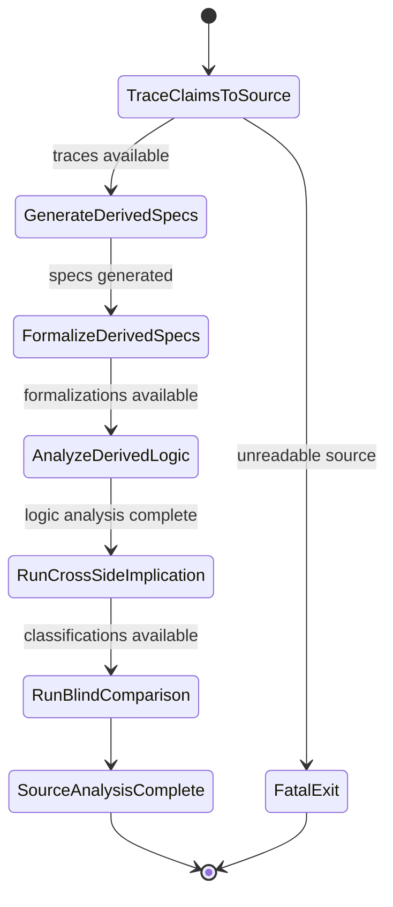

#### Decision Table

| Phase | Success Condition | Failure Condition | Failure Contract |
|---|---|---|---|
| source traceability | source directory scanned | unreadable source directory | `CatalogError` |
| code-derived generation | at least one capability generates specs | LLM failure for all capabilities | error findings emitted |
| code-derived formalization | at least one claim formalized | all formalizations fail | error findings emitted |
| code-derived logic analysis | solver returns results | solver failures | findings preserved |
| aggregate implication | 2 Z3 calls per matched capability | solver failures | `uncertain` classification |
| pairwise implication | N*M within pair budget | budget exceeded | skip pairwise, keep aggregate |
| blind comparison | LLM provides rationale | LLM failure | error findings emitted |

#### Invariants

| ID | Invariant |
|---|---|
| SB-1 | Source scanning is confined to the declared `--src` directory |
| SB-2 | Per-file size limit of 1 MiB prevents unbounded memory consumption |
| SB-3 | Original requirement text never crosses into code-derived generation or blind comparison input |
| SB-4 | Cross-side implication operates on formal artifacts only, not mixed claim text |
| SB-5 | Greedy matching for pairwise results is deterministic: sorted by classification score, then lexicographic claim ID |
| SB-6 | Partial results are preserved: one capability's failure does not affect others |

#### Safety and Liveness

- Safety: the blind boundary is structurally enforced; original spec text never reaches the code-derived side.
- Safety: cross-side implication queries are persisted verbatim for audit.
- Liveness: source-backed analysis proceeds capability-by-capability even when individual generated claims are ambiguous or partially unsupported.
- Liveness: pairwise comparison is bounded by `--pair-budget` (default 200).

**Spec reference:** [`source-traceability-and-code-backwards`](openspec/specs/source-traceability-and-code-backwards/spec.md) -- `[STC-GEN-SPECS]`, `[STC-CROSS-IMPLY]`, `[STC-BLIND-COMPARE]`.

### 6.5 Reporting and Manifest Lifecycle

Relevant code: [`src/domain/reporting/render.ts`](src/domain/reporting/render.ts), [`src/domain/reporting/manifest.ts`](src/domain/reporting/manifest.ts)

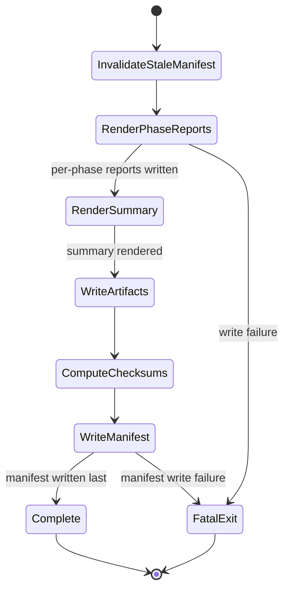

#### Decision Table

| Condition | Action | Outcome |
|---|---|---|
| stale manifest exists from prior run | remove before new output | clean slate |
| no stale manifest | no-op | proceed |
| finding has valid shape | render normally | included in report |
| finding has malformed shape | replace with `reporting.unsupported_verdict` defect | defect visible in report |
| all phase reports written | compute SHA-256 checksums | manifest entries ready |
| all checksums computed | write `manifest.json` atomically | run marked complete |

#### Invariants

| ID | Invariant |
|---|---|
| RP-1 | Stale manifest is removed at run start before any new output is written |
| RP-2 | Manifest is the final file written in the output directory |
| RP-3 | Report writes are atomic (temp + rename) |
| RP-4 | Manifest checksums match the content written to disk |
| RP-5 | Malformed findings are never silently dropped; they are replaced with defect markers |

#### Safety and Liveness

- Safety: no partial run leaves a valid final manifest.
- Safety: manifest checksums enable post-run integrity verification.
- Liveness: reporting completes once all upstream phase results are available and writes succeed.

**Spec reference:** [`reporting-and-evidence`](openspec/specs/reporting-and-evidence/spec.md) -- `[RAE-ATOMIC-MANIFEST]`, `[RAE-OUTPUT-ATOMIC]`.

### 6.6 Adapter Layer

Relevant code: [`src/adapters/`](src/adapters/)

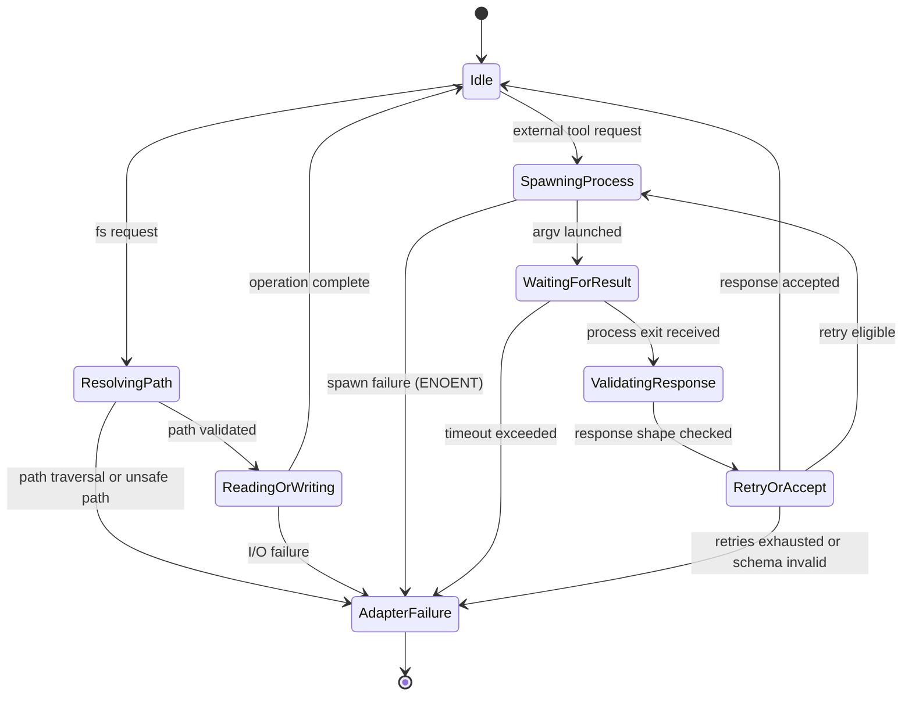

#### Decision Table -- `opencode` Adapter

| Condition | Action | Outcome |
|---|---|---|
| process exits with valid NDJSON events containing `type: "text"` | concatenate text fragments, parse as JSON | `ok` result if schema-valid |
| `type: "error"` event detected | treat as failure | consume a retry |
| JSON parse failure on concatenated text | `invalid_json` error | consume a retry |
| schema validation failure | `schema_validation_error` | consume a retry |
| retries exhausted | return last error | `err` result |
| timeout exceeded | kill process | `timeout` error |

#### Decision Table -- `z3` Adapter

| Condition | Action | Outcome |
|---|---|---|
| stdout contains `(error ...)` lines | classify as `error` | error overrides any verdict |
| stdout contains exact `sat` | classify as `sat` | consistent |
| stdout contains exact `unsat` | classify as `unsat` | contradictory |
| stdout contains exact `unknown` | classify as `unknown` | inconclusive |
| no recognizable verdict | classify as `error` | malformed output |
| timeout exceeded | kill process | `timeout` result |

#### Invariants

| ID | Invariant |
|---|---|
| AD-1 | All subprocess calls use argv arrays via `execFile` with `shell: false` |
| AD-2 | `opencode` retries are bounded (default 3); each invalid response consumes one retry |
| AD-3 | `z3` error-line detection overrides any subsequent verdict (errors make verdicts unreliable) |
| AD-4 | Path confinement in the filesystem adapter uses `precondition()` assertion |
| AD-5 | Atomic writes use temp file + rename; cleanup on rename failure |
| AD-6 | `z3` adapter never rejects; all failures resolve with a classified `Z3Result` |

---

## 7. Interaction Protocols

### 7.1 Pipeline Orchestration Flow

Relevant code: [`src/cli/run-cli.ts`](src/cli/run-cli.ts), [`src/cli/phase-runner.ts`](src/cli/phase-runner.ts)

The pipeline is decomposed into `runIngestionPhases`, `runAnalysisPhases`, `runSourcePhases`, and `runReportingPhase` for phase-group isolation. `PipelineAbortError` is used for typed error propagation between phase groups.

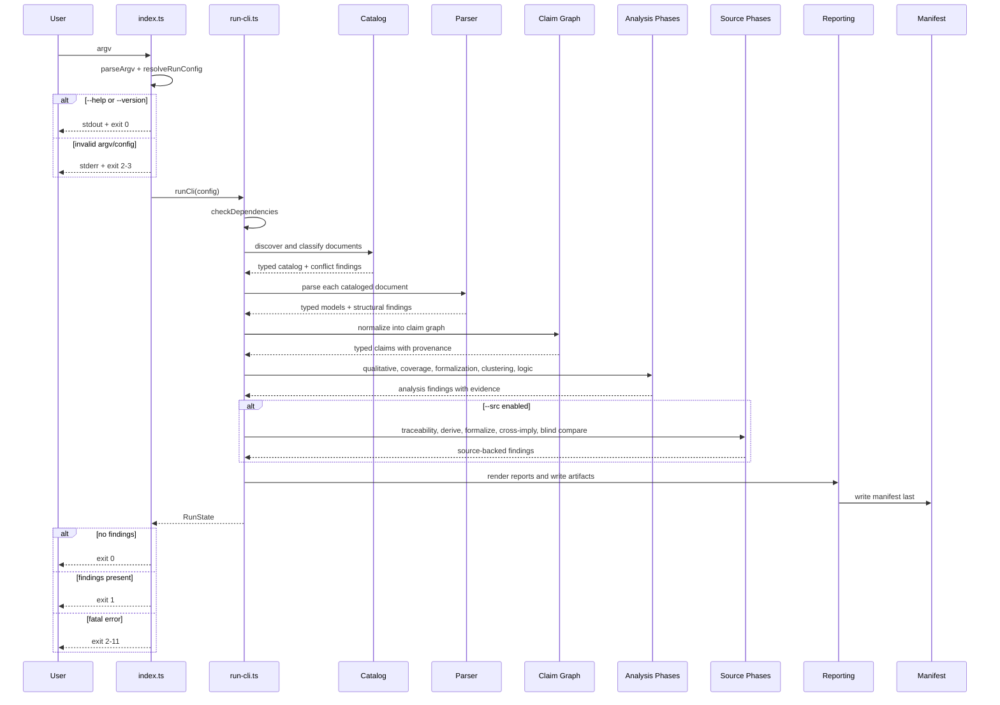

Protocol rules:

- validation occurs before any external tool invocation
- phase groups execute in strict order: ingestion → analysis → source → reporting
- `PipelineAbortError` bridges domain `ErrorCategory` into the exception world for progress-event infrastructure compatibility
- each phase emits exactly one `started` event and one `completed`/`failed` event

### 7.2 Formalization and Solver Sequence

Relevant code: [`src/domain/formal/formalize.ts`](src/domain/formal/formalize.ts), [`src/domain/formal/clustering.ts`](src/domain/formal/clustering.ts), [`src/domain/formal/smtlib.ts`](src/domain/formal/smtlib.ts), [`src/domain/formal/logic-analysis.ts`](src/domain/formal/logic-analysis.ts)

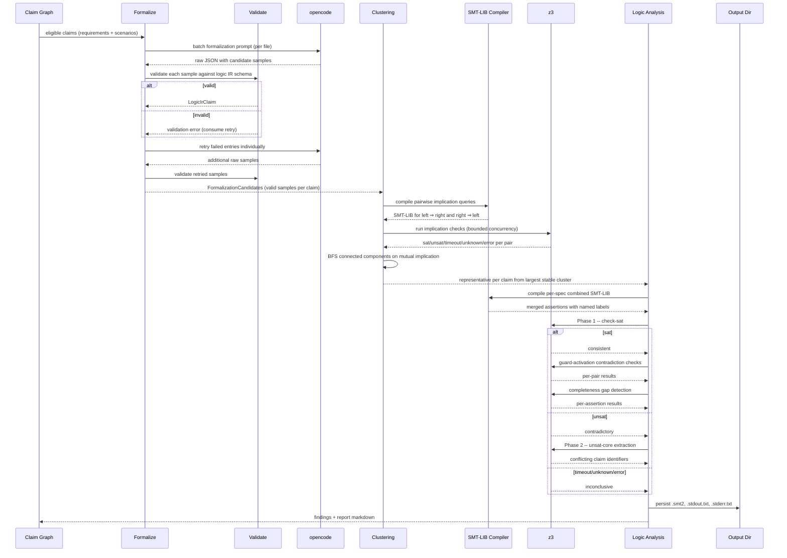

Protocol rules:

- formalization uses a three-phase strategy: batch per file, individual retry for failures, additional samples for clustering
- compiled SMT-LIB excludes solver commands until query execution time
- implication queries contain exactly one `(check-sat)`
- per-spec logic analysis uses a two-phase strategy: satisfiability first, unsat-core extraction only on contradiction
- solver stdout/stderr, timeout, unknown, and error diagnostics are persisted verbatim

### 7.3 Code-Backwards Sequence

Relevant code: [`src/domain/code-backwards/`](src/domain/code-backwards/), [`src/cli/pipeline-helpers.ts`](src/cli/pipeline-helpers.ts)

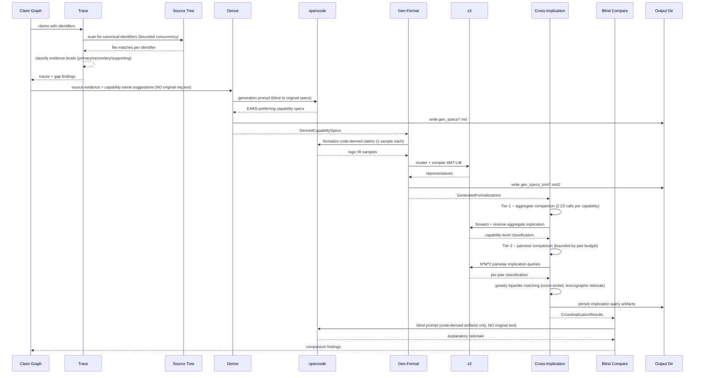

Protocol rules:

- code-derived generation receives source-scoped evidence and capability-name suggestions only; no original requirement text, proposal text, or design text
- cross-side implication operates on formal artifacts, not mixed claim text
- blind comparison provides explanatory rationale; solver implication remains the primary classifier
- tiered comparison strategy: aggregate first (always runs, cheap), pairwise second (budget-bounded, expensive)

### 7.4 Core to `opencode` Boundary

Relevant code: [`src/adapters/opencode.ts`](src/adapters/opencode.ts)

Protocol rules:

- prompts are fenced so analyzed content is not promoted to instruction position
- the `opencode` adapter builds argv (`opencode run --model <name> --format json <prompt>`) and parses newline-delimited JSON event output
- `type: "text"` event payloads are concatenated and parsed as the final JSON response
- `type: "error"` events are treated as failures
- `opencode` responses must be schema-valid before entering the core model
- invalid responses consume bounded retries (default 3)
- all valid and invalid samples are preserved as evidence

### 7.5 Core to `z3` Boundary

Relevant code: [`src/adapters/z3.ts`](src/adapters/z3.ts)

Protocol rules:

- SMT-LIB content is piped via stdin (`-in` flag), not temp files
- compiled SMT-LIB excludes solver commands until query execution time
- the adapter classifies exit into sat/unsat/timeout/unknown/error
- error lines (`(error ...)`) override any verdict (verdicts after errors are unreliable)
- solver stdout/stderr, timeout, unknown, and error diagnostics are persisted verbatim
- per-query timeout default is 30s

---

## 8. Failure Modes and Error Model

### 8.1 Error Categories and Exit Codes

Relevant code: [`src/domain/errors.ts`](src/domain/errors.ts)

The domain defines a structured error hierarchy using a generic `ErrorBase<C>` discriminated union pattern with plain readonly objects (no class inheritance):

| Exit Code | Category | Meaning |
|---|---|---|
| 0 | -- | Analysis completed without findings |
| 1 | FindingsPresent | Analysis completed and surfaced one or more findings |
| 2 | ArgumentError | CLI argument parsing failure |
| 3 | ConfigError | Configuration loading or validation failure |
| 4 | DependencyError | Missing external binary dependency |
| 5 | CatalogError | Input document discovery or reading failure |
| 6 | AdapterError | External process adapter failure |
| 7 | ValidationError | Schema or structure validation failure |
| 8 | QualitativeError | LLM-backed qualitative review failure |
| 9 | FormalizationError | LLM-backed formalization failure |
| 10 | PipelineError | Pipeline phase orchestration failure |
| 11 | OutputError | File or manifest output failure |

**Invariant:** Exit codes 2-11 correspond to the `ErrorCategory` discriminated union. Exit code mapping is deterministic and stable across versions. Fatal errors in any category prevent the tool from producing a trustworthy evidence set.

Narrowed boundary unions (`PipelinePhaseError`, `AdapterBoundaryError`, `CliResolutionError`) constrain which error categories can appear at specific subsystem boundaries, providing compile-time safety.

### 8.2 Stderr and Stdout Formats

**Stderr:** Diagnostic and error output. Fatal errors follow this format:
```
[spec-check] <Category>: <concise message>
```
Details, when present, are indented on subsequent lines.

**Stdout:** Structured JSON progress events. Each event is a single JSON line with at least:
- `phase`: the pipeline phase name
- `status`: one of `started`, `completed`, `failed`, `skipped`
- `timestamp`: ISO-8601 UTC timestamp

Phase completion events include `duration_ms` and summary counts where applicable.

### 8.3 Failure Mode Analysis

| Failure Mode | Detection | Impact | Mitigation |
|---|---|---|---|
| **False negative analysis** | Missed by tool | Undermines core product value | Multi-layer analysis (qualitative + formal + coverage) |
| **Nondeterministic material divergence** | Repeated runs surface different findings | Weakens trust in dependability cases | Deterministic core; nondeterminism isolated at boundaries |
| **Evidence loss** | Reports omit provenance or evidence | Weakens findings even when correct | Provenance propagation; evidence preservation invariants |
| **`opencode` unavailable** | Adapter timeout or spawn failure (ENOENT) | Critical phases cannot complete | Fail fast with `QualitativeError` or `FormalizationError` |
| **`z3` unavailable** | Binary absent or non-executable | Solver phases cannot complete | Fail fast with `DependencyError` at dependency check phase |
| **Solver timeout/unknown** | No definitive sat/unsat result within 30s | Incomplete formal analysis | Preserve as findings; classify as `uncertain` or `logic.inconclusive` |
| **Solver error diagnostic** | `(error ...)` lines in Z3 output | Malformed SMT-LIB from formalization | Surface as `logic.solver_error` finding; error overrides any verdict |
| **Invalid LLM response** | Schema validation failure at adapter boundary | Retry consumed | Bounded retries (default 3); fail hard after exhaustion |
| **Prompt injection** | Analyzed text elevated to system position | Distorted analysis | `sanitizeForCodeFence()` + fenced prompt construction in all LLM-backed phases |
| **SMT-LIB syntax collision** | User-derived identifiers with reserved chars | Malformed solver inputs | `sanitizeIdentifier()` with hex escaping; reversible mapping comments |
| **Blind boundary violation** | Original text exposed to code-derived side | Undermines comparison methodology | Structural enforcement; violations surfaced as analysis defects |
| **Manifest written prematurely** | Manifest before all outputs finalized | Partial output trusted as complete | `invalidateStaleManifest()` at run start; manifest written last |
| **Output write failure** | Filesystem error during atomic write | Incomplete evidence set | Exit with `OutputError`; no manifest written; temp file cleaned up |
| **Conflicting in-development deltas** | Multiple deltas modify same capability | Hidden coordination failure | Surface as findings, not silent resolution; lexicographically first wins |
| **Parser loss** | Unrecognized content silently dropped | Missing requirements or constraints | Loss-aware parser: unmatched lines preserved as evidence and findings |
| **Path traversal** | Output path escapes configured directory | Filesystem overreach | `resolveConfinedOutputPath()` with `precondition` assertion |

### 8.4 Failure Taxonomy

**Unsafe inputs:** Malformed identifiers, missing sections, unreadable files, invalid config, malformed task content, output directory inside source directory.

**Fragile formats:** OpenSpec files are close to structured prose. Minor heading or identifier drift can silently distort meaning unless the parser is loss-aware and validates structure explicitly.

**Inadequate control actions:** Continuing after invalid LLM responses, missing solver binaries, or provenance-free claims would create misleading output.

**Process model flaws:** False negatives, nondeterministic divergence between runs, and blind trust in opaque heuristics.

**Coordination failures:** Timeouts, retries, and optional phases can produce confusing results unless phase boundaries and skipped-scope reporting are explicit.

### 8.5 Control and Recovery

- Validate early: reject invalid paths, malformed config, missing dependencies, and empty input conditions before deeper processing.
- Retry bounded external calls with explicit timeouts and fail hard when required evidence-producing phases remain unavailable.
- Preserve inconclusive states (timeouts, unknown solver responses) as findings rather than treating them as success.
- Treat parser loss, unsupported references, and provenance gaps as surfaced defects rather than invisible degradation.
- Use atomic writes plus manifest-last semantics so interrupted runs cannot impersonate complete output.
- No automatic retry policy at the pipeline level: individual phases control their own retry behavior.

### 8.6 Result Type and Assertion Utilities

**Result type:** All error paths in domain code are expressed as `Result<T, E>` values with typed error unions. Adapter code catches system exceptions and wraps them into `Result` before returning.

```typescript
type Result<T, E> =
  | { readonly ok: true; readonly value: T }
  | { readonly ok: false; readonly error: E };
```

Factory functions `ok()` and `err()` use `never` in the unused branch for type-safe composition. No methods; pure data.

**Assertion utilities:** Runtime invariant enforcement uses four assertion functions for programmer errors (not expected domain failures):

| Function | Purpose |
|---|---|
| `precondition()` | Asserts caller contract obligations at function boundaries |
| `invariant()` | Asserts structural invariants within functions or modules |
| `postcondition()` | Asserts guaranteed outcomes before returning |
| `assertNever()` | Asserts exhaustive handling in discriminated union switches |

All four use TypeScript's `asserts condition` return type for control-flow narrowing. `assertNever` leverages the `never` type -- adding a new union variant causes a compile error at all call sites.

Relevant code: [`src/domain/result.ts`](src/domain/result.ts), [`src/domain/errors.ts`](src/domain/errors.ts), [`src/domain/assert.ts`](src/domain/assert.ts)

### 8.7 Signal Handling

- During LLM or solver calls: SIGINT/SIGTERM immediately abort the current external call and exit without writing the manifest. Intermediate artifacts already written remain under the output directory.
- During report writing: If killed between artifact write and manifest write, intermediate artifacts may be present but the manifest is absent, signaling an incomplete run.
- The tool does not trap SIGKILL. Under SIGKILL, no cleanup occurs and manifest absence is the only indicator of incompleteness.

---

## 9. Safety and Liveness Claims

### 9.1 Safety Properties

| Claim | Mechanism | Verification |
|-------|-----------|--------------|
| **No analysis proceeds with incomplete catalog** | Catalog validation before deeper phases; `PipelineAbortError` on failure | Contract tests; integration tests |
| **No claim enters the graph without provenance** | Claim graph builder validation; `detectOrphanClaims()` | Property tests; orphaned-claim detection |
| **No formalization sample enters clustering without schema validation** | `validateFormalizationSample()` with structural checks on variables, functions, sorts, assertions | Contract tests |
| **No solver conclusion from unvalidated formalization** | Pipeline ordering enforced by domain types; clustering only accepts validated `LogicIrClaim` | Integration tests |
| **No blind comparison exposes original requirement text** | Structural boundary enforcement in `derive.ts` and `blind-compare.ts` | Property tests; boundary violation detection |
| **No code-derived generation exposes original requirement text** | Generation receives only source evidence and capability name suggestions | Property tests |
| **No manifest written before all outputs finalized** | `invalidateStaleManifest()` at start; `writeManifest()` as final I/O | Integration tests |
| **No unsupported verdict reaches final report** | Report rendering replaces malformed findings with `reporting.unsupported_verdict` defects | Contract tests |
| **No shell injection** | Argv-based `execFile` only with `shell: false`; no `exec` in codebase | Codebase invariant |
| **No writes outside output directory** | `resolveConfinedOutputPath()` with `precondition` assertion | Contract tests |
| **Solver inputs/outputs always persisted** | Adapter-level persistence via `writeOutputAtomic()` | Integration tests |
| **Findings never silently removed** | Monotonic `addFindings()` in `RunState` with length postcondition | Property tests |
| **No archived spec participates in active analysis** | Catalog classification excludes archived paths | Contract tests |
| **Parser never silently drops content** | Unmatched lines become unparsed evidence and structural findings | Property tests |

### 9.2 Liveness Properties

| Claim | Mechanism | Bound |
|-------|-----------|-------|
| **Qualitative analysis completes** | If `opencode` responds with valid output within retry bounds | Bounded retries (default 3) with per-call timeout (default 120s) |
| **Formalization completes** | If `opencode` responds with valid output within retry bounds | Bounded retries per claim; three-phase strategy |
| **Solver analysis completes** | If `z3` responds within per-query timeout | Per-query timeout (default 30s) |
| **Cross-side implication completes** | If `z3` responds within per-query timeout | Per-query timeout; pair budget bounds total work (default 200) |
| **Code-derived generation completes** | If `opencode` responds within timeout | Bounded retries per capability; per-call timeout (default 300s) |
| **Code-derived formalization completes** | If `opencode` responds within retry bounds | Bounded retries per capability |
| **Manifest is written** | If all required phases complete without fatal error | Pipeline completion triggers manifest write |
| **Signal handlers fire cleanup** | Process-level SIGINT/SIGTERM listeners | Immediate (kernel delivery) |
| **Source scanning completes** | Files bounded by 1 MiB limit and concurrency limit | Default 16 concurrent file reads |
| **Clustering terminates** | Pairwise queries bounded by sample count | Default 30s per Z3 query; default concurrency 4 |

---

## 10. Quality Attributes

| Attribute | Target | How Achieved |
|-----------|--------|--------------|
| **Reliability** | Never silently drop findings or evidence; hard-fail when required external-tool responses are unavailable | Fail-fast at boundaries; monotonic findings accumulation; preserved intermediate artifacts |
| **Observability** | Every finding includes provenance; every run emits progress; every successful run writes a manifest | Structured JSON progress events; manifest-based completion; preserved solver and model artifacts |
| **Security** | Argv-only subprocesses; write-confinement to `--output`; prompt fencing | Subprocess adapter design; `resolveConfinedOutputPath()`; `sanitizeForCodeFence()`; `sanitizeIdentifier()` |
| **Bounded responsiveness** | All external calls bounded by timeout and retry policy | `opencode`: 120s timeout, 3 retries; `z3`: 30s timeout; pairwise: `--pair-budget` cap |
| **Determinism** | Identical inputs and cached LLM responses produce byte-identical outputs | Deterministic core; nondeterminism isolated at boundaries; deterministic claim graph, parser, coverage, clustering pair enumeration |
| **Maintainability** | Changes localized by pipeline phase and architecture layer | Phase-based specs; three-layer architecture; deterministic domain-core design; isolated adapter boundaries |
| **Testability** | All domain logic testable without external tools | Domain/adapter separation; injectable adapters; pure domain functions |

---

## 11. Verification Strategy

The project follows the **verification pyramid** from [`docs/lfm.md`](docs/lfm.md):

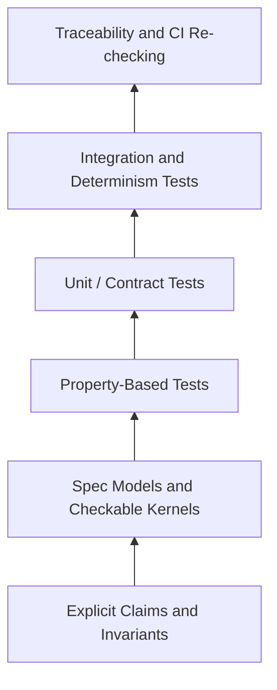

### 11.1 Claims and Evidence Sources

| Layer | Focus | Primary Sources |
|---|---|---|
| capability requirements | normative behavior | [`openspec/specs/`](openspec/specs/) |
| design claims | architecture, sequencing, invariants, safety, liveness | this document |
| implementation structure | where behavior lives and architectural boundaries | code map in [section 3](#3-architecture) and [section 14.4](#144-repository-layout) |
| executable evidence | tests and traceability runs | `test/contract/`, `test/property/`, `test/integration/`, `test/determinism/` |

### 11.2 Evidence Layers

| Layer | Coverage Focus |
|---|---|
| **Property-based tests** | Parser invariants, claim extraction invariants, clustering determinism, implication classification symmetry, blind boundary enforcement, manifest integrity, run-state monotonicity |
| **Contract tests** | CLI argument handling, config merge precedence, parser structural checks, EARS classification, LLM schema validation, SMT-LIB sanitization, manifest semantics, boundary violation detection, obligation-aware severity |
| **Integration tests** | End-to-end analyses with fixture specs plus fake `opencode` and fake `z3` adapters |
| **Determinism tests** | Re-run with fixed inputs and cached responses, then diff outputs byte-for-byte |
| **Invariant tests** | Repository-wide safety and liveness rules |
| **Fault injection tests** | Graceful degradation when adapters fail or timeout |
| **Adversarial input tests** | Malformed, hostile, or boundary-case inputs handled without crash or misleading results |
| **Oracle/golden tests** | Expected logic encodings and parser outputs as permanent fixtures |
| **Regression fixtures** | Every discovered ambiguity pattern, counterexample, and parser-loss issue as a permanent fixture |

### 11.3 Key Test Categories

**Contract tests** validate per-spec requirements:
- CLI argv parsing accepts valid flags and rejects invalid arguments
- Config loading and merge with CLI precedence
- Catalog discovery, classification, archived exclusion, delta conflict detection
- Parser EARS extraction, identifier validation, loss-aware capture
- Claim graph provenance attachment, obligation levels, orphaned-claim detection
- Coverage gap, contradiction, unsupported reference, and task inconsistency detection
- `opencode` adapter schema validation and bounded retries
- `z3` adapter timeout handling and exit classification
- SMT-LIB identifier sanitization
- Formalization sample validation (variables, functions, sorts, assertion syntax)
- Clustering stability threshold and ambiguity findings
- Logic analysis obligation-aware severity and evidence persistence
- Source traceability gap findings and scope confinement
- Code-derived generation blind boundary enforcement
- Cross-side implication classification (same/stronger/weaker/different/uncertain)
- Blind comparison boundary enforcement
- Report rendering, manifest checksums, manifest-last ordering

**Property-based tests** exercise invariants over generated inputs:
- Parser: every input line is classified or preserved as unparsed evidence
- Claim graph: every claim has provenance; no orphaned claims
- Clustering: deterministic representative selection; symmetry invariant
- SMT-LIB compilation: valid syntax after sanitization for arbitrary identifiers
- Manifest: every listed file exists and has correct checksum
- Run-state: findings never removed by later phases
- Blind boundary: original requirement text never exposed to code-derived side
- Cross-side classification: deterministic and symmetric
- Greedy matching: deterministic given same classification scores

**Spec traceability:** Every testable requirement in `openspec/specs/` carries a bracketed identifier (e.g., `[CAT-PARSE-EARS]`). Contract tests reference these identifiers via `traceSpec(...)`, and the traceability tooling validates coverage.

**Spec reference:** [`spec-traceability`](openspec/specs/spec-traceability/spec.md)

---

## 12. Distribution and Packaging

| Artifact | Format | Target |
|----------|--------|--------|
| npm package | Standard npm tarball | `npm install -g` or `npx` |
| `dist/spec-check.js` | Single-file ESM bundle (esbuild) | Node >= 20 |

**Build invariants:**
- The bundle is a single `.js` file with no external dependencies at runtime.
- `#!/usr/bin/env node` shebang is prepended.
- Source maps are excluded from the distribution artifact.
- The bundled artifact passes the same integration tests as the source tree.
- Both distribution forms preserve the same help/version surface, output contracts, and exit-code behavior.

**Parity requirement:** help/version behavior, outputs, exit codes, and command contracts match across supported forms.

**Build commands:**

| Command | Purpose |
|---|---|
| `npm run build` | TypeScript compilation (`tsc`) |
| `npm run bundle` | Single-file bundle creation (`esbuild`) |
| `npm run smoke:parity` | Build + bundle + parity verification |

Relevant code: [`build/esbuild.ts`](build/esbuild.ts), [`package.json`](package.json)

---

## 13. Security and Trust Boundaries

The tool has no end-user authentication or authorization model because it is a local CLI, but it has meaningful security boundaries:

| Concern | Design Constraint | Implementation |
|---|---|---|
| subprocess invocation | argv-based execution via `execFile`; no shell interpolation | `shell: false` in [`src/adapters/process.ts`](src/adapters/process.ts) |
| prompt injection | document content fenced in prompts; analyzed spec text never elevated into system-level instruction position | `sanitizeForCodeFence()` in [`src/domain/fence.ts`](src/domain/fence.ts); fenced prompt construction in qualitative and formalization modules |
| filesystem overreach | all writes confined to `--output` directory; output paths resolved and validated up front | `resolveConfinedOutputPath()` with `precondition` in [`src/adapters/fs.ts`](src/adapters/fs.ts) |
| SMT-LIB identifier injection | user-derived identifiers sanitized before writing SMT-LIB artifacts (unsafe characters replaced with `_` + hex escape) | `sanitizeIdentifier()` in [`src/domain/formal/smtlib.ts`](src/domain/formal/smtlib.ts) |
| blind comparison boundary | original requirement text never crosses to the code-derived comparison or generation side | Structural enforcement in [`src/domain/code-backwards/derive.ts`](src/domain/code-backwards/derive.ts) and [`src/domain/code-backwards/blind-compare.ts`](src/domain/code-backwards/blind-compare.ts) |
| subprocess output | captured via stdout/stderr arrays; no ambient shell risk | Chunked accumulation in [`src/adapters/process.ts`](src/adapters/process.ts) |
| evidence integrity | solver inputs/outputs persisted verbatim; LLM responses preserved with full content | Adapter-level persistence in analysis modules |
| output-inside-source prevention | output directory must not be inside source directory | `[CAT-CLI-OUTSRC]` check in [`src/cli/config.ts`](src/cli/config.ts) |

---

## 14. Operational Concerns

### 14.1 Observability

| Concern | Design Choice |
|---|---|
| phase progress | structured JSON events on stdout with phase name, status, timestamp, optional duration_ms |
| human diagnostics | normalized first-line stderr in the form `[spec-check] <Category>: <message>` with optional indented details |
| evidence visibility | per-phase reports preserved; provenance, identifiers, and evidence references visible |
| intermediate artifacts | solver files, clustering inputs, formalization samples, comparison artifacts preserved under output directory |
| run completion | manifest presence is the atomic completion marker; stale manifests removed at run start |

### 14.2 Deployment and Rollout

| Concern | Design Choice |
|---|---|
| primary release path | standard npm package installation |
| additional artifact | bundled `dist/spec-check.js` |
| rollback model | version-based; no persistent mutable state in v1 |
| feature flags | none required in v1; rollout is repository-local |

### 14.3 Capacity and Scaling

`spec-check` is a local single-user CLI. Scaling concerns are bounded-work and subprocess-behavior concerns rather than server-side throughput.

| Concern | Design Choice |
|---|---|
| v1 capacity targets | up to 10 spec files, low hundreds of requirements/scenarios total, modest source trees |
| LLM call cost | proportional to document count and claim count; bounded retries per call (default 3) |
| formalization cost | multiplied by sample count per claim; bounded by capability count |
| solver cost | per-query timeout (default 30s); pairwise pair budget (default 200) |
| cross-side cost | 2 Z3 calls per matched capability (aggregate) + bounded pairwise |
| source scanning | 1 MiB per-file limit; default 16 concurrent file reads |
| evidence volume | disk output grows with preserved artifacts; cost accepted because retained evidence is central to product value |

### 14.4 Repository Layout

```text
src/
  index.ts                      entrypoint, argv dispatch, exit code mapping
  version.ts                    version constant
  cli/
    run-cli.ts                  phase-group orchestration
    parse-argv.ts               hand-rolled argument parser
    config.ts                   three-tier config resolution
    phase-runner.ts             progress event decoration
    pipeline-helpers.ts         phase composition and helpers
    pipeline-types.ts           PipelineAbortError, context types
  domain/
    model.ts                    core domain types (Document, Claim, Parsed*)
    branded.ts                  phantom-branded types and factories
    errors.ts                   error hierarchy and exit code mapping
    result.ts                   Result<T,E> type
    assert.ts                   precondition/invariant/postcondition/assertNever
    logic-ir.ts                 logic IR types (sorts, variables, assertions)
    claim-graph.ts              claim extraction and normalization
    findings.ts                 finding shape types
    progress.ts                 progress event protocol
    run-state.ts                immutable append-only run state
    fence.ts                    prompt fencing utility
    tasks-analysis.ts           task analysis utilities
    parser/
      catalog.ts                input discovery and classification
      spec.ts                   spec parsing with EARS classification
      proposal.ts               proposal section parsing
      design.ts                 design section parsing
      task.ts                   task document parsing
      shared.ts                 heading, section, identifier utilities
    spec-forward/
      qualitative.ts            LLM-backed review passes (2 sequential)
      coverage.ts               deterministic coverage analysis (5 sub-analyses)
    formal/
      formalize.ts              LLM-backed formalization sampling (3-phase)
      validate.ts               logic IR schema validation
      clustering.ts             solver-backed equivalence clustering (BFS)
      smtlib.ts                 SMT-LIB compilation and sanitization
      logic-analysis.ts         per-spec solver analysis (2-phase)
      logic-analysis-sexpr.ts   s-expression parsing utilities
      logic-analysis-checks.ts  guard-activation and completeness checks
    code-backwards/
      trace.ts                  source traceability scanning
      derive.ts                 code-derived spec generation (blind)
      gen-formal.ts             code-derived formalization
      gen-logic.ts              code-derived logic analysis
      cross-implication.ts      bidirectional solver comparison
      cross-implication-smt.ts  cross-implication SMT query construction
      cross-implication-types.ts  cross-implication type definitions
      blind-compare.ts          blind LLM comparison (explanatory)
    reporting/
      render.ts                 report rendering and defect replacement
      manifest.ts               manifest construction and integrity
    prompts/
      formalization.ts          formalization prompt templates
      informalize.ts            informalization prompt templates
      blind-compare.ts          blind comparison prompt templates
      qualitative-base.ts       qualitative review prompt base
      qualitative-properties.ts qualitative properties prompt
      qualitative-review.ts     qualitative review prompt
  adapters/
    fs.ts                       confined writes, atomic temp+rename, checksums
    process.ts                  safe execFile wrapper, no shell
    opencode.ts                 LLM subprocess with NDJSON parsing, retries
    z3.ts                       solver subprocess with stdin piping, classification
    concurrency.ts              bounded parallel map with deterministic ordering
test/
  contract/                     per-spec requirement tests
  property/                     invariant tests over generated inputs
  invariant/                    repository-wide safety rules
  integration/                  multi-phase pipeline tests
  determinism/                  stable output tests
  oracle/                       expected logic encodings
  fixtures/                     test input fixtures
  support/                      test helpers and spec traceability
openspec/
  specs/
    catalog-and-parse/
    claim-graph-and-coverage/
    formalization-and-logic-analysis/
    source-traceability-and-code-backwards/
    reporting-and-evidence/
    spec-traceability/
```

---

## 15. Forward Evolution

### 15.1 Evolution Paths

- The parser is specialized to the current schema but isolated enough that future schema support could be introduced behind new parser and catalog branches.
- The claim graph creates a stable internal model that can support richer analyses later without rewriting input parsing.
- Report synthesis is separated from analysis phases so new evidence types can be added with additive report sections.
- Source-backed analysis is optional and bounded so future capability growth can happen without complicating the base specs-forward pipeline.
- The formalization and clustering pipeline can support richer logic (e.g., quantifiers, richer sorts) by extending the logic IR without changing the compilation boundary.

### 15.2 Risks and Mitigations

| Risk | Mitigation |
|---|---|
| LLM dependence can block required phases | Bound retries, validate schemas, fail hard when evidence-producing phases cannot complete |
| Strict failure posture may frustrate users who want partial results | Preserve intermediate diagnostics and make failure causes explicit so reruns are actionable |
| Specialized parsing may need maintenance as schema evolves | Keep parser logic modular and loss-aware so drift is surfaced early |
| Evidence preservation increases disk output | Accept the cost because retained evidence is central to product value |
| Source-backed comparison can overstate confidence if evidence boundaries are loose | Keep declared source scope explicit and enforce the blind-comparison boundary |
| Code-derived formalization doubles LLM and solver cost with `--src` | Symmetric formal pipeline is necessary for solver-backed classification; cost bounded by capability and claim count |
| Cross-side implication may be inconclusive for complex claims | Preserve uncertainty honestly and fall back to blind comparison as the explanatory layer |

### 15.3 Alternatives Considered

| Alternative | Why Rejected |
|---|---|
| Generic Markdown AST first | Schema is constrained; product needs deterministic, loss-aware structural extraction more than generic Markdown completeness |
| LLM-heavy end-to-end analysis | Would weaken determinism, auditability, and failure isolation |
| Single-pass formalization without clustering | Ambiguity in formalization is itself useful evidence and must be surfaced rather than hidden |
| Best-effort partial success when critical phases fail | Incomplete evidence could be mistaken for a trustworthy result |
| Temp-file piping for Z3 instead of stdin | Stdin piping is simpler, avoids temp-file cleanup, and avoids path-safety concerns |

---

## 16. Pipeline and Output Summary

### 16.1 Specs-Forward Pipeline

| Step | Output | Description |
|---|---|---|
| Qualitative review (pass 1) | `report_1.1.md` | Independent evaluation of proposal, design, and spec files for inconsistencies, contradictions, ambiguity |
| Qualitative review (pass 2) | `report_1.2.md` | Rigorous assessment ensuring proposal and design capture all preconditions, postconditions, invariants, failure modes |
| Coverage analysis | `report_1.3.md` | Cross-artifact coverage, contradiction, and semantic alignment |
| Formalization | `smt/` directory | SMT-LIB artifacts from formalized claims |
| Solver analysis | `report_1.logic.md` | Z3 evaluation including counterexamples |
| Source traceability | `report_1.src.md` | Requirement/scenario tracing to code (when `--src` provided) |
| Tasks analysis | `report_1.tasks.md` | Task consistency with specs (when `tasks.md` provided) |
| Synthesized summary | `report_1.md` | Combined findings from all specs-forward passes |

### 16.2 Code-Backwards Pipeline (when `--src` provided)

| Step | Output | Description |
|---|---|---|
| Code-derived spec generation | `gen_specs/` directory | EARS-preferring specs per capability from source evidence |
| Code-derived formalization | `gen_specs_smt/` directory | SMT-LIB artifacts from code-derived specs |
| Code-derived solver analysis | `report_2.logic.md` | Internal consistency of code-derived formalizations |
| Cross-side implication | persisted queries | Solver-backed classification (same/stronger/weaker/different/uncertain) |
| Blind comparison | `report_2.compare.md` | Explanatory rationale with dual-layer evidence |
| Synthesized summary | `report_2.md` | Combined findings from all code-backwards passes |

### 16.3 Completion

| Artifact | Description |
|---|---|
| `report_summary.md` | Synthesized summary across all phases with category counts and skipped-phase reporting |
| `manifest.json` | Completion record listing all produced files with SHA-256 checksums; written last |

### 16.4 CLI Interface

```
spec-check [OPTIONS] [INPUT FILES]
```

| Flag | Purpose | Default |
|---|---|---|
| `--output` | Output directory for reports and evidence | `./build/spec-check` |
| `--src` | Source code directory (enables code-backwards mode) | not set |
| `--caps` | Capability listing file | inferred from input files |
| `--z3` | Path to Z3 binary | `z3` on PATH |
| `--config` | JSON configuration file for model and prompt settings | not set |
| `--pair-budget` | Maximum N*M pairwise comparisons per capability | `200` |
| `--model` | LLM model identifier for `opencode` | adapter default |
| `--help` | Print help and exit | -- |
| `--version` | Print version and exit | -- |

### 16.5 Cross-Side Implication Tiering

| Tier | When | Cost | Output |
|---|---|---|---|
| Tier 1 (Aggregate) | Always for matched capabilities | 2 Z3 calls per matched capability | `capability_aggregate` classification |
| Tier 2 (Pairwise) | When N*M within `--pair-budget` | Up to N*M*2 Z3 calls | `cross_implication` per matched pair; `unmatched_original` and `unmatched_generated` for surplus |

Classification rules: both directions hold = same; only code->original = stronger; only original->code = weaker; neither = different; any inconclusive = uncertain.

Greedy matching is deterministic: sorted by classification score (same=4, stronger=3, uncertain=2, weaker=1, different=0), with lexicographic claim ID as tiebreaker.

Per-capability divergence detection: when >50% of pairs classify as different or weaker, a `high_divergence` error finding is emitted.

---

## 17. Relationship to Other Documents

| Document | Relationship |
|---|---|
| [`openspec/specs/`](openspec/specs/) | Defines the normative behavior for each capability; this document explains the design that ties those specs to the implementation |
| [`docs/lfm.md`](docs/lfm.md) | Explains the assurance posture and evidence model |
| [`docs/spec_traceability.md`](docs/spec_traceability.md) | Explains the traceability contract between specs, tests, and identifiers |
| [`docs/typescript_style.md`](docs/typescript_style.md) | Explains how the implementation should embody the design |
| Archived core change under [`openspec/changes/archive/2026-06-18-spec-check-core/`](openspec/changes/archive/2026-06-18-spec-check-core/) | Historical source material for the initial design baseline |
| [`pasture/concept.md`](pasture/concept.md) | Original concept document; useful background, but where it differs from current specs or code, the active specs and implementation win |

### 17.1 Normative vs Explanatory

- The normative behavioral contract lives in [`openspec/specs/`](openspec/specs/).
- This document explains the design that ties those specs to the current implementation and test strategy.
- Where archived concept/design text conflicts with current code or active specs, the active specs and implementation win.

---

## 18. Maintenance Rules

This is a living document.

Update it when:

- pipeline phases or analysis modes change
- state machines change
- evidence preservation or output format rules change
- invariants or source-of-truth boundaries change
- failure contracts or exit codes change
- safety or liveness guarantees change
- verification expectations change
- new capabilities are added or existing capabilities are modified
- the CLI interface changes
- new branded types, error categories, or assertion patterns are introduced

Maintenance guidance:

- Summarize durable design intent rather than copying every requirement from the specs verbatim.
- Keep capability-specific sections linked to the relevant OpenSpec specs.
- Prefer stable module links over line-number-heavy implementation commentary.
- Ensure new code, tests, and specs continue to support the claims made in this document.
- Keep the numbered section structure when adding new sections.
- Preserve the separation between design intent here and normative behavior in the capability specs.
- When the repository layout changes, update section 14.4 alongside the code change.
- Keep numbered invariant IDs stable across revisions; add new IDs at the end of each series.
