## Context

### Current State

`runReportingPhase` writes phase reports and `report_summary.md`, computes checksums for all core artifacts, and writes `manifest.json` as the final core output. The manifest is removed at the start of the next run so that its presence identifies a completed analysis. The selected prompt F depends on this contract: it reads the manifest first, inventories the evidence directory, and qualifies unmanifested evidence.

All current LLM phases use `callOpencode`, which executes `opencode run` with argv-only process spawning, captures JSON events, extracts text payloads, and applies phase-specific schema validation. Current phases return their complete result through stdout and do not give the model write access. The final report differs: evaluation showed that report-capable models may naturally write a file, while a complete Markdown report is a poor fit for the existing bounded JSON-response protocol.

`RunConfig.output` is branded as an absolute `OutputDirPath`, but `resolveRunConfig` currently preserves a relative spelling. Filesystem helpers call `resolve()` internally, which masks the mismatch for existing writes. Runtime-bound prompt paths and exact permission rules require the invariant to hold at configuration resolution.

### Constraints and Architecture Drivers

- Prompt F must observe a valid completion manifest, so final-report generation occurs after core completion.
- `report.md` is useful but not required evidence; report failure must not cause a fatal analysis result.
- The agent needs broad read access but exactly one writable path. The built-in `build` agent is too permissive.
- OpenCode permissions are configuration-driven. Inline `OPENCODE_CONFIG_CONTENT` has higher precedence than project and user configuration, except managed administrator policy.
- The process boundary remains argv-only and must not use `--auto`.
- The report body is written by the agent. Stdout carries only a bounded acknowledgment.
- The model acknowledgment is untrusted. The filesystem is the source of truth for report existence and validity.
- Existing core-manifest checksums remain mechanically valid after warning persistence.
- Verification follows `docs/lfm.md`: state critical properties first, model the lifecycle, connect the model to implementation with a pure transition oracle, add generated histories and fault injection, and retain regressions for counterexamples.

## Goals

- Produce one decision-oriented `report.md` from every completed evidence bundle when the final-report dependency behaves correctly.
- Preserve core-run completion under every handled final-report failure.
- Make success and failure outcomes mutually exclusive, exhaustive, and observable.
- Limit agent writes to one exact path and reject symlink or non-regular output.
- Keep the report deliberately outside the core manifest without weakening checksum integrity for manifested files.
- Remove stale and invalid output so report presence always refers to the current run.
- Keep prompt content consistent between source and bundled distribution.
- Bound report size, invocation time, adapter retries, and agent capabilities.

### Non-Goals

- The final report is not a new authority over the evidence bundle.
- The final report is not a completion marker and is not checksummed by `manifest.json`.
- The design does not change prompt F's evidence interpretation or report sections except for transport instructions.
- The design does not guarantee cleanup after `SIGKILL`, host loss, or storage loss.
- The design does not add a report-specific model or timeout configuration.
- The design does not permit arbitrary shell commands as an alternative report-writing mechanism.

## Proposed Design

### System Model

```mermaid
stateDiagram-v2
    [*] --> Preparing
    Preparing --> CoreReporting: stale report removed
    CoreReporting --> CoreComplete: core manifest written
    CoreComplete --> Generating: start restricted agent
    Generating --> Validating: process returns acknowledgment
    Generating --> Cleaning: adapter failure
    Validating --> ReportAvailable: acknowledgment and file valid
    Validating --> Cleaning: acknowledgment or file invalid
    Cleaning --> WarningPersisted: candidate absent; summary rewritten; manifest refreshed
    ReportAvailable --> [*]
    WarningPersisted --> [*]
```



The state machine has one important asymmetry. `CoreComplete` is already a successful analysis state. `ReportAvailable` and `WarningPersisted` are post-completion refinements. Neither can transition to an analysis-failed state. On the failure path, the refreshed manifest is again the final core-artifact write. On the success path, `report.md` intentionally postdates the core manifest.

### Component Descriptions

- **Final-report prompt builder**: embeds the updated prompt F and replaces declared placeholders with absolute evidence and report paths. It also states the exact write boundary and acknowledgment schema. The builder is pure.
- **Transient agent policy builder**: produces isolated inline and on-disk OpenCode configuration for a dedicated primary agent. OpenCode runs with `--pure`, an isolated `--dir`, `OPENCODE_CONFIG`, `OPENCODE_CONFIG_DIR`, and `XDG_CONFIG_HOME`; formatters, LSP, and MCP are disabled. The policy allows required reads, denies powerful tools, and allows edit only for the exact report path.
- **OpenCode adapter extension**: adds the `final-report` phase, `--agent <restricted-name>`, and `--dir <workspace-root>`. It supplies the inline configuration through the child environment, omits `--auto`, and validates `{ "report_path": string }` with no additional properties required for success.
- **Final-report generator**: resolves the one destination, invokes the adapter, compares the acknowledgment path by exact absolute-string equality, independently validates the filesystem object, and returns a typed `Result`.
- **Report validator**: uses `lstat` before any content read, rejects symlinks and non-regular files, rejects byte size greater than 1,048,576, then reads UTF-8 and rejects whitespace-only content. It reads only the precomputed confined destination, never the acknowledgment path.
- **Lifecycle orchestrator**: removes stale output before ingestion, writes core reports and the core manifest, invokes final-report generation, and handles the terminal result. Failure cleanup removes the report destination, appends one well-formed warning, rewrites the summary, rebuilds its manifest entry, and atomically refreshes the manifest.
- **Reference lifecycle model**: a small pure TypeScript transition function mirrors the Alloy states and legal events. Property and differential tests compare generated event histories against orchestration-observable outcomes.

### System Invariant Tactics

- **Core-completion monotonicity**: final-report generation is called only after `writeManifest` succeeds. The generator returns `Result` and never throws for expected adapter, acknowledgment, or report-validation failures. The orchestrator maps `Err` to warning persistence rather than `PipelineAbortError`.
- **Terminal partition**: the pure lifecycle reducer has two handled terminal states, `report_available` and `warning_persisted`. Invalid transitions are rejected. The orchestrator has one success branch and one failure branch corresponding to those states.
- **Manifest exclusion**: `report.md` is never converted to a `ManifestEntry`; manifest construction accepts only existing core descriptors. Contract and property tests assert exclusion in success and failure histories.
- **No invalid residue**: all handled failures converge on one cleanup function that removes the confined destination with force semantics before the warning is persisted. Cleanup itself is mandatory; if cleanup cannot establish absence, the system must surface an output failure rather than falsely claim `warning_without_report`.
- **Single-writer confinement**: inline agent configuration uses a deny-first edit map followed by one exact allow rule. Bash and delegation are denied. `--auto` is absent. The validator never follows an acknowledged path.
- **Path agreement**: configuration resolves output absolute once; `resolveConfinedOutputPath(output, "report.md")` derives the destination; the prompt, permission rule, acknowledgment comparison, and validator use that same string.
- **Permission-pattern safety**: request construction rejects evidence or report paths containing OpenCode wildcard metacharacters `*` or `?`; the optional phase degrades rather than widening edit authority.
- **Validation authority**: acknowledgment validation is necessary but insufficient. Success is returned only after independent `lstat`, size, and content checks.
- **Warning integrity**: warning state is added before rerendering `report_summary.md`. The final summary descriptor replaces the original summary descriptor before manifest entries are rebuilt, and `writeManifest` occurs after the rewritten summary.
- **Prompt parity**: a contract test normalizes only declared placeholders and transport instructions, then compares `report_prompts/prompt_f.md` with the embedded prompt constant. Distribution tests execute the bundled builder against the same fixtures.

### Quality Attribute Tactics

- **Correctness**: use one destination value throughout, a closed error union, a pure lifecycle reducer, postcondition assertions, and model/differential/property tests.
- **Security**: deny shell and subagents, exact-path edit allowlist, `lstat` symlink rejection, no `--auto`, argv-only process invocation, and managed-policy failures that fail closed.
- **Reliability**: retain adapter timeout and retry behavior, classify expected failures as data, converge on centralized cleanup, and preserve the expensive core result.
- **Integrity**: keep the derivative outside the manifest by type and construction; refresh core checksums after failure-warning persistence.
- **Boundedness**: 1 MiB file limit, one logical final-report call, current bounded retry count, configured timeout per adapter attempt, small acknowledgment schema, and finite lifecycle transitions.
- **Portability**: resolve output and workspace paths before prompt construction, pass values as argv/environment entries rather than shell text, and test spaces and relative spellings.
- **Auditability**: emit normal phase progress, return stable final-report error kinds, and persist a fully shaped warning with category, provenance, rationale, and evidence.

### Interaction Protocols

1. **Run preparation**: remove stale `manifest.json`, prior formalization evidence, and `report.md` before any analysis phase. These targets are disjoint; cleanup may run concurrently only if failure propagation remains deterministic.
2. **Core reporting**: render phase reports and summary, write optional metrics, then atomically write the core manifest.
3. **Request construction**: derive absolute evidence and report paths from the resolved output; derive an absolute workspace root; build prompt and inline restricted-agent configuration from these values.
4. **OpenCode invocation**: execute `opencode run --pure <prompt> --model <model> --format json --agent spec-check-final-report --dir <isolated-root>` plus the existing model variant. The isolated root is also `OPENCODE_CONFIG`, `OPENCODE_CONFIG_DIR`, and `XDG_CONFIG_HOME`; formatter, LSP, and MCP surfaces are disabled. The analyzed workspace is named in the prompt and explicitly allowlisted for external reads. Do not include `--auto`.
5. **Acknowledgment**: parse existing OpenCode JSON events. The final text payload must decode to an object with a non-empty `report_path`. Compare its normalized absolute spelling to the precomputed exact destination; do not read any alternate path.
6. **File validation**: `lstat` the destination, reject links and non-files, reject `size > 1 MiB`, read UTF-8, and require `content.trim().length > 0`.
7. **Success**: preserve the validated file, emit completed progress, return state without adding a finding, and do not rewrite the manifest.
8. **Failure**: remove the destination, append one warning, invalidate the old manifest, rerender the summary from updated state, replace its core descriptor, and write a fresh manifest with checksums for final core bytes. Persistence failure leaves no stale completion marker. The warning can cause CLI exit code `1`, but it is not fatal.

### Forward Evolution

- A future opt-out flag can guard the post-completion transition without changing core reporting.
- A future detached signature or separate derivative manifest can cover `report.md` without placing it in the core completion manifest.
- A future report schema can add metadata to the acknowledgment while retaining file validation as authority.
- Additional post-completion derivatives can reuse the lifecycle pattern only if each gets a separate exact write target and does not weaken core completion.

### Costs

- One additional LLM call per successful core run, with the same configured per-attempt timeout and adapter retry policy.
- One full read of a report bounded to 1 MiB.
- On failure, one additional summary render and manifest rewrite.
- Small maintenance cost for canonical/embedded prompt parity and OpenCode permission-schema compatibility.

### Alternatives Considered

- **Generate before the manifest and include the report**: rejected because prompt F requires a completed manifest and would otherwise inspect an incomplete bundle.
- **Write a provisional manifest, generate, then replace it**: rejected because a provisional completion marker can be observed as successful and complicates crash semantics.
- **Capture Markdown on stdout**: rejected because existing adapter parsing expects a structured payload and evaluations showed model-dependent truncation or file-writing behavior.
- **Use the built-in `build` agent**: rejected because it grants unnecessary shell and workspace mutation capabilities.
- **Trust the acknowledgment**: rejected because model output cannot establish filesystem type, path safety, completeness, or size.
- **Attach the whole evidence bundle as files**: rejected because the bundle can be large, the prompt explicitly requires inventory and selective validation, and the agent already has bounded read access.
- **Manifest the post-completion report**: rejected because the report depends on the manifest and would create a cyclic or two-generation integrity contract.

## Component Design

### Key Components

1. `buildFinalReportPrompt(evidenceDir, reportPath)` is pure and requires absolute paths.
2. `buildFinalReportAgentConfig(evidenceDir, reportPath)` is pure and returns serialized inline OpenCode configuration with deny-first permissions and exact report edit access.
3. `callOpencode` gains final-report invocation controls and acknowledgment schema validation while retaining event extraction, retries, timeout, telemetry, and argv-only execution.
4. `generateFinalReport` owns request construction, invocation, path agreement, validation, and typed failure classification.
5. `validateFinalReport` owns filesystem-object and content checks at the trusted destination.
6. `removeFinalReport` owns idempotent confined cleanup for stale and failed output.
7. `reduceFinalReportLifecycle` is a pure reference model used by production assertions and tests.
8. `runReportingPhase` owns ordering, warning creation, summary regeneration, and manifest refresh.

### Data Design

```ts
const FINAL_REPORT_PATH = "report.md";
const FINAL_REPORT_MAX_BYTES = 1_048_576;

interface FinalReportAcknowledgment {
  readonly report_path: string;
}

type FinalReportErrorKind =
  | "agent_failed"
  | "acknowledgment_invalid"
  | "path_unsupported"
  | "path_mismatch"
  | "report_missing"
  | "report_symlink"
  | "report_not_regular"
  | "report_empty"
  | "report_too_large"
  | "report_unreadable";

interface FinalReportError {
  readonly kind: FinalReportErrorKind;
  readonly message: string;
}

type FinalReportState =
  | "not_started"
  | "core_complete"
  | "generating"
  | "validating"
  | "cleaning"
  | "report_available"
  | "warning_persisted";
```

Encoding and validity rules:

- `RunConfig.output`, workspace root, evidence directory, and report path are absolute platform paths.
- Evidence and report paths used in permission patterns contain neither `*` nor `?`; paths that do return `path_unsupported` before OpenCode is invoked.
- `report_path` is UTF-8 JSON text and must be a non-empty string. Extra acknowledgment fields may be rejected to keep the protocol minimal.
- Runtime paths in the prompt are encoded as JSON string literals, so quotes, backslashes, spaces, Unicode, and non-pattern metacharacters preserve their exact decoded value.
- Path equality is evaluated on pre-resolved absolute strings. The acknowledgment does not select a path.
- `report.md` is UTF-8 Markdown, has at least one non-whitespace character, and has at most 1,048,576 bytes according to `lstat.size` before read.
- A symbolic link is invalid even if its target is a regular file inside the output directory.
- The warning uses severity `warning`, category `reporting.final_report_failed`, provenance file `<reporting>`, a non-empty rationale, and evidence containing the stable failure kind.
- Inline agent configuration has a fixed private agent name and contains no credentials. Environment construction inherits the parent environment and overrides only `OPENCODE_CONFIG_CONTENT`.

### Interface Contracts

`resolveRunConfig`:

- **Postcondition**: `output === path.resolve(rawOutput)` and satisfies the `OutputDirPath` absolute-path invariant.
- **Compatibility**: output-inside-source validation continues to compare resolved paths. User-facing behavior and destination are unchanged for relative output values.

`buildFinalReportPrompt`:

- **Preconditions**: evidence and report paths are absolute; report path is the confined `report.md` destination.
- **Postconditions**: no unresolved placeholder remains; both paths occur in unambiguous delimited instructions; report content is requested on disk; stdout is restricted to the acknowledgment.
- **Invariant**: evidence paths are data, not shell syntax.

`buildFinalReportAgentConfig`:

- **Postconditions**: defines `spec-check-final-report` as a primary agent; allows read/search; denies bash and delegation; edit rules deny `*` then allow exactly `reportPath`; external-directory rules grant only access required for the evidence/report directory outside the workspace.
- **Invariant**: `--auto` is not required and remains absent.

`generateFinalReport`:

- **Precondition**: core manifest exists and the destination was cleared for this run.
- **Success postcondition**: returned path is `report.md`; returned content is the exact validated UTF-8 bytes represented as text; destination satisfies all file invariants.
- **Error postcondition**: returns a stable error kind; the orchestrator owns mandatory destination cleanup.
- **Safety**: never follows or reads the acknowledgment path; it reads only the precomputed destination.

`runReportingPhase`:

- **Ordering**: core outputs -> core manifest -> final-report attempt -> success terminal, or cleanup -> warning summary -> refreshed manifest -> failure terminal.
- **Postcondition**: a handled attempt ends in exactly one terminal state.
- **Failure boundary**: cleanup or warning-persistence I/O failure is an output failure because the `warning_without_report` postcondition cannot be established safely.

### Code Map

- `report_prompts/prompt_f.md`: canonical evaluated prompt with runtime placeholders and file-output protocol.
- `src/domain/prompts/final-report.ts`: embedded prompt, pure substitution, and transient-agent policy builder.
- `src/adapters/opencode.ts`: phase union, argv/environment controls, and acknowledgment validation.
- `src/adapters/process.ts`: optional inherited environment override for the transient inline configuration.
- `src/adapters/fs.ts`: confined report removal and safe report metadata/read boundary, or narrow helpers called by reporting.
- `src/domain/reporting/final-report.ts`: lifecycle types, pure reducer, generator, validation classification, and constants.
- `src/cli/config.ts`: absolute output resolution.
- `src/cli/run-cli.ts`: stale cleanup, post-manifest orchestration, warning state, summary rerender, and manifest refresh.
- `test/contract/`: prompt, policy, adapter, config, validator, and distribution contracts.
- `test/property/`: lifecycle histories, terminal partition, path substitution, and manifest exclusion.
- `test/integration/`: successful and degraded pipeline flows.
- `test/invariant/`: global safety/liveness registration.

## Failure and Reliability

### Failure Mode Analysis

- **Unsafe inputs**: relative or traversing destinations, malformed acknowledgment paths, symlink destinations, oversized content, whitespace-only content. Controls: absolute configuration, confined destination derivation, exact path equality, `lstat`, byte bound, content validation.
- **Fragile formats**: invalid OpenCode event JSON, wrapped or malformed acknowledgment JSON, invalid UTF-8 replacement behavior. Controls: existing event parser and phase schema; report validity relies on bounded UTF-8 read and non-whitespace content, not Markdown parsing.
- **Inadequate control actions**: an agent denial prevents the legitimate write; cleanup fails; summary rewrites but manifest refresh fails. Controls: fail closed to warning for agent denial; treat inability to clean or persist consistent warning evidence as output failure.
- **Process model flaws**: acknowledgment claims success without a file; a file changes between `lstat` and read; agent mutates another path. Controls: acknowledgment is non-authoritative; exact edit permission; post-read size check can confirm read bytes remain bounded; security tests inspect resolved policy. The local filesystem is assumed not to be concurrently adversarial.
- **Coordination failures**: concurrent runs target one output directory; consumers read `report.md` while the agent writes it; process termination leaves partial output after core completion. Controls: existing single-run assumption; no stronger concurrency support is introduced; next-run stale cleanup; report is optional until validation completes. Documentation states that manifest completion does not guarantee report availability.

### Control and Recovery

- Adapter retries only the existing transient OpenCode error kinds and remains timeout-bounded.
- Every handled generation or validation failure converges on idempotent report cleanup.
- Warning persistence is ordered after cleanup and before the refreshed manifest.
- Stale report cleanup at the next run recovers from prior termination that bypassed handled cleanup.
- Managed policy that denies required access causes safe report failure, not policy bypass.
- No retry is added around invalid report shape or path mismatch; repeating an identical request does not repair deterministic protocol violations beyond the adapter's existing response retries.

## Operational Concerns

### Observability

- Emit a named `final-report` progress phase with started, completed, or failed/degraded outcome consistent with existing progress conventions.
- Record OpenCode telemetry under phase `final-report`, including model, variant, duration, token usage, and terminal adapter outcome.
- The in-memory run collector records final-report telemetry. Opt-in `metrics.json` remains a core-completion snapshot and intentionally excludes this post-completion phase so report success does not require rewriting core evidence.
- Persist degradation as `reporting.final_report_failed` with stable failure-kind evidence.
- Do not log report content or inline permission configuration beyond bounded diagnostics.

### Deployment and Rollout

- Ship source and bundled prompt support together; distribution parity is a release gate.
- No persistent data migration is required. Existing output directories are compatible because stale `report.md` is removed at run start.
- OpenCode versions lacking required permission or inline-config behavior fail the optional phase safely and produce a warning.

### Capacity and Scaling

- One report call is added after each successful run. It may inspect the full evidence bundle, so latency is model- and bundle-dependent but bounded by the existing timeout and retries; captured stdout plus stderr is bounded to 1 MiB.
- Accepted and retained report storage is capped at 1 MiB. A direct agent write can transiently exceed that size before process completion; validation rejects and cleanup removes it on handled paths.
- Warning-path summary and manifest rewrites are proportional to existing finding and manifest sizes and occur at most once per run.

## Security

- The transient primary agent denies shell, task delegation, web access, skills, questions, and todo tools.
- Read/search permissions cover the workspace and configured evidence directory. Edit permission denies all paths except the exact report destination.
- External-directory permission is granted only when required for configured output outside the workspace and does not broaden edit permission.
- The process does not use `--auto`; any unspecified permission remains denied by the generated agent policy.
- The implementation passes prompt, paths, and configuration without shell interpolation.
- `lstat` rejects symlinks before content read. Validation never follows a model-selected path.
- Core evidence and analyzed inputs remain read-only during the post-completion step.
- The inline config contains policy only and is not persisted as evidence.

## Risks / Trade-offs

- **[Manifest is not the last physical write on report success]** -> Define it precisely as the last core-evidence write and sole core-completion marker; specify `report.md` as an optional derivative.
- **[Direct agent write is not atomically published]** -> Validate only after process completion, remove invalid/partial output on handled failure, and clear stale output at the next run; document process-termination limits.
- **[OpenCode permission syntax or precedence changes]** -> Pin behavior with adapter contract tests against generated argv/config and a guarded live test; fail closed to warning.
- **[OpenCode wildcard rules cannot quote literal `*` or `?`]** -> Reject those paths for the optional phase and persist a warning; continue to support spaces, Unicode, quotes, `$`, and other non-pattern characters without shell interpolation.
- **[Managed policy overrides inline permission]** -> Accept the denial as an optional report failure; never use `--auto` or broaden permissions to bypass policy.
- **[Model writes another file despite policy]** -> Deny all non-target edits mechanically; integration-test sentinel files and policy patterns.
- **[Report output is valid but low quality]** -> Retain evaluated prompt F and parity tests; content-quality reevaluation remains a separate process.
- **[Concurrent filesystem actor changes report between metadata and read]** -> Preserve the existing single-writer output-directory assumption; use one precomputed path and reject links. Strong hostile-filesystem race resistance is out of scope.
- **[Warning changes a clean run to exit code 1]** -> Preserve the existing rule that warnings are findings; document that report failure is nonfatal but observable.

## Migration Plan

1. Add absolute output resolution and update config contracts.
2. Add prompt and restricted-agent policy builders with parity tests.
3. Extend process and OpenCode adapters behind the new phase without changing existing phase argv.
4. Add final-report lifecycle, validation, and cleanup helpers.
5. Wire run-start cleanup and post-manifest orchestration, then add warning-path summary/manifest refresh.
6. Update specifications, Alloy model, docs, and distribution artifact tests.
7. Run full verification before release.

Rollback removes the post-manifest invocation and stale-report cleanup. Existing `report.md` files are unmanifested and may be manually removed; no core manifest or persisted data migration must be reversed.

## Verification Strategy

The verification stack forms a small dependability case rather than relying on implementation-authored examples alone.

### Claims and Assumptions

- Claims: terminal partition, completion monotonicity, manifest exclusion, no invalid residue, exact write confinement, path agreement, warning checksum integrity, and bounded work.
- Assumptions: one pipeline writer per output directory; OpenCode enforces its documented permission matching; managed policy may deny but not silently broaden the generated agent policy; uncatchable process termination can bypass cleanup.

### Alloy Model

`specs/reporting-and-evidence/alloy/final-report.als` models core completion, report attempt, validation, cleanup, warning persistence, manifest refresh, and stuttering. It checks:

- report generation never starts before core completion;
- success and warning terminal states are mutually exclusive;
- terminal success has a valid unmanifested report;
- terminal failure has warning evidence and no report residue;
- report outcome never revokes core completion;
- warning completion follows manifest refresh;
- manifested files never include the report;
- under a weak fairness assumption that an active handled attempt eventually takes a non-stutter transition, every attempt eventually reaches one terminal state.

Commands include positive success and failure witnesses, bounded safety checks, initiation/preservation checks where useful, and liveness checks with explicit fairness and step bounds. Analyzer results are reported as bounded evidence, not proof.

Post-review Alloy 6.2.0 recheck on 2026-08-24: all four success, handled-failure, and output-failure witnesses were SAT, and all twelve safety and progress-qualified liveness checks were UNSAT within four atoms and twelve steps. The strengthened model represents acknowledgment-with-missing-file, cleanup, marker invalidation, summary rewrite, manifest refresh, and output failure. Candidate presence becomes authoritative only at validation success; partial failed writes are abstracted because all handled failure paths converge on cleanup. The full-snapshot reducer is called as a production postcondition oracle and generated histories connect the same transition kernel to observed outcomes.

### Executable Reference Model and Differential Tests

- Implement a pure lifecycle reducer with the same states and event guards as the Alloy model.
- Generate legal and illegal event histories with `fast-check`.
- Compare reducer terminal state to the observable orchestrator result under a fake adapter/filesystem boundary.
- Assert the same partition, ordering, and cleanup properties after every generated step.

### Contract Tests

- Absolute config output for default, CLI, config-file, parent segments, and paths containing spaces.
- Prompt substitution leaves no placeholders and names exactly the evidence and report paths.
- Canonical prompt and embedded prompt parity; source and bundled builder parity.
- Generated agent policy denies all edits except the exact report path, denies bash/task/web, grants required reads/external-directory access, and requires no `--auto`.
- OpenCode argv includes `--agent` and `--dir`; existing phases remain unchanged.
- Acknowledgment accepts only the required shape and rejects missing, empty, non-string, and wrong-path values.
- Validation accepts a bounded regular file and rejects missing, symlink, directory, special-file where testable, empty, whitespace-only, oversized, and unreadable output.

### Property and Metamorphic Tests

- For generated absolute paths, substitution and policy serialization preserve paths exactly, including spaces and metacharacters, without shell interpretation.
- For generated lifecycle histories, terminal states are exclusive and exhaustive and core completion is monotonic.
- For every generated manifest descriptor set, adding a successful report never adds a `report.md` entry.
- For every generated failure kind, cleanup produces absence before warning persistence.
- Repeating stale cleanup is idempotent.
- Changing report content without changing core files leaves core manifest construction unchanged; changing warning summary bytes changes its checksum.

### Fault Injection

- Inject each terminal `OpencodeError.kind`, malformed events, malformed acknowledgment, path mismatch, missing file, partial write, symlink, oversized file, `lstat` failure, read failure, cleanup failure, summary rewrite failure, and manifest refresh failure.
- Assert core completion survives expected generation/validation failures.
- Assert cleanup and persistence failures do not falsely claim the handled terminal postcondition.
- Simulate termination residue by precreating partial `report.md`, then verify next-run cleanup before any new phase work.

### Integration and Security Tests

- Success: fake report agent writes a valid file and acknowledgment; report remains, manifest excludes it, and sentinels are unchanged.
- Nonfatal failure: agent fails or writes invalid output; report is absent, warning is in summary, refreshed manifest checksum matches, and the returned run state contains the warning.
- Permission integration: invoke a controlled OpenCode test agent that can write the target but is denied a sibling sentinel path; keep this guarded from normal offline tests if provider access is required.
- Distribution: bundled CLI contains and uses the same prompt and phase protocol.
- Interruption recovery: a completed core manifest plus stale/partial report is cleaned at the next run start without treating the previous core run as incomplete.

### Static and CI Evidence

- `npm run lint`, `npm run build`, `npm test`, `npm run test:trace`, and `npm run bundle` must pass.
- Run distribution contract tests against `dist/spec-check.js`.
- Run the Alloy model with the repository Alloy tool and require expected SAT witnesses and UNSAT checks.
- Run `openspec validate add-final-evidence-report --strict`.
- Record every discovered counterexample as a deterministic regression test and update the model/spec if it exposes a missing assumption.

## Open Questions

- None blocking. The 1 MiB bound and inline restricted-agent configuration are design decisions for this change and can be revised only with corresponding specification and verification updates.
