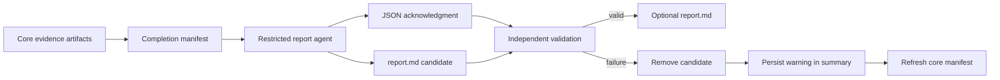

## Motivation

`spec-check` produces detailed phase reports, raw evidence, a summary, and a completion manifest. Engineers must still perform a separate synthesis pass before they can decide what to fix. The evaluated `report_prompts/prompt_f.md` prompt performs that synthesis well, but it is not part of the normal command. This leaves the most decision-oriented artifact dependent on a manual, inconsistently configured agent invocation.

This change adds a bounded final-report step that reads a completed evidence bundle and writes `report.md`. The report is deliberately a post-completion derivative rather than evidence used to establish pipeline completion. A report-generation failure therefore does not invalidate successful analysis. It removes any partial report and records a warning in the checksummed core bundle.

## Scope

### In Scope

- Generate `report.md` after the phase reports, `report_summary.md`, and the core `manifest.json` establish that analysis completed.
- Use the evaluated prompt F with runtime-bound absolute paths for the configured evidence directory and exact report destination.
- Give the final-report agent read access to the workspace and evidence bundle, and write access only to the designated `report.md` path.
- Require the agent to save the Markdown report to disk and return only a small JSON acknowledgment naming that path.
- Validate the acknowledgment and independently validate the file as a non-symlink regular file with non-whitespace Markdown content and a maximum size of 1 MiB.
- Keep `report.md` outside `manifest.json` because the report is produced after core completion and derives from the manifested evidence.
- Remove a stale `report.md` before a new run starts.
- Treat every final-report failure as nonfatal: remove any partial or invalid report, append a `reporting.final_report_failed` warning, rewrite `report_summary.md`, and refresh `manifest.json` so its checksum remains valid.
- Resolve the configured output directory to an absolute path before it enters the pipeline.
- Preserve prompt parity between the repository prompt and the prompt embedded in the bundled distribution.
- Extend the reporting lifecycle model and verification evidence for report success, failure, cleanup, permissions, path confinement, and manifest exclusion.
- Update user-facing and architecture documentation for the new artifact and its completion semantics.

### Out of Scope

- Making `report.md` mandatory for a successful analysis run.
- Adding `report.md` to `manifest.json` or using it as evidence for its own generation.
- Changing the content strategy selected by the prompt evaluation, beyond the instructions needed for runtime paths, restricted file writing, and acknowledgment.
- Changing existing analysis phases, phase reports, solver behavior, or source-backed analysis behavior.
- Adding a CLI flag to disable final-report generation or select a separate report model.
- Rerunning the report-prompt evaluation.
- Guaranteeing cleanup after uncatchable process termination such as `SIGKILL` or host failure.

## Context

### Background

The reporting phase currently writes phase reports and `report_summary.md`, then writes `manifest.json` last as the sole core-run completion marker. Prompt F requires the reviewer to read `manifest.json` first, inventory the evidence directory, and distinguish manifested evidence from integrity-unverified artifacts. It therefore cannot run correctly before the manifest exists.

Evaluations in `pasture/report_prompts_eval*` selected prompt F as a strong decision-oriented report prompt. They also exposed runner variability: some models entered plan mode or wrote a report to disk instead of returning it on stdout. The final-report protocol addresses this by requiring a designated file write and using stdout only for a bounded acknowledgment.

### Affected Systems and Stakeholders

- Engineers who consume `spec-check` output and need prioritized remediation guidance.
- The reporting lifecycle and manifest completion contract.
- The OpenCode adapter and its process, permission, acknowledgment, and timeout boundary.
- Prompt construction and bundled-distribution parity.
- Filesystem confinement and stale-output cleanup.
- Maintainers of `README.md`, `ARCHITECTURE.md`, `docs/design.md`, and the `reporting-and-evidence` capability specification.

### Assumptions and Dependencies

- Core reporting has completed and a readable `manifest.json` exists before final-report generation starts.
- OpenCode supports a non-interactive agent with workspace reads and path-restricted edits.
- OpenCode `--pure` suppresses external plugins for this invocation; managed administrator policy may still deny required access but cannot be bypassed.
- The workspace root supplied to OpenCode contains the analyzed specifications and, when configured, source files.
- The configured evidence directory and report path can be represented as absolute filesystem paths, including paths containing spaces.
- The selected model follows the prompt sufficiently to write a file and return an acknowledgment; the implementation does not trust this behavior without independent validation.
- The operating system provides regular-file and symbolic-link metadata needed to validate the generated file.
- The existing timeout remains the bound for the final-report invocation.

### Constraints

- `manifest.json` remains the completion marker for the core evidence bundle.
- `report.md` is intentionally absent from that manifest in both success and failure states.
- Existing input documents and source files remain read-only.
- The agent must not receive unrestricted build permissions and must not run with `--auto`.
- All expected failures are represented as data and degrade to a warning; they must not change a completed analysis into a fatal run.
- Report validation is independent of the model acknowledgment.
- The report is bounded to at most 1,048,576 bytes to limit resource use and accidental output amplification.
- Because OpenCode permission paths treat `*` and `?` as wildcards, an output path containing either character cannot express exact single-file authority and degrades final-report generation to a warning.
- New code follows `docs/typescript_style.md`; verification follows the invariant-first, model-backed, layered approach in `docs/lfm.md`.

### References

- `plan_b.md` - selected engineering plan
- `report_prompts/prompt_f.md` - evaluated report prompt
- `pasture/report_prompts_eval*` - prompt evaluation evidence
- `docs/lfm.md` - lightweight formal methods workflow
- `docs/typescript_style.md` - implementation and contract guidance
- `docs/design.md` - pipeline and completion design
- `ARCHITECTURE.md` - code and boundary map
- `openspec/specs/reporting-and-evidence/spec.md` - current reporting contract

## Domain Model

- **Core Evidence Bundle**: The phase reports, summary, raw evidence, and manifest produced by a successful analysis. Manifest presence marks core completion.
- **Completion Manifest**: The checksummed inventory of core output artifacts. It does not include the final report.
- **Final Report Request**: The evaluated instructions plus the absolute evidence-directory path, absolute destination path, model, timeout, and workspace root.
- **Restricted Report Agent**: A transient OpenCode agent that may read the workspace and evidence bundle but may create or replace only the designated final report.
- **Report Acknowledgment**: A small JSON object whose `report_path` must equal the designated absolute destination. It is protocol evidence, not proof that the file is valid.
- **Final Report**: A post-completion Markdown derivative named `report.md`. A valid report is a non-symlink regular file, contains at least one non-whitespace character, and is at most 1 MiB.
- **Report Failure Warning**: A warning finding with category `reporting.final_report_failed` that describes a terminal report-generation or validation failure and records its failure kind.
- **Final Report Outcome**: Exactly one terminal outcome for an attempted report: `valid_report` or `warning_without_report`.

## Preconditions, Postconditions, and Invariants

### Preconditions

- Core reporting completed successfully and `manifest.json` exists before the final-report agent starts.
- The output directory, workspace root, and report destination are absolute paths.
- The report destination resolves exactly to `report.md` directly under the configured output directory.
- The model and timeout passed to the adapter have already passed configuration validation.

### Postconditions

- Every attempted final-report generation reaches exactly one terminal outcome: one validated `report.md`, or no `report.md` plus one persisted `reporting.final_report_failed` warning.
- On success, `report.md` is a non-symlink regular file, contains non-whitespace content, is no larger than 1 MiB, and is absent from `manifest.json`.
- On failure, the designated report path is absent, the refreshed summary contains the warning, every manifest checksum still matches its core file, and the run remains complete.
- A new run cannot expose a stale `report.md` as its result.
- Prompt source and bundled prompt content remain equivalent after the defined runtime substitutions.

### Invariants

- **Core-completion monotonicity**: once the core manifest exists, final-report success or handled failure does not turn the run into a failed analysis.
- **Manifest exclusion**: `report.md` is never a manifest entry.
- **Terminal partition**: after an attempted report step, exactly one of `ValidReport` and `WarningWithoutReport` holds.
- **No invalid residue**: a failed report step leaves no file, symlink, directory, empty file, whitespace-only file, or oversized file at the designated path.
- **Single-writer confinement**: the restricted agent may modify only the exact report destination; specs, source, core evidence, and other workspace files remain unchanged by the report step.
- **Path agreement**: the requested path, acknowledgment path, and validated path are equal absolute paths inside the configured output directory.
- **Validation authority**: filesystem validation, not the acknowledgment, determines report success.
- **Bounded work**: one final-report invocation uses the configured timeout, bounded adapter retries, a bounded acknowledgment, and a 1 MiB report limit.
- **Warning integrity**: if a warning changes `report_summary.md`, the manifest is refreshed after the summary write so its checksum matches the final summary bytes.
- **Prompt parity**: the editable canonical prompt and embedded distribution prompt differ only by declared runtime substitutions.

## Failure Modes

- **Agent or model failure**: OpenCode cannot start, times out, exits unsuccessfully, or returns invalid protocol output.
  - **Rationale**: Report synthesis is nondeterministic and externally dependent; it must not erase a completed analysis or leave ambiguous output.
- **Missing report**: The acknowledgment is returned but no report exists.
  - **Rationale**: The acknowledgment is untrusted and cannot substitute for the requested artifact.
- **Invalid report object**: The destination is a symlink, directory, special file, empty or whitespace-only file, or exceeds 1 MiB.
  - **Rationale**: Following links can escape confinement, and malformed or unbounded output is unsafe to publish as a report.
- **Path disagreement**: The acknowledgment names a path other than the exact configured destination.
  - **Rationale**: A path mismatch indicates protocol failure or an attempted write outside the intended single-writer region.
- **Unrepresentable permission path**: The configured output path contains `*` or `?`, so OpenCode would interpret the report path as a wildcard rule.
  - **Rationale**: Broadening an edit rule would violate the single-writer invariant; safe degradation is preferable to ambiguous authority.
- **Unauthorized mutation attempt**: The agent attempts to modify a core artifact, input, source file, or another workspace path.
  - **Rationale**: `spec-check` is read-only with respect to analyzed material, and the core bundle must remain trustworthy while it is reviewed.
- **Partial report survives failure**: A failed generation leaves bytes or another filesystem object at `report.md`.
  - **Rationale**: Consumers could mistake stale or partial content for the current run's result.
- **Warning persistence failure**: Generation fails but the summary or refreshed manifest does not record the warning consistently.
  - **Rationale**: Silent degradation hides loss of the engineer-facing artifact. The old marker is invalidated before summary mutation, so persistence failure leaves no stale checksum manifest.
- **Stale report contamination**: A prior run's report remains when a new run begins or when current generation fails.
  - **Rationale**: The report could be falsely attributed to the current evidence bundle.
- **Process termination after core completion**: The process ends after the manifest is written but before report success or handled cleanup.
  - **Rationale**: Core completion remains truthful, but `report.md` may be absent or partial; the next run's stale-report cleanup is required to restore a clean attempt boundary.

## Quality Attributes

- **Correctness**:
  - **Target/Threshold**: 100% of handled report attempts satisfy the terminal partition and no-invalid-residue invariants; 100% of report paths agree across request, acknowledgment, and validation.
  - **Influence**: Makes report presence unambiguous and keeps failure separate from analysis completion.
- **Security**:
  - **Target/Threshold**: The agent has write permission for exactly one path; symlinks and non-regular files are rejected; no invocation uses `--auto`.
  - **Influence**: Preserves the read-only product boundary and limits agent effects.
- **Reliability**:
  - **Target/Threshold**: Every handled OpenCode, protocol, and filesystem validation failure degrades nonfatally and removes the report candidate.
  - **Influence**: A convenience artifact cannot invalidate costly completed analysis.
- **Integrity**:
  - **Target/Threshold**: `report.md` appears in zero manifest entries; after warning persistence, 100% of manifest checksums match core artifact bytes.
  - **Influence**: Keeps the completion record mechanically truthful despite post-completion work.
- **Boundedness**:
  - **Target/Threshold**: At most one logical report call with adapter-bounded retries; configured timeout per attempt; report size at most 1 MiB; acknowledgment contains only the required path field.
  - **Influence**: Limits latency, token use, memory use, and output amplification.
- **Portability**:
  - **Target/Threshold**: Absolute paths, relative CLI output paths, and paths containing spaces produce the same runtime path binding without shell interpolation.
  - **Influence**: Makes invocation independent of the caller's current path spelling and safe across common workspace layouts.
- **Auditability**:
  - **Target/Threshold**: Every handled failure is represented by one warning with a stable category and failure kind; prompt parity and permission policy are mechanically tested.
  - **Influence**: Lets reviewers distinguish a missing optional report from an unattempted or incomplete analysis.

## Capabilities

### New Capabilities

(none)

### Modified Capabilities

- `reporting-and-evidence`: add optional post-completion `report.md` generation, restricted agent permissions, independent file validation, manifest exclusion, stale/partial cleanup, nonfatal warning persistence, and the final-report lifecycle model.
