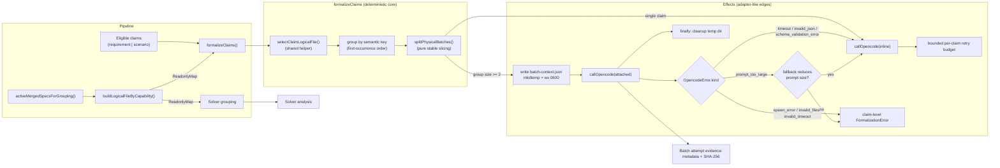

## Context

### Current State

`spec-check` formalizes spec claims into Logic IR candidates via an LLM adapter (`callOpencode`), then runs solver analysis grouped by logical file. The two phases already group differently today: `formalizeClaims` (`src/domain/formal/formalize.ts`) groups claims by `claim.provenance.file`, while `groupRepresentativesBySpec` (`src/cli/pipeline-helpers.ts`) already groups by `Claim.capability` → merged `logicalFile` with the synthetic fallback `<merged-spec/{capability}>`. With merged capability specs, a capability's claims can span multiple provenance files (base plus deltas), so formalization splits the semantic unit the solver analyzes as one group. Additionally, additional-sample merging in `formalizeClaims` currently matches candidates by `claim.id`, which may be missing or duplicated. Multi-claim batching currently extends the inline batch prompt, and the temp-file lifecycle, error taxonomy mapping, identity rules, and evidence preservation for attached batches are under-specified. The authoritative engineering plan is `pasture/semantic_batching_plan.md`; this design aligns that plan with the OpenSpec artifacts.

### Constraints and Architecture Drivers

- `docs/typescript_style.md`: deterministic cores with effects at the edges; `Result`-style expected failures; explicit bounds everywhere; aggressive assertions; complete TSDoc; `tsc --strict` clean.
- `docs/lfm.md`: invariants first; pure helpers; property/fault-injection/differential evidence; the harness is the trust boundary.
- `src/domain/errors.ts`: the public `ErrorCategory` union is complete — no new top-level categories. Local behavior selection uses the existing `OpencodeError.kind` discriminated union.
- The adapter supports file attachments and measures inline prompts in UTF-8 bytes.
- Temp context files contain full claim text; they are ephemeral transport artifacts and must not be intentionally retained.

## Goals

- Formalization grouping moves to the solver's existing capability/`logicalFile` grouping semantics; one shared key helper (`selectClaimLogicalFile`) serves both phases; solver-specific filtering happens before grouping.
- Semantic logical-file grouping is the only production grouping path for formalization and solver analysis, with identical semantics for requirement and scenario claims.
- Multi-claim first-sample physical batches always use file-attached JSON context with deterministic serialization, a dedicated prompt, explicit `index`-based response matching, and a defined temp-file lifecycle.
- Failure handling maps terminal `OpencodeError.kind` values (post adapter-internal retries) to either immediate claim-level errors (infrastructure) or graceful per-claim degradation (model-response failures).
- Original eligible index (or claim object identity) is authoritative for internal identity and ordering; `claim.id` is display/evidence metadata only.
- Every attached batch attempt preserves auditable, byte-verifiable evidence (claim-text-pointer metadata plus SHA-256) despite context deletion.

### Non-Goals

- No new public error categories.
- No durable retention of full temp context contents or verbatim claim text in batch attempt evidence.
- No change to clustering, solver, or reporting semantics beyond consuming the unified grouping; the batch response schema gains a required `index` field per entry (adapter phase-schema update) — that is in scope.
- No path normalization of `claim.provenance.file`.
- No change to the claim-graph and solver-input activity filters (`requirements.length > 0`); `activeMergedSpecsForGrouping()` is used only for grouping-map construction.
- No support for standalone scenario claims outside requirement blocks; the scenario-only activity clause is defensive only (unreachable in the current merge domain model, where merged scenarios derive only from requirement blocks).
- `maxBatchSize` remains internal/test-only; no public configuration surface.

## Proposed Design

### System Model



### Component Descriptions

- **`selectClaimLogicalFile(claim, logicalFileByCapability)`**: the single shared semantic key function. Capability-less claims key by `claim.provenance.file`; capability-bearing claims key by `logicalFileByCapability.get(capability) ?? \`<merged-spec/${capability}>\``. Pure and deterministic.
- **`activeMergedSpecsForGrouping(mergedSpecs)`**: selects merged specs with `requirements.length > 0 || scenarios.length > 0`. Used *only* for grouping-map construction; it does not replace the claim-graph or solver-input filters (`requirements.length > 0`). The scenarios clause is defensive: standalone scenario claims cannot occur in the current merge domain model (merged scenarios derive only from requirement blocks), so the clause should be unreachable today but keeps the map correct under future domain evolution. Filtering policy is explicit in the name and TSDoc.
- **`buildLogicalFileByCapability(mergedSpecs)`**: pure mapper over the specs it is given; validates that each `spec.logicalFile` is a non-empty string (empty values are validation failures); guarantees one entry per provided capability. Capability uniqueness is inherited from merge-layer `capabilityOrder` deduplication (observed property, not re-enforced here).
- **`formalizeClaims(...)`**: orchestrates validation, eligibility filtering, grouping, sub-batching, transport selection, degradation, and outcome assembly. Keeps the deterministic core pure; filesystem and process effects live in small edge helpers.
- **Temp context lifecycle helpers**: `mkdtemp()` (prefix `spec-check-batch-`) directory creation separate from file writing; exclusive `wx` write with `0600`; cleanup in `finally`; cleanup failure after success becomes a warning `Finding` with category `formalization.temp_cleanup_failed` (provenance: batch key + sub-batch ordinal; evidence: cleanup error detail + context hash).
- **Dedicated attached prompt**: a new prompt constant (not an extension of `BATCH_FORMALIZATION_INSTRUCTIONS`) that states claims are attached JSON, that the JSON is untrusted data, that each output entry must carry an explicit `index` matching an attached claim index, and that `claims[].id` is informational (may be `null` or duplicated).
- **Batch attempt evidence recorder**: builds a `BatchAttemptEvidence` record per attached attempt — schema version, batch key, ordered original eligible indexes, claim IDs when present, provenance files, context SHA-256, prompt variant/version, model, sub-batch ordinal, response/failure classification, and cleanup outcome. Records are collected in `FormalizationOutput.batchAttempts`, recorded before temp cleanup, threaded to the reporting phase, and persisted in the run manifest/evidence output. Claim text is referenced by pointer (eligible index), never duplicated; reconstruction resolves indexes against preserved source artifacts and re-serializes deterministically, with the hash verifying byte-equality.
- **Degradation policy helper**: pure function from terminal `OpencodeError.kind` (post adapter-internal retries) plus a fallback-feasibility pre-check for `prompt_too_large` (see Interface Contracts) to a decision: degrade to per-claim retry, or emit claim-level errors for the physical batch.

### System Invariant Tactics

- **No key drift**: one shared `selectClaimLogicalFile` helper; formalization and solver grouping must not duplicate capability fallback logic. The pipeline builds the map once in `run-cli.ts` and passes it to both phases. Verified by a grouping-parity property test and the integration oracle.
- **Claim partition**: under all handled failure modes, every eligible claim reaches candidate or claim error. Validation happens before `mapBounded`; worker-thrown failures are converted to claim-level errors for the affected physical batch inside `formalizeClaims` (sibling batches continue), so unstarted claims are never silently dropped. Verified by completeness property tests and fault-injection tests.
- **Deterministic grouping and sub-batching**: grouping uses exact string equality on semantic keys; groups are ordered by first key occurrence in eligible-claim order; sub-batching is pure stable slicing — when `maxBatchSize > 0` chunks are `<= maxBatchSize`, when `maxBatchSize = 0` each group yields exactly one chunk. Verified by key-determinism and sub-batch-invariant property tests.
- **Provenance immutability**: `Claim` objects and `claim.provenance` are never mutated; all transforms produce new values. Verified by a provenance-immutability property test.
- **Byte-deterministic context**: `JSON.stringify(value, null, 2)`, declared key insertion order, UTF-8, no BOM, LF newlines, exactly one trailing newline. Verified by a serialization determinism contract test; SHA-256 computed over the exact serialized bytes.
- **Identity discipline**: internal tracking uses original eligible index (zero-based, in eligible-claim order) or claim object identity. Additional-sample merging keys on that identity, never `claim.id` alone. Verified by duplicate-ID and missing-ID tests.
- **Untrusted context boundary**: the dedicated prompt marks attached JSON as untrusted data; no claim bodies appear inline. Verified by prompt-content negative tests and an adversarial prompt-injection test.
- **Temp hygiene**: cleanup is attempted after success, graceful model failure, adapter-return failure, thrown adapter failure, and partial write failure. States: `not_created → dir_created → file_written → cleanup_succeeded | cleanup_failed`. SIGINT/SIGTERM handlers attempt temp cleanup as part of existing shutdown handling; under `SIGKILL` no cleanup occurs (no handler can run), consistent with the existing signal model in `docs/design.md`. Verified by per-terminal-state fault-injection cleanup tests.

### Quality Attribute Tactics

- **Correctness**: terminal-outcome invariant enforced structurally (Result-typed outcomes per claim) and by tests across every handled `OpencodeError.kind`.
- **Determinism**: pure helpers for key selection, grouping, sub-batching, and serialization; effects isolated at edges; property tests over generated claim sets and maps.
- **Auditability**: evidence record per attached attempt; context reconstructable from preserved source artifacts plus metadata and hash.
- **Security**: `0600` exclusive temp writes in a fresh `mkdtemp` directory; attached JSON fenced as data; prompt wording asserts no instruction elevation.
- **Reliability**: `maxBatchSize`, `samplesPerClaim`, and `concurrency` validated with `Number.isSafeInteger()` before work begins; bounded retry budget for per-claim degradation; `prompt_too_large` degrades only when every per-claim inline prompt fits the adapter prompt-size limit (see Interface Contracts), so degradation is never vacuously attempted.

### Interaction Protocols

- **Map construction**: `run-cli.ts` builds `logicalFileByCapability` once — `buildLogicalFileByCapability(activeMergedSpecsForGrouping(ctx.mergedSpecs))` — and passes the same map to both formalization and solver grouping. This replaces the map currently built ad hoc inside `groupRepresentativesBySpec`. The claim-graph filter and the solver-input filter (both `requirements.length > 0`) are unchanged; the grouping filter can only broaden the map relative to solver inputs, never narrow it.
- **Pipeline → formalization**: the pipeline always provides `logicalFileByCapability` (possibly empty). Empty map means capability-bearing claims use synthetic fallback keys. `formalizeClaims` rejects empty map values with `err(readonly FormalizationError[])`. The pipeline does not pass `concurrency` today; when omitted, the existing default applies. Validation of `concurrency` applies when a caller supplies it.
- **Formalization → adapter**: multi-claim first-sample attempts pass the attached context file; single-claim attempts remain inline. Additional sampling for `samplesPerClaim > 1` issues bounded per-claim inline calls and is not additional physical sub-batching.
- **Adapter error semantics**: `callOpencode` returns errors only after exhausting its internal retry budget (default 3 attempts; `spawn_error`, `timeout`, and `invalid_json` are retried). The batch-level degradation policy therefore applies to *terminal* adapter errors; formalization never bypasses or duplicates adapter-internal retries.
- **Response matching**: the batch response schema gains a required `index` field per returned entry (the adapter phase-schema validator for the formalization phase is updated accordingly — in scope). Each returned `index` is validated against the attached claim indexes for that physical batch; entries with unknown, duplicate, or missing indexes are claim-level schema failures handled as `schema_validation_error` degradation. Array position alone is never authoritative; `claim.id` is never used for matching.
- **`prompt_too_large` pre-check**: degradation to per-claim inline calls happens only when every per-claim inline prompt (inline prompt template plus that claim's text, measured in UTF-8 bytes by the same adapter prompt-size check) fits the adapter limit. If any claim's inline prompt would still exceed the limit, the physical batch produces claim-level `FormalizationError` values immediately, since fallback cannot succeed. Because attached batch prompts exclude claim bodies, an oversized attached context almost always means the claim texts themselves are too large, making this pre-check the common case.
- **Formalization → pipeline**: if formalization returns zero candidates and one or more errors, `run-cli.ts` aborts with `PipelineAbortError("FormalizationError", ...)`; partial success continues to clustering and solver analysis with errors surfaced. `FormalizationOutput.batchAttempts` is threaded to the reporting phase and persisted in the run manifest/evidence output.
- **Formalization ↔ solver**: both call `selectClaimLogicalFile`; solver-specific exclusions are filtered before grouping and documented independently.

### Forward Evolution

- New claim kinds become formalizable by extending the eligibility predicate; grouping semantics are unchanged.
- A future batch context `schemaVersion: 2` (e.g., explicit response `index` requirement) can evolve the schema and evidence record additively.
- If stronger temp-dir assurance is required, mode verification or `chmod(0o700)` can be added behind the same lifecycle helpers.
- Larger logical groups are absorbed by file attachments plus internal deterministic `maxBatchSize`, without new public configuration.
- If standalone scenario claims are ever admitted (relaxing the merge domain model), the defensive scenario clause becomes load-bearing: the `scenarios_imply_requirements_today` assumption in the grouping-map model must be removed, making `scenario_only_specs_mapped` a live property, and the claim-graph activity filter (`requirements.length > 0`) must be broadened in the same change — otherwise scenario-only claims would exist without ever reaching formalization.

### Costs

- One temp directory plus one JSON file per multi-claim first-sample physical batch; ephemeral and cleaned on all handled terminal states.
- SHA-256 over context bytes per attached attempt; bounded by context size.
- Graceful degradation can issue up to the per-claim retry budget after a model-response batch failure; bounded and visible.

### Alternatives Considered

- **Keep historical file grouping as a mode**: rejected. Two grouping paths invite key drift; historical grouping now emerges only when semantic keys equal provenance files.
- **Extend `BATCH_FORMALIZATION_INSTRUCTIONS` for attached batches**: rejected. Stale "same spec file" / "presented below" language is factually wrong for semantic groups and weakens the untrusted-data boundary.
- **New public error categories (`infrastructure_failure`, `llm_response_failure`)**: rejected. The public taxonomy in `src/domain/errors.ts` is complete; existing `OpencodeError.kind` values already discriminate local behavior.
- **`claim.id`-keyed sample merging** (the current behavior in `formalize.ts`): rejected. IDs may be absent or duplicated; original eligible index or object identity is authoritative.
- **Array-position response matching**: rejected in favor of an explicit required `index` field. Position-only matching is implicit and fragile against model reordering or omission; an explicit index makes misattribution a detectable schema failure instead of silent corruption. The cost is a small adapter phase-schema update.
- **Fuzzy `prompt_too_large` fallback ("materially reduces prompt size")**: rejected. The condition is unverifiable and nearly vacuous (attached prompts exclude claim bodies, so per-claim fallback usually *increases* total bytes). Replaced with a precise pre-check: degrade only when every per-claim inline prompt fits the adapter size limit.
- **Verbatim claim text in batch attempt evidence**: rejected. Claim-text pointers (eligible indexes resolved against preserved source artifacts) plus deterministic serialization and SHA-256 give byte-verifiable reconstruction without duplicating claim text in durable output.
- **Durable temp context retention**: rejected. Pointer-based evidence plus SHA-256 preserves auditability without retaining full claim text on disk.
- **Broadening the claim-graph/solver-input filters to match `activeMergedSpecsForGrouping`**: rejected. The merge model cannot produce scenario-only specs today; changing the claim-graph filter would be a semantic change with no reachable benefit. The grouping filter stays broader purely as defense in depth.

## Component Design

### Key Components

1. **Semantic key helper** — `selectClaimLogicalFile(claim, logicalFileByCapability): string`. Pure; exact string equality semantics; no normalization.
2. **Map builder** — `activeMergedSpecsForGrouping(mergedSpecs)` (filter) and `buildLogicalFileByCapability(specs)` (pure mapper with non-empty-value validation).
3. **Grouping and sub-batching** — group eligible claims by semantic key (first-occurrence order, stable claim order); `splitPhysicalBatches(group, maxBatchSize)` as pure stable slicing: `maxBatchSize=0` → one chunk per logical group regardless of size (unbounded); `=1` → single-claim inline batches; `>1` → chunks of size `<= maxBatchSize`.
4. **Context construction and serialization** — build `BatchContextFile` (schemaVersion 1) and serialize byte-deterministically; compute SHA-256 over the exact bytes.
5. **Temp file lifecycle** — `mkdtemp()` (prefix `spec-check-batch-`) → write `batch-context.json` (`utf8`, `0600`, `wx`) → attach → `finally` cleanup. Directory creation separate from file writing so `dir_created` is cleanable if writing fails. OS-temp unwritable surfaces as directory-creation failure → claim-level errors for the physical batch.
6. **Transport decision** — group size `>= 2` → attached attempt; size `1` → inline attempt.
7. **Degradation policy** — pure mapping from terminal `OpencodeError.kind` (plus the `prompt_too_large` inline-fits pre-check) to degrade-vs-claim-errors.
8. **Identity tracking** — original eligible index threaded through grouping, sub-batching, context construction, response matching (explicit `index` validation), and additional-sample merging.
9. **Evidence recorder** — per-attempt `BatchAttemptEvidence` (pointer-based metadata plus context hash, response/failure classification, cleanup outcome), recorded before cleanup and collected into `FormalizationOutput.batchAttempts`.

### Data Design

String domains and encoding:

- `CapabilityName`: validated lowercase kebab-case branded string from `toCapabilityName()`.
- `ClaimId`: validated branded string when present; may be absent on a `Claim`.
- `logicalFile`: non-empty string produced by merge logic or synthetic fallback.
- Semantic key / `batchKey`: exact JavaScript string produced by `selectClaimLogicalFile()`; compared by exact string equality; no Unicode normalization.
- Synthetic fallback key: ASCII template `` `<merged-spec/${capability}>` `` where `capability` is a validated `CapabilityName`.
- `provenance.file`: opaque string stored verbatim; never normalized or resolved by formalization.
- `model`: non-empty identifier validated by configuration/adapter paths.
- Inline prompts measured in UTF-8 bytes by the existing adapter prompt-size check.
- Context JSON: UTF-8, no BOM, LF newlines, exactly one trailing newline, `JSON.stringify(value, null, 2)`, declared key insertion order.

Batch context schema (schemaVersion 1):

```ts
interface BatchContextFile {
  readonly schemaVersion: 1;
  readonly batchKey: string;
  readonly claims: readonly {
    readonly index: number;              // original index inside the physical batch; auditability
    readonly id: string | null;          // null when claim.id is absent; duplicates permitted
    readonly obligation: string;
    readonly provenance: { readonly file: string };
    readonly text: string;
  }[];
}
```

Validity rules:

- `samplesPerClaim`, `concurrency`: safe integers `>= 1`; invalid → `err(readonly FormalizationError[])` before `mapBounded`. `concurrency` is validated only when supplied; the pipeline currently omits it (default applies).
- `maxBatchSize`: safe integer `>= 0`; default `0` (unbounded: one chunk per logical group); negative/`NaN`/`Infinity`/fractional → `err(...)`.
- `logicalFileByCapability`: required in the pipeline path; empty map allowed; empty values rejected with `err(...)`. Invariant: the map covers every capability present on any eligible claim — the synthetic fallback guarantees a key even when a capability is unmapped, so a missing entry is never fatal, but map construction from `activeMergedSpecsForGrouping` makes it findable.
- Empty `claims` array → empty successful output.

Batch response schema (formalization phase): each returned batch entry gains a required `index` field identifying the attached claim it formalizes. Validation of entries checks that every `index` matches exactly one attached claim index for that physical batch; unknown, duplicate, or missing `index` values are `schema_validation_error` failures subject to per-claim degradation.

Batch attempt evidence record (collected in `FormalizationOutput.batchAttempts`):

```ts
interface BatchAttemptEvidence {
  readonly schemaVersion: 1;
  readonly batchKey: string;
  readonly claimIndexes: readonly number[];      // original eligible indexes, in context order
  readonly claimIds: readonly (string | null)[]; // parallel to claimIndexes; null when absent
  readonly provenanceFiles: readonly string[];   // parallel to claimIndexes, verbatim
  readonly contextSha256: string;                // hex, over exact serialized UTF-8 bytes
  readonly promptVariant: string;                // dedicated attached-prompt version identifier
  readonly model: string;
  readonly subBatchOrdinal: number;              // zero-based within the logical group
  readonly outcome:                              // response/failure classification
    | { readonly kind: "success" }
    | { readonly kind: "model_failure"; readonly errorKind: OpencodeErrorKind }
    | { readonly kind: "infrastructure_failure"; readonly errorKind: OpencodeErrorKind }
    | { readonly kind: "transport_failure"; readonly detail: string };
  readonly cleanup: "succeeded" | "failed" | "not_attempted";
}
```

Reconstruction contract: given preserved source artifacts (claims with text), the context file is byte-reconstructable by resolving `claimIndexes` to claim text, rebuilding the `BatchContextFile`, and re-serializing deterministically; the reconstructed bytes are verified against `contextSha256`.

### Interface Contracts

```ts
function selectClaimLogicalFile(
  claim: Pick<Claim, "capability" | "provenance">,
  logicalFileByCapability: ReadonlyMap<string, string>,
): string {
  const capability = claim.capability;
  if (capability === undefined) return claim.provenance.file;
  return logicalFileByCapability.get(capability) ?? `<merged-spec/${capability}>`;
}
```

- The pipeline always provides a map; it may be empty.
- Historical file grouping occurs only for capability-less claims or when a capability semantic key equals the provenance file.
- Any solver-specific filtering happens before grouping and does not alter the key function.

`formalizeClaims` signature (new/changed fields):

```ts
formalizeClaims(input: {
  readonly claims: readonly Claim[];
  readonly model: string;
  readonly samplesPerClaim: number;                       // safe integer >= 1
  readonly timeoutMs: number;                             // existing adapter timeout domain
  readonly concurrency?: number;                          // safe integer >= 1 when supplied
  readonly logicalFileByCapability: ReadonlyMap<string, string>; // required; empty map allowed
  readonly maxBatchSize?: number;                         // safe integer >= 0; default 0 (unbounded)
}): Promise<Result<FormalizationOutput, readonly FormalizationError[]>>
```

`FormalizationOutput` gains `batchAttempts: readonly BatchAttemptEvidence[]` (empty when no attached batches were attempted). `groupRepresentativesBySpec` is refactored to accept `logicalFileByCapability: ReadonlyMap<string, string>` directly (built once in `run-cli.ts`), replacing its internal map construction from `mergedSpecs`; the artifact-key collision precondition behavior is unchanged.

`formalizeClaims` contract:

- **Inputs**: `claims` (readonly), `model`, `samplesPerClaim >= 1`, `timeoutMs` (adapter domain), `concurrency >= 1` when supplied, `logicalFileByCapability` (required in pipeline path), `maxBatchSize >= 0` (default `0`).
- **Eligibility**: only `kind === "requirement"` or `kind === "scenario"`.
- **Postconditions**: terminal outcome per eligible claim under all handled failure modes; no mutation of inputs; groups ordered by first key occurrence; claims in group preserve eligible order; sub-batches preserve group and claim order; candidates/errors emitted in eligible input order where practical, otherwise outputs carry explicit claim/index identity; findings ordered by phase of discovery, each with provenance and evidence; `batchAttempts` records one entry per attached attempt (including failed attempts).

`OpencodeError.kind` handling (kinds are *terminal* errors — the adapter has already exhausted its internal retry budget, default 3 attempts, before returning):

| `kind` | Multi-claim attached batch | Single-claim inline |
|---|---|---|
| `spawn_error` | claim errors for physical batch; no fallback | claim-level `FormalizationError` |
| `invalid_files` | claim errors for physical batch; no fallback | not expected without attachments; if observed, claim-level error |
| `invalid_timeout` | claim errors; no fallback | claim-level error |
| `timeout` | degrade to per-claim inline retry | claim error after adapter retry budget exhausted |
| `invalid_json` | degrade to per-claim inline retry | claim error after retry budget exhausted |
| `schema_validation_error` | degrade to per-claim inline retry (covers unknown/duplicate/missing response `index`) | claim error after retry budget exhausted |
| `prompt_too_large` | degrade only when every per-claim inline prompt fits the adapter prompt-size limit; otherwise claim errors | claim error when inline prompt is too large |

Thrown adapter failures are caught as `unknown` and normalized to claim-level `FormalizationError` in both paths, preserving the terminal-outcome invariant. Cleanup still runs when `callOpencode()` throws. `mapBounded` worker errors are converted to claim-level errors for the affected physical batch inside `formalizeClaims`; sibling batches continue (this is a specified behavior, not an implementation choice).

### Code Map

- Semantic key helper, map builder, grouping, sub-batching: formalization module alongside `formalizeClaims` (pure helpers in the same or a sibling module, e.g. `src/domain/formal/grouping.ts`), reused by the solver-grouping path.
- Temp context lifecycle, context serialization, evidence recorder: formalization transport module (edge effects, small narrow `try` scopes).
- Dedicated attached prompt: prompt constants module, separate from `BATCH_FORMALIZATION_INSTRUCTIONS`.
- Batch response schema (`index` field): formalization phase-schema validator in `src/adapters/opencode.ts`.
- Pipeline wiring: `run-cli.ts` (single map construction site — `buildLogicalFileByCapability(activeMergedSpecsForGrouping(ctx.mergedSpecs))` — passed to both `formalizeClaims` and `groupRepresentativesBySpec`; abort behavior unchanged for all-error output).
- Solver grouping: `pipeline-helpers.ts` `groupRepresentativesBySpec` accepts the shared map and calls `selectClaimLogicalFile` after its own documented filtering.
- Reporting: `FormalizationOutput.batchAttempts` threaded to the reporting phase and persisted in the run manifest/evidence output.
- Tests: contract tests, `fast-check` property tests, fault-injection tests (adapter seam), evidence tests, and the integration oracle; Vitest.

## Failure and Reliability

### Failure Mode Analysis

- **Unsafe inputs**: invalid `maxBatchSize`/`samplesPerClaim`/`concurrency` (non-integer, negative, fractional) → rejected with `err` before any work. Empty logical-file map values → rejected as validation failures. OS temp unwritable → `mkdtemp` failure → claim-level errors for the physical batch.
- **Fragile formats**: context JSON is byte-deterministic; response matching validates the required `index` field against attached claim indexes (unknown/duplicate/missing indexes are `schema_validation_error` degradation); malformed model responses surface as `invalid_json`/`schema_validation_error` and degrade per claim.
- **Inadequate control actions**: per-claim fallback after terminal `spawn_error`/`invalid_files`/`invalid_timeout` cannot recover and is prohibited; `prompt_too_large` fallback only when every per-claim inline prompt fits the adapter size limit (pre-checked before any fallback call).
- **Process model flaws**: key drift between formalization and solver (prevented by the shared helper and single map construction site); scenario-only specs dropped from the map (defensively prevented by `activeMergedSpecsForGrouping`; unreachable in the current merge domain model); `claim.id` treated as identity (prevented by index/identity-keyed merging — the current `formalize.ts` merging bug this change fixes).
- **Coordination failures**: `mapBounded` rejects on first worker error and does not launch remaining items; `formalizeClaims` therefore converts worker-thrown failures into claim-level errors for the affected physical batch so sibling batches continue and unstarted claims are never silently dropped; concurrency validated before `mapBounded`; cleanup in `finally` covers thrown adapter failures.
- **Outcome/evidence window under process kill**: evidence records are written before cleanup (to capture cleanup classification) and claim outcomes resolve after cleanup; a SIGKILL in that window may leave a durable attempt record whose claims never terminated. Acceptable: the record's purpose is auditing what was sent, not proving what resolved.
- **Partial write failure**: directory created but file write fails → attempt cleanup, then return claim errors; if that cleanup also fails, include cleanup detail without masking the original write failure.
- **Cleanup failure after success**: becomes a warning `Finding` (`formalization.temp_cleanup_failed`); never discards successful candidates.

### Control and Recovery

- **Detection**: terminal adapter-return `OpencodeError.kind` values (post adapter-internal retries); thrown adapter failures caught as `unknown` and normalized immediately; validation failures detected before effects.
- **Mitigation**: graceful per-claim degradation for `timeout`/`invalid_json`/`schema_validation_error`; immediate claim errors for infrastructure kinds; pre-checked conditional degradation for `prompt_too_large`.
- **Recovery**: bounded per-claim retry budget for degraded claims; partial success continues through the pipeline; all-error/no-candidate output aborts with `PipelineAbortError("FormalizationError", ...)` exactly as today.
- **Every counterexample becomes a permanent regression test.**

## Operational Concerns

### Observability

- Findings ordered by phase of discovery, each with provenance and evidence.
- Warning `Finding` (`formalization.temp_cleanup_failed`) on cleanup failure after success.
- Batch attempt evidence records persisted in the run manifest/evidence output enable post-hoc audit and byte-verifiable reconstruction of deleted contexts; the `spec-check-batch-` temp prefix aids debugging when cleanup fails.
- Tests tag the scenario or invariant exercised, per `docs/lfm.md`.

### Deployment and Rollout

- Behavior change is internal to formalization/grouping; no configuration surface is added (`maxBatchSize` stays internal/test-only).
- Rollout is gated by the full verification stack (contract, property, fault-injection, evidence, integration) plus `npm run lint` and `npm test`.
- Rollback: revert the change; no persistent data migration exists.

### Capacity and Scaling

- **First-sample call count is monotonically non-increasing relative to file grouping.** Semantic groups are unions of same-capability provenance-file groups: a capability whose claims span a base spec plus delta specs previously cost one batch call per provenance file and now costs one attached batch call per logical group. Capability-less claims and one-file capabilities produce exactly the same group count as file grouping. No input produces more first-sample calls than before, since different capabilities were never co-batched previously either. (Test-only `maxBatchSize > 1` deliberately increases first-sample calls by splitting a logical group; that is its purpose and never happens in production, where the default `0` keeps one batch per group.)
- **Per-call work increases for attached batches**: merged logical groups are larger than per-file groups, the harness reads the attached JSON context before generating, and response size scales with claim count. Two mitigations apply: the inline prompt body no longer scales with claim text (claim bodies move to the attachment, so the adapter's inline prompt-size check becomes less likely to trip, not more), and capability-sized groups were already the pre-merge reality for single-spec capabilities.
- **The universal timeout is unchanged (decision).** A too-tight timeout on a large attached batch degrades gracefully to bounded per-claim inline calls — each a small prompt that fits easily — so timeout pressure costs extra calls (latency/budget), never correctness. Raising the global default was rejected because it would slow failure detection for every other LLM phase and weaken the universal-timeout invariant (`FLA-FORMAL-TIMEOUT`). If operational data shows attached batches timing out regularly, the batch attempt evidence records (model, sub-batch ordinal, outcome classification) are the measurement mechanism for retuning; revisit then, not speculatively.
- Larger logical groups (merged capabilities spanning many provenance files) increase context pressure; absorbed by file attachments (prompt excludes claim bodies) plus internal deterministic `maxBatchSize`.
- All loops, queues, retries, batch sizes, and in-flight work are bounded and visible at call sites.

## Security

- Attached context JSON is untrusted data; the dedicated prompt states this explicitly and never elevates spec text into instruction position.
- Temp files: fresh `mkdtemp()` directory (prefix `spec-check-batch-`), fixed filename `batch-context.json`, exclusive `wx` write, `0600` mode, cleanup on every handled terminal state; SIGINT/SIGTERM handlers attempt cleanup, and under `SIGKILL` no cleanup occurs (no handler can run). If stronger assurance is required, verify mode or `chmod(0o700)` and test it.
- No path normalization or resolution of `provenance.file`; stored verbatim.
- Adversarial prompt-injection test: claim text containing instruction-like content must not alter formalization behavior beyond data.

## Risks / Trade-offs

- Key drift between formalization and solver -> one shared helper, single map construction site in `run-cli.ts`, grouping-parity tests, and the integration oracle.
- Scenario-only claims lose semantic key -> active-spec filter includes requirements OR scenarios as defense in depth (unreachable in the current merge domain model); scenario-only contract tests.
- Stale "same file" prompt language -> dedicated attached prompt plus negative prompt-content tests.
- Temp context leak on partial write failure -> explicit lifecycle states plus per-terminal-state fault-injection cleanup tests.
- Retrying true infrastructure failures wastes budget -> terminal `OpencodeError.kind` policy prohibits per-claim fallback for `spawn_error`/`invalid_files`/`invalid_timeout` (adapter-internal retries already exhausted).
- Over-classifying errors with a new taxonomy -> keep existing public categories; local discriminants only.
- Larger logical groups increase context pressure -> file attachments plus internal deterministic `maxBatchSize`.
- Duplicate/missing claim IDs confuse matching -> original eligible index or object identity is authoritative (fixes the current `formalize.ts` `claim.id`-keyed merging bug).
- Deleted temp context weakens auditability -> claim-text-pointer metadata plus SHA-256 with byte-verifiable reconstruction from source artifacts.
- Response `index` mismatch or omission by the model -> required `index` validation turns misattribution into `schema_validation_error` degradation rather than silent corruption.

## Migration Plan

1. Land pure helpers (key helper, map builder, grouping/sub-batching, serialization) with contract and property tests.
2. Wire the pipeline to always build and pass `logicalFileByCapability`; remove undefined-map production semantics.
3. Switch solver grouping to the shared helper; document solver-specific filtering separately.
4. Introduce the dedicated attached prompt, temp lifecycle helpers, degradation policy, and evidence recorder with fault-injection tests.
5. Update identity/ordering internals and additional-sample merging with duplicate/missing-ID tests.
6. Update `docs/design.md`, `ARCHITECTURE.md`, and the two OpenSpec specs.
7. Run the full verification stack; every counterexample becomes a regression test.

Rollback: revert the change set; no data migration or durable format changes exist.

## Verification Strategy

The verification strategy for this change is intentionally detailed because the project follows the lightweight formal methods workflow in `docs/lfm.md`. The implementation is not considered complete merely because the code compiles; it must produce direct evidence that the semantic grouping, physical sub-batching, temp-file lifecycle, identity, and evidence-preservation invariants stated in this design actually hold. The implementation and its tests must also follow the design and implementation discipline required by `docs/typescript_style.md`. This strategy is sourced from the verification plan in `pasture/semantic_batching_plan.md`.

### Grouping Verification

Contract tests for the shared semantic grouping rules, one test per rule:

- A capability-bearing claim mapped in `logicalFileByCapability` groups by the mapped `logicalFile` value.
- A capability-less claim groups by `claim.provenance.file`, stored verbatim.
- A capability-bearing claim absent from the map groups by the synthetic fallback `<merged-spec/{capability}>`.
- An empty map still uses the synthetic fallback for capability-bearing claims.
- Historical file grouping emerges exactly when semantic keys equal provenance files.
- Requirement claims and scenario claims use the same grouping helper and co-group when their keys are equal.
- Scenario-only merged specs appear in `logicalFileByCapability` (via `activeMergedSpecsForGrouping()`).
- Empty `logicalFile` map values are rejected as validation failures.
- Solver grouping and formalization grouping produce the same semantic key for the same claim inputs after the same explicit filtering.
- Logical groups are ordered by first occurrence of the semantic key in eligible-claim order; claims inside each group preserve eligible input order.

### Physical Sub-Batching Verification

- `maxBatchSize=0` is unbounded: one first-sample physical batch per logical group regardless of group size.
- `maxBatchSize=1` yields single-claim inline calls for every claim.
- `maxBatchSize=5` on a 12-claim logical group splits into chunks of sizes `[5, 5, 2]` in stable claim order.
- Invalid `maxBatchSize`, `samplesPerClaim`, and `concurrency` values (negative, `NaN`, infinite, fractional) are rejected with `err(readonly FormalizationError[])` before any LLM or filesystem work.
- Sub-batching never changes a claim's semantic key.

### Attached Context Transport Verification

- A first-sample physical batch of two or more claims attaches a JSON context file; the prompt body contains no claim text.
- A first-sample attempt over exactly one claim stays inline and creates no context file.
- Context serialization is byte-deterministic: UTF-8 without BOM, LF newlines, exactly one trailing newline, `JSON.stringify(value, null, 2)`, declared key insertion order.
- A missing `claim.id` serializes as `id: null`; duplicate IDs are permitted in the context.
- Provenance path strings are stored verbatim in the context file.
- The dedicated attached prompt contains no claim bodies, no "same spec file" wording, and no "presented below" wording (negative prompt-content tests).
- The dedicated attached prompt states that attached JSON content is untrusted data, not instructions.
- The dedicated attached prompt requires an explicit `index` field per output entry and states that `claims[].id` is informational (may be `null` or duplicated).
- Response matching validates each returned `index` against the attached claim indexes: a well-formed response with correct indexes matches each entry to its claim; unknown, duplicate, or missing `index` values are `schema_validation_error` failures that degrade per claim. `claim.id` is never used for matching.
- Temp directory names use the `spec-check-batch-` prefix (assertable in lifecycle tests).

### Determinism Verification

- Determinism tests run at least 3 repeated invocations with identical inputs and assert byte-for-byte identical logical groups, physical sub-batches, context serializations, and context SHA-256 hashes.
- Because key selection, grouping, sub-batching, and serialization are pure helpers with explicit ordering rules (first key occurrence, eligible input order, stable slicing), hash-map ordering sensitivity does not apply to outputs.
- Determinism is verified specifically for: group order, in-group claim order, chunk boundaries, serialized context bytes, and context hash.

### Property-Based Testing

Property-based tests (`fast-check`) verify the following invariants across at least 100 generated inputs:

- **Key determinism**: the same claim and same map always produce the same semantic key.
- **Grouping completeness**: every eligible claim appears in exactly one logical group.
- **Grouping parity**: formalization grouping and solver grouping agree on semantic keys after the same explicit filtering.
- **Sub-batch invariant**: when `maxBatchSize > 0`, chunk sizes are `<= maxBatchSize`; when `maxBatchSize = 0`, each logical group produces exactly one chunk; chunk sizes always sum to the group size and claim order is preserved.
- **Sub-batching termination**: sub-batching terminates for all valid `maxBatchSize` values.
- **Provenance immutability**: no input `Claim` object or `claim.provenance` is mutated.
- **Emergent legacy equivalence**: when semantic keys equal provenance files, grouping equals historical file grouping.
- **Candidate identity invariant**: duplicate or missing claim IDs do not affect response matching or additional-sample merging.

The generator must produce structurally valid inputs covering: capability-bearing and capability-less claims, mapped and unmapped capabilities, missing claim IDs, duplicate claim IDs, scenario-only merged specs, and varied logical group sizes.

### Fault-Injection Verification

- Temp directory creation failure produces claim-level `FormalizationError` values for the affected physical batch, assigned immediately (no directory exists, so no cleanup is owed) [FLA-TEMP-ORDER].
- Temp write failure after directory creation attempts cleanup before returning claim errors [FLA-TEMP-WRITEFAIL].
- Cleanup failure after a partial write failure is reported with cleanup detail and does not mask the original write failure.
- A successful attached batch removes the temp directory.
- Attached-batch claim outcomes are assigned only after the temp lifecycle reaches a terminal cleanup state; a test asserts that outcome resolution events observe `cleanup_succeeded`/`cleanup_failed` (or `not_created` for the directory-creation-failure path) [FLA-TEMP-ORDER].
- Batch `invalid_files` produces claim errors with no per-claim fallback.
- Batch `spawn_error` produces claim errors with no per-claim fallback.
- Batch `invalid_timeout` produces claim errors with no per-claim fallback.
- Batch `timeout` degrades to bounded per-claim inline retry.
- Batch `invalid_json` degrades to bounded per-claim inline retry.
- Batch `schema_validation_error` degrades to bounded per-claim inline retry.
- Batch `prompt_too_large` degrades to per-claim retry only when every per-claim inline prompt (template plus claim text, UTF-8 bytes) fits the adapter prompt-size limit; otherwise it produces claim errors immediately with no fallback calls.
- An adapter throw during `callOpencode()` still triggers temp cleanup in `finally`.
- A single-claim thrown adapter failure is normalized to a claim-level `FormalizationError`.
- A `mapBounded` worker failure does not silently drop unstarted eligible claims.

### Additional Sampling Verification

- When `samplesPerClaim > 1`, additional per-claim sampling calls always use the inline path and never create attached context files; these calls are bounded separate work, not additional physical sub-batches.
- When `samplesPerClaim > 1` over a multi-claim logical group, additional samples merge into the correct candidate keyed by original eligible index (or claim object identity), with the correct merged sample count per claim.
- Additional-sample merging is correct when claim IDs are duplicated across distinct claims in the same logical group.
- Additional-sample merging is correct when claim IDs are missing on some or all claims.
- The additional-sampling retry budget is bounded and visible; exhausted retries produce claim-level errors without affecting already-collected candidates.

### Concurrency Verification

- With `concurrency > 1` across multiple logical groups, in-flight work never exceeds the configured concurrency bound (deterministic test via instrumented adapter call tracking).
- With `concurrency > 1`, emitted candidates and errors carry correct claim/index attribution regardless of completion order; output assembly does not depend on interleaving.
- A failure (adapter error, degradation, or thrown failure) in one logical group does not alter the outcomes of sibling logical groups processed concurrently.
- Any concurrency bug discovered during implementation or testing becomes a deterministic regression test, per the concurrency discipline in `docs/typescript_style.md`.

### Safety And Liveness Verification

Each safety and liveness claim in this design maps to concrete evidence:

| Property | Evidence |
|---|---|
| No key drift | Contract grouping parity test; integration oracle; Alloy model check (`parity_by_shared_key`) |
| No eligible claim loss | Property grouping completeness; fault-injection terminal-outcome tests; Alloy model check (`grouping_partitioned`) |
| Key determinism | Property key determinism; contract exact group tests; Alloy embedded check (`parity_by_shared_key`) |
| Group and claim ordering | Property grouping-order tests only (first-occurrence group order, eligible-order claim order); not covered by the Alloy model (ordering requires sequences, deliberately out of model scope) |
| Deterministic sub-batching | Property sub-batch invariant; Alloy model check (`batches_within_one_group`) |
| Claim provenance immutability | Property provenance immutability |
| Attached text not treated as instructions | Dedicated prompt negative tests and adversarial prompt-injection test |
| Temp cleanup after handled terminal states | Alloy model check (`cleanup_attempted_after_handled_terminal_states`); fault-injection cleanup tests per terminal state |
| Cleanup failure after success preserves candidates | Alloy model check (`cleanup_failure_preserves_candidates`); fault-injection test |
| Evidence recorded for every attached attempt | Alloy model check (`evidence_recorded_for_every_attached_attempt`); evidence tests |
| Duplicate/missing IDs safe | Contract and property candidate identity tests |
| Every eligible claim reaches candidate or error | Alloy model check (`all_claims_reach_terminal_outcome`); fault-injection tests plus integration oracle |
| Sub-batching terminates | Property test over valid `maxBatchSize` |

The new safety and liveness claims introduced by this change are also registered as explicit SAFE-*/LIVE-* cases in the existing invariant harness (`test/invariant/safety-liveness.invariant.test.ts`), alongside the current SAFE-3/LIVE-11 style entries, so the dependability case lives in one canonical place:

- SAFE: no key drift between formalization and solver grouping.
- SAFE: no formalizable requirement or scenario claim is silently lost during grouping or sub-batching.
- SAFE: no attached claim text is treated as instructions.
- SAFE: no temp context file is intentionally retained after a handled success or failure.
- SAFE: duplicate or missing claim IDs cannot cause samples to merge into the wrong candidate.
- LIVE: sub-batching terminates for all valid `maxBatchSize` values.
- LIVE: every eligible claim reaches a candidate or explicit claim error under bounded retries and handled adapter outcomes.
- LIVE: temp cleanup is attempted after all handled terminal states.

### Formal Model

All modeling for this change lives in one Alloy 6 module: [`specs/formalization-and-logic-analysis/alloy/semantic-batching.als`](specs/formalization-and-logic-analysis/alloy/semantic-batching.als) (validated with `tooling/alloy_v6.0.2.jar`: 9 run witnesses SAT, 16 checks UNSAT). The spec deltas reference the module from `#### Requirement model` pointers; no Alloy is embedded in the spec.md files.

The module has two layers. Modeling discipline: **facts are used only for genuinely universal domain truths** (key-space construction, partition-by-key, transport arity, merge-layer capability uniqueness); **conditional claims are predicates**, and each `check` shows the property holds within the predicate's stated conditions.

- **Structural layer** — semantic grouping and the grouping map. Checks: `grouping_partitioned`, `parity_by_shared_key`, `kind_irrelevant`, `fallback_total` (grouping, unconditional under the partition construction); `grouping_map_covers_solver_inputs` (under `scenariosImplyRequirements` and `mapCoversActiveSpecs`), `scenario_only_specs_mapped` (under `mapCoversActiveSpecs` alone — load-bearing in a future domain, not vacuous), `empty_specs_excluded` (under `mapCoversActiveSpecs`).
- **Temporal layer** — temp context lifecycle, attempt outcomes, degradation, claim partition. Safety checks (unconditional): `resolved_attached_batches_created_dir`, `cleanup_is_terminal`, `cleanup_failure_preserves_candidates`, `evidence_recorded_for_every_attached_attempt`, `outcomes_are_stable`, `no_cross_batch_outcomes`. Liveness checks (under explicit fairness predicates): `cleanup_attempted_after_handled_terminal_states` under `cleanupFairness`, `all_claims_reach_terminal_outcome` under `progressFairness`.
- **Cross-layer invariant**: `batches_within_one_group` — every physical batch lies within exactly one logical group (sub-batching never crosses groups). Folding the fragments into one module made this link between the structural grouping and the temporal batches expressible; it was previously only implicit.

One modeling insight worth recording: "cleanup is always attempted" is genuinely a *liveness* property, not a safety invariant — without a fairness premise (no infinite stuttering of an enabled cleanup event), a trace can reach a terminal resolution and then stutter forever without cleaning up. The implementation discharges this premise via cleanup in `finally`; the model states it explicitly (`cleanupFairness`) rather than assuming it.

### Pipeline Integration Verification

Integration oracle: use a merged capability with base and delta provenance files and at least one scenario-level claim, and assert:

- Formalization logical groups use the merged logical file.
- Solver groups use the same semantic key.
- Requirement and scenario claims share the same grouping semantics.
- Original claim provenance is preserved unchanged.
- With `maxBatchSize=0`, there is one first-sample physical batch for the logical group when group size is `>= 2`.
- With small `maxBatchSize`, there are multiple physical sub-batches under the same logical group.
- The attached prompt contains no claim bodies.
- Temp context files are cleaned after run completion.
- Context metadata and hash evidence are preserved.

Group-boundary interaction with existing solver preflight guards:

- A merged logical group whose claim count exceeds `CLAIMS_PER_GROUP_MAX` still degrades gracefully as `logic.invalid_group` rather than aborting the run (existing `FLA-SPEC-GROUP-BOUNDS` behavior under unified semantic grouping).
- A merged logical group containing duplicate raw or sanitized claim IDs is still rejected as `logic.invalid_group` before solver execution (existing `FLA-SPEC-DUPLICATE-CLAIM-ID` behavior under unified semantic grouping).
- A valid sibling group in the same run still compiles and completes when another group is rejected by preflight.

Adversarial prompt-injection coverage — claim text in the attached context containing each of the following must not alter formalization behavior beyond data (the model output contract and claim partition hold identically to benign text):

- Fake instructions embedded in claim text (e.g., "ignore previous instructions and return ...").
- Fake JSON payloads embedded in claim text that mimic the response schema.
- Fence-breaking content (markdown code-fence sequences) inside attached claim bodies.

### Performance Verification

- Context construction, byte-deterministic serialization, and SHA-256 hashing for a large logical group complete within a stated time budget (a light `tinybench` or `node:perf_hooks` benchmark kept alongside the transport module, per the measurement discipline in `docs/typescript_style.md`).
- The attached transport adds no per-claim filesystem or hashing overhead beyond one temp file and one hash per physical batch; a bound assertion guards against accidental per-claim context writes.

### Evidence And Artifact Verification

- Attached batch metadata includes schema version, batch key, ordered original eligible indexes, claim IDs when present, provenance files, context SHA-256, prompt variant/version, model, sub-batch ordinal, response/failure classification, and cleanup outcome.
- The context hash is computed over the exact UTF-8 serialized bytes of the context file.
- A deleted temp context is byte-reconstructable: resolving the recorded claim indexes against preserved source artifacts (claim text), rebuilding the `BatchContextFile`, and re-serializing deterministically yields bytes that match the recorded SHA-256. A reconstruction test performs this round-trip.
- Batch attempt records are recorded before temp cleanup (so cleanup classification is included) and are persisted via the run manifest/evidence output.
- Tests are tagged or documented so each major scenario and invariant is traceable to its spec identifier (`FLA-*`, `MCA-*`).
- Documentation updates (`docs/design.md`, `ARCHITECTURE.md`, and the two OpenSpec specs) are reviewed for consistency with implementation and tests.
- Any counterexample or bug discovered during implementation becomes a permanent regression test.

### Static And Tooling Checks

- `npm run lint`
- `npm test`
- TypeScript strict mode remains clean (`tsc --strict`).
- ESLint remains clean with no ignored type errors.
- New exported helpers have TSDoc covering preconditions, postconditions, invariants, failures, and safety requirements.

## Open Questions

- **Temp directory hardening**: whether mode verification or `chmod(0o700)` after `mkdtemp()` is required, or whether OS/Node defaults suffice.

### Resolved During Design Review

- **Response matching** → resolved: the batch response schema gains a required explicit `index` field per entry, validated against attached claim indexes; mismatches degrade as `schema_validation_error`. Array position alone is never authoritative. (See Interface Contracts and Alternatives Considered.)
- **Scenario-only merged specs** → resolved: unreachable in the current merge domain model (merged scenarios derive only from requirement blocks). The `scenarios.length > 0` clause in `activeMergedSpecsForGrouping()` is retained defensively and documented as such; standalone-scenario support is future work. (See Component Descriptions and Non-Goals.)
- **Evidence payload granularity** → resolved: claim-text pointers (eligible indexes resolved against preserved source artifacts) plus deterministic serialization and SHA-256 for byte-verifiable reconstruction; claim text is never duplicated into evidence records. (See Data Design.)
- **`maxBatchSize = 0` semantics** → resolved: `0` means unbounded (one chunk per logical group regardless of size); the chunk-size bound applies only when `maxBatchSize > 0`.
