## Context

### Current State

`spec-check` is a CLI application that does not yet have an implementation scaffold at the repository root. The intended product is a read-only TypeScript utility that analyzes OpenSpec proposal, design, capability spec, and optional task artifacts, then optionally compares those artifacts against source-backed evidence.

The design problem is cross-cutting. It spans parsing, deterministic domain modeling, LLM-backed qualitative and formalization phases, solver-backed logic analysis, source traceability, and report generation. The product also needs first-class evidence preservation so that developers can review why a finding exists rather than trusting an opaque summary.

### Constraints and Architecture Drivers

- The tool is local-only in v1 and must treat inputs as read-only.
- The core must remain deterministic and inspectable even though it depends on `opencode` and `z3` at the edges.
- Reliability matters more than graceful partial success when critical evidence-producing phases fail.
- Observability requires phase progress, provenance-rich findings, preserved intermediate artifacts, and manifest-based run completion.
- Security requires argv-only subprocesses, prompt fencing, identifier sanitization, and confinement of writes to the configured output directory.
- v1 targets small repositories: up to 10 spec files, low hundreds of requirements and scenarios total, and modest single-package or small multi-module source trees.

## Goals

- Build a deterministic analysis pipeline that converts OpenSpec artifacts into typed claims, findings, reports, and preserved evidence.
- Keep nondeterminism at explicit boundaries so reviewers can distinguish deterministic processing from model- or solver-dependent behavior.
- Preserve enough intermediate structure that every meaningful finding can be traced back to its source artifact and supporting evidence.
- Support both specs-forward and optional source-backed analysis without conflating their evidence models.
- Make canonical spec identifiers and traced verification first-class inputs to the design.

### Non-Goals

- Support arbitrary spec schemas or arbitrary Markdown conventions in v1.
- Build a hosted service, daemon, or multi-user workflow.
- Optimize for monorepo-scale scanning or very large input catalogs in the initial version.
- Provide incremental resume or cache-coordination semantics in v1.
- Turn the tool into a full formal verification system for the entire implementation.

## Proposed Design

### System Model

The system is a phase-oriented pipeline with a deterministic core and two nondeterministic boundaries.

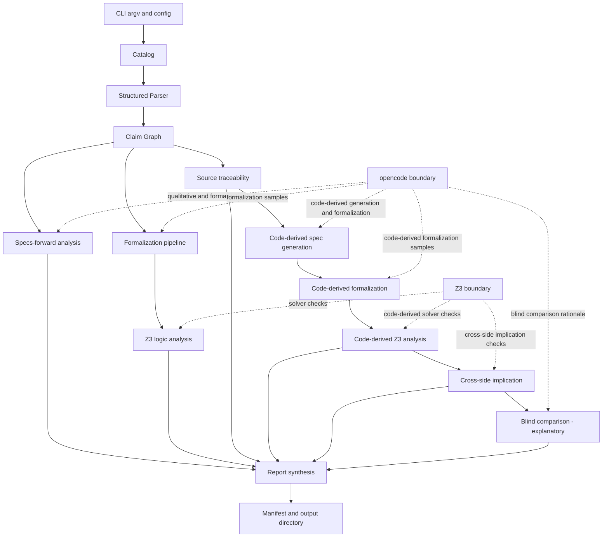
```mermaid
flowchart TD
  A[CLI argv and config] --> B[Catalog]
  B --> C[Structured Parser]
  C --> D[Claim Graph]
  D --> E[Specs-forward analysis]
  D --> F[Formalization pipeline]
  F --> G[Z3 logic analysis]
  D --> H[Source traceability]
  H --> H2[Code-derived spec generation]
  H2 --> H3[Code-derived formalization]
  H3 --> H4[Code-derived Z3 analysis]
  H4 --> H5[Cross-side implication]
  H5 --> I[Blind comparison - explanatory]
  E --> J[Report synthesis]
  G --> J
  H --> J
  H4 --> J
  H5 --> J
  I --> J
  J --> K[Manifest and output directory]

  X[opencode boundary] -. qualitative and formalization .-> E
  X -. formalization samples .-> F
  X -. code-derived generation and formalization .-> H2
  X -. code-derived formalization samples .-> H3
  X -. blind comparison rationale .-> I
  Y[Z3 boundary] -. solver checks .-> G
  Y -. code-derived solver checks .-> H4
  Y -. cross-side implication checks .-> H5
```

The core phases consume typed inputs and produce typed outputs. The `opencode` and `z3` adapters are the only intended nondeterministic boundaries. Everything between them is modeled as deterministic transformation, validation, clustering, or report assembly. The code-backwards pipeline reuses the same formalization and solver infrastructure as specs-forward, applying it to code-derived specifications to enable solver-backed cross-side implication as the primary strength classifier.

### Component Descriptions

- **Catalog**: Resolves the input set, capability mapping, active spec state, optional source directory, and optional tasks file.
- **Structured Parser**: Performs line-oriented parsing for proposal, design, spec, and task documents. It also performs deterministic structural validation and loss-aware capture of unmatched content.
- **Claim Graph Builder**: Normalizes parsed content into typed claims for requirements, scenarios, design properties, assumptions, invariants, failure modes, and task evidence.
- **Qualitative Analysis Module**: Packages parsed and normalized content for the two specs-forward LLM-backed review passes and validates returned finding schemas.
- **Coverage Module**: Compares proposal and design claims against capability specs and references to detect missing coverage, contradiction, and semantic mismatch.
- **Formalization Module**: Requests multiple LLM-backed formalization samples, validates them, and compiles accepted logic IR into SMT-LIB artifacts.
- **Clustering Module**: Compares formalization candidates with solver-backed implication checks to identify stable or divergent interpretations.
- **Logic Analysis Module**: Runs obligation-aware solver passes, captures contradictions and gaps, and preserves counterexamples and inconclusive results.
- **Source Traceability Module**: Relates claims to source files, traced tests, and verified contracts when `--src` is enabled.
- **Code-Derived Spec Generator**: Produces EARS-preferring behavioral specifications per capability from source evidence, operating blind to original requirement text. Persists output as Markdown files in `gen_specs/` under the output directory.
- **Code-Derived Formalization Module**: Applies the same formalization pipeline (LLM sampling, schema validation, equivalence clustering, representative selection) to code-derived specifications. Persists SMT-LIB artifacts in `gen_specs_smt/` under the output directory.
- **Code-Derived Logic Analysis Module**: Runs obligation-aware solver analysis on code-derived formalizations to check internal consistency of what the code guarantees.
- **Cross-Side Implication Module**: Runs bidirectional solver-backed implication checks between original (`smt/`) and code-derived (`gen_specs_smt/`) formalizations. Produces the primary strength classification (same, stronger, weaker, different, uncertain).
- **Code-Backwards Comparison Module**: Provides blind LLM comparison as the explanatory layer that adds human-readable rationale to the formal cross-side classification. Maintains the no-requirement-text boundary.
- **Reporting Module**: Renders Markdown reports, writes intermediate artifacts, and produces the final manifest.

### System Invariant Tactics

- **Read-only input treatment**: Every phase receives immutable source references and writes only to the configured output directory.
- **Provenance propagation**: Parsed nodes, claims, and findings all carry source file and heading provenance so later phases never need to reconstruct origin information heuristically.
- **Schema validation at boundaries**: `opencode` responses are validated immediately against phase-specific schemas before entering the core model.
- **Loss-aware parsing**: The parser records unparsed lines rather than silently dropping content, ensuring the evidence set stays conservative.
- **Evidence preservation**: Solver files, clustering inputs, sampled formalizations, and report fragments are preserved so conclusions remain auditable.
- **Manifest-last completion**: Output is only considered complete once all selected artifacts are finalized and the manifest is written last.

### Quality Attribute Tactics

- **Reliability**
  - Fail fast when required external responses are invalid or unavailable after bounded retry.
  - Keep deterministic validation and transformation separate from heuristic phases so more of the pipeline remains inspectable and testable.
  - Preserve both parser findings and LLM findings rather than deduplicating away potentially useful evidence.
- **Observability**
  - Emit phase progress events on stdout and human diagnostics on stderr.
  - Attach provenance, identifiers, and evidence references to all surfaced findings.
  - Persist intermediate logic, solver, clustering, and comparison artifacts under the output directory.
- **Security**
  - Use explicit argv arrays for `opencode` and `z3` invocations.
  - Sanitize user-derived identifiers before they reach SMT-LIB output.
  - Fence document content in prompts and never treat analyzed text as system instruction.
  - Resolve and confine output writes to the designated output tree only.

### Interaction Protocols

- **CLI to Catalog**: The CLI passes validated argv-derived configuration into catalog building. Invalid paths, missing inputs, or malformed config stop the run before deeper phases begin.
- **Catalog to Parser**: The catalog passes a canonical set of document descriptors. The parser returns typed document models plus deterministic structural findings.
- **Parser to Claim Graph**: Parsed structures are converted into typed claim records with obligation, role, and provenance metadata.
- **Core to `opencode`**: Qualitative and formalization phases send bounded prompt payloads and require schema-valid JSON responses before acceptance.
- **Formalization to `z3`**: Clustering and logic analysis compile solver-ready files and pass them to the solver adapter with explicit timeouts.
- **Source Traceability Boundary**: Source-backed modules receive only the declared source tree and capability context. They do not scan outside the configured analysis scope.
- **Code-Derived Generation Boundary**: The code-derived spec generator receives only source-scoped evidence and capability metadata. It never receives original requirement text, proposal text, or design text.
- **Code-Derived Formalization to `z3`**: Code-derived formalizations use the same solver adapter and SMT-LIB compilation as specs-forward, applied to code-derived claims.
- **Cross-Side Implication Boundary**: The cross-side implication module receives both original and code-derived SMT-LIB artifacts but generates implication queries without mixing claim text; it operates purely on formal artifacts.
- **Blind Comparison Boundary**: The blind LLM comparison side receives only code-derived artifacts and supporting metadata, not original requirement text. It provides explanatory rationale for the formal classification.

### Forward Evolution

The design keeps evolution points explicit:

- The parser is specialized to the current schema but isolated enough that future schema support could be introduced behind new parser and catalog branches.
- The claim graph creates a stable internal model that can support richer analyses later without rewriting input parsing.
- Report synthesis is separated from analysis phases so new evidence types can be added with additive report sections.
- Source-backed analysis is optional and bounded so future capability growth can happen without complicating the base specs-forward pipeline.

### Costs

- LLM-backed phases introduce latency and external tool dependence proportional to document count and claim count.
- Formalization sampling multiplies both `opencode` and solver work by sample count.
- Evidence preservation increases disk output volume, but that cost is acceptable because the product value depends on retained artifacts.
- The specialized parser and typed core require more initial design discipline than a generic Markdown pipeline, but they reduce ambiguity and increase auditability.

### Alternatives Considered

- **Generic Markdown AST first**: Rejected because the schema is constrained and the product needs deterministic, loss-aware structural extraction more than generic Markdown completeness.
- **LLM-heavy end-to-end analysis**: Rejected because it would weaken determinism, auditability, and failure isolation.
- **Single-pass formalization without clustering**: Rejected because ambiguity in formalization is itself useful evidence and must be surfaced rather than hidden.
- **Best-effort partial success when formalization or qualitative phases fail**: Rejected because incomplete evidence could be mistaken for a trustworthy result.

## Component Design

### Key Components

The core implementation is organized as a small set of cooperating stateful layers. Each layer has a narrow lifecycle and explicit terminal failure states so the system can preserve evidence instead of hiding partial progress.

#### CLI layer

Parses argv, loads config, validates paths, selects modes, and coordinates exit behavior.

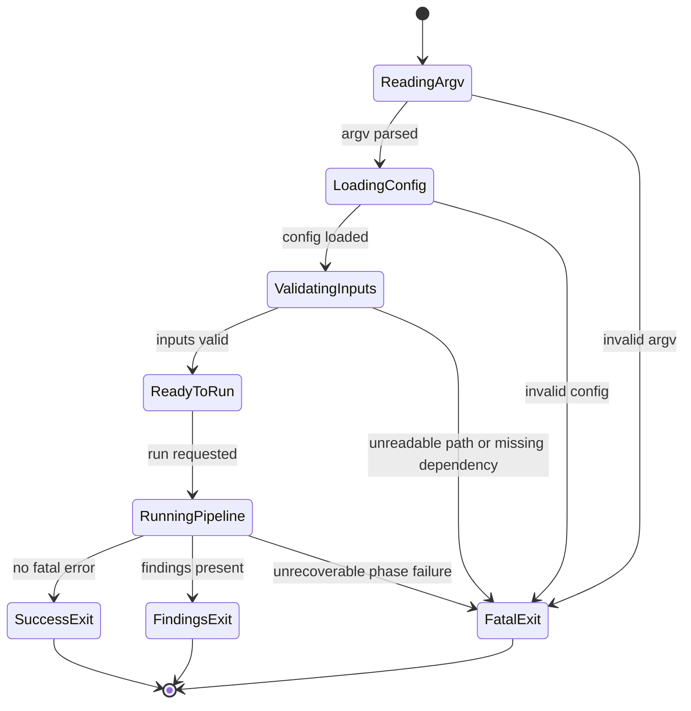
```mermaid
stateDiagram-v2
  [*] --> ReadingArgv
  ReadingArgv --> LoadingConfig: argv parsed
  ReadingArgv --> FatalExit: invalid argv
  LoadingConfig --> ValidatingInputs: config loaded
  LoadingConfig --> FatalExit: invalid config
  ValidatingInputs --> ReadyToRun: inputs valid
  ValidatingInputs --> FatalExit: unreadable path or missing dependency
  ReadyToRun --> RunningPipeline: run requested
  RunningPipeline --> SuccessExit: no fatal error
  RunningPipeline --> FindingsExit: findings present
  RunningPipeline --> FatalExit: unrecoverable phase failure
  SuccessExit --> [*]
  FindingsExit --> [*]
  FatalExit --> [*]
```

#### Domain layer

Defines findings, parsed models, claim graph types, logic IR, clustering semantics, run state, and domain errors.

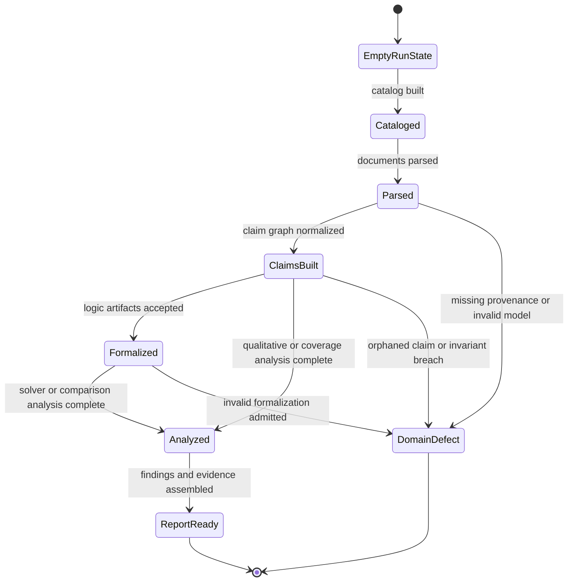
```mermaid
stateDiagram-v2
  [*] --> EmptyRunState
  EmptyRunState --> Cataloged: catalog built
  Cataloged --> Parsed: documents parsed
  Parsed --> ClaimsBuilt: claim graph normalized
  ClaimsBuilt --> Formalized: logic artifacts accepted
  ClaimsBuilt --> Analyzed: qualitative or coverage analysis complete
  Formalized --> Analyzed: solver or comparison analysis complete
  Analyzed --> ReportReady: findings and evidence assembled
  Parsed --> DomainDefect: missing provenance or invalid model
  ClaimsBuilt --> DomainDefect: orphaned claim or invariant breach
  Formalized --> DomainDefect: invalid formalization admitted
  ReportReady --> [*]
  DomainDefect --> [*]
```

#### Adapter layer

Owns filesystem operations, child-process execution, `opencode` integration, and `z3` integration.

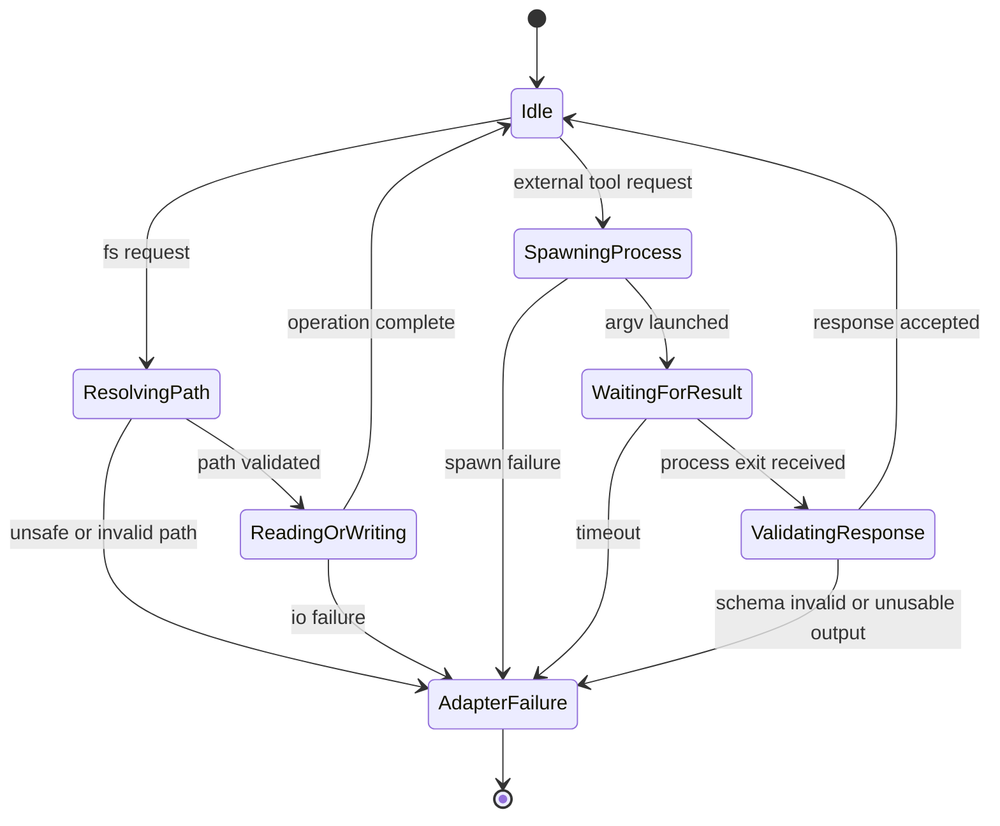
```mermaid
stateDiagram-v2
  [*] --> Idle
  Idle --> ResolvingPath: fs request
  Idle --> SpawningProcess: external tool request
  ResolvingPath --> ReadingOrWriting: path validated
  ResolvingPath --> AdapterFailure: unsafe or invalid path
  ReadingOrWriting --> Idle: operation complete
  ReadingOrWriting --> AdapterFailure: io failure
  SpawningProcess --> WaitingForResult: argv launched
  SpawningProcess --> AdapterFailure: spawn failure
  WaitingForResult --> ValidatingResponse: process exit received
  WaitingForResult --> AdapterFailure: timeout
  ValidatingResponse --> Idle: response accepted
  ValidatingResponse --> AdapterFailure: schema invalid or unusable output
  AdapterFailure --> [*]
```

#### Analysis submodules

Implement specs-forward reviews, coverage analysis, formalization, logic checks, tasks analysis, and code-backwards comparison.

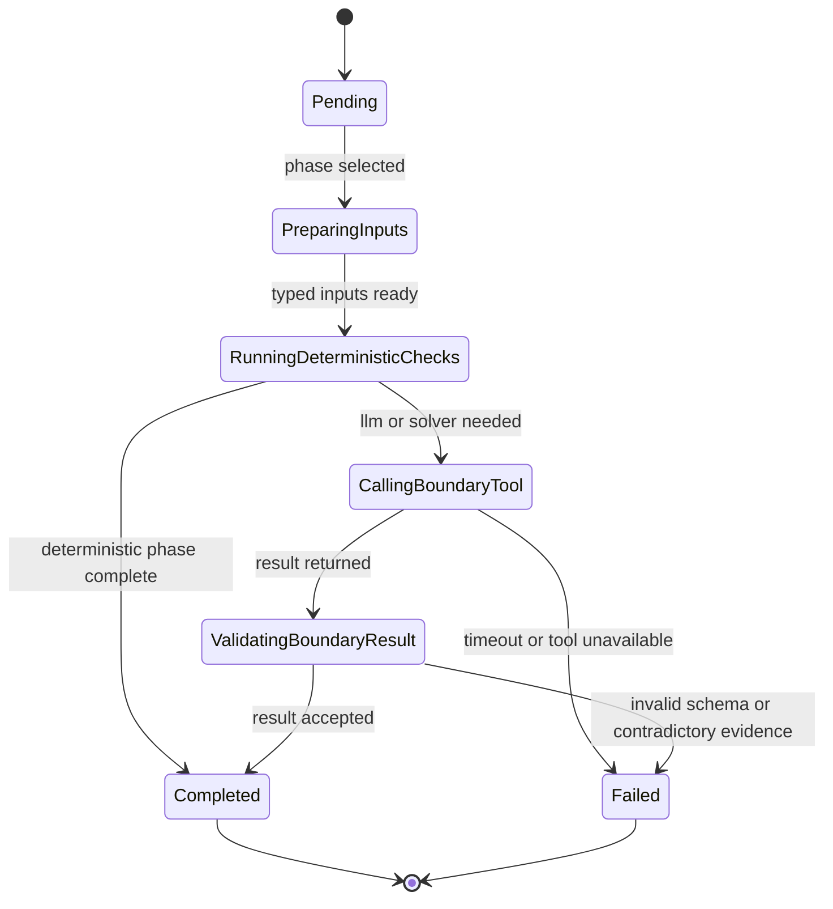
```mermaid
stateDiagram-v2
  [*] --> Pending
  Pending --> PreparingInputs: phase selected
  PreparingInputs --> RunningDeterministicChecks: typed inputs ready
  RunningDeterministicChecks --> CallingBoundaryTool: llm or solver needed
  RunningDeterministicChecks --> Completed: deterministic phase complete
  CallingBoundaryTool --> ValidatingBoundaryResult: result returned
  CallingBoundaryTool --> Failed: timeout or tool unavailable
  ValidatingBoundaryResult --> Completed: result accepted
  ValidatingBoundaryResult --> Failed: invalid schema or contradictory evidence
  Completed --> [*]
  Failed --> [*]
```

#### Reporting layer

Renders phase reports and synthesized summaries from typed findings and preserved evidence references.

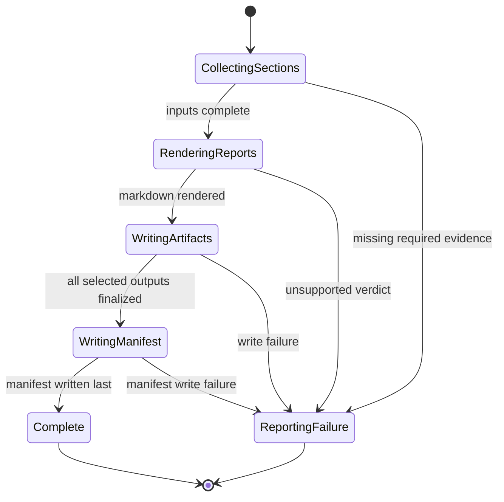
```mermaid
stateDiagram-v2
  [*] --> CollectingSections
  CollectingSections --> RenderingReports: inputs complete
  CollectingSections --> ReportingFailure: missing required evidence
  RenderingReports --> WritingArtifacts: markdown rendered
  RenderingReports --> ReportingFailure: unsupported verdict
  WritingArtifacts --> WritingManifest: all selected outputs finalized
  WritingArtifacts --> ReportingFailure: write failure
  WritingManifest --> Complete: manifest written last
  WritingManifest --> ReportingFailure: manifest write failure
  Complete --> [*]
  ReportingFailure --> [*]
```

### Phase-Level Control Flows

The following flowcharts show the operational control flow for each major pipeline phase.

#### Catalog Discovery

Primary modules: `src/cli/run-cli.ts`, `src/domain/parser/catalog.ts`, `src/adapters/fs.ts`.

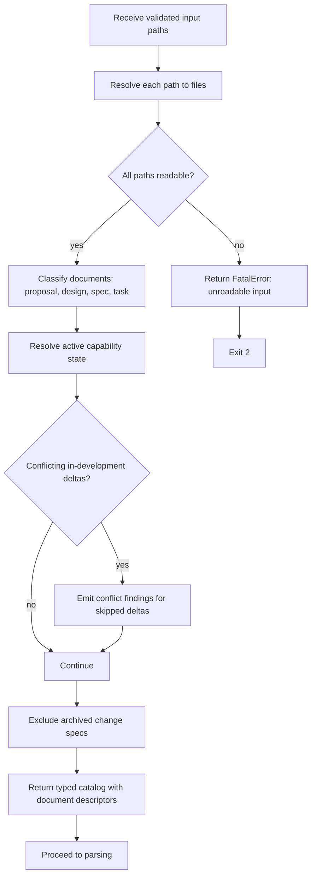
```mermaid
flowchart TD
    A[Receive validated input paths] --> B[Resolve each path to files]
    B --> C{All paths readable?}
    C -- no --> D[Return FatalError: unreadable input]
    C -- yes --> E[Classify documents: proposal, design, spec, task]
    E --> F[Resolve active capability state]
    F --> G{Conflicting in-development deltas?}
    G -- yes --> H[Emit conflict findings for skipped deltas]
    G -- no --> I[Continue]
    H --> I
    I --> J[Exclude archived change specs]
    J --> K[Return typed catalog with document descriptors]
    D --> L[Exit 2]
    K --> M[Proceed to parsing]
```

Contract notes:
- All input paths must be verified readable before any classification begins.
- Archived change specs are excluded deterministically.
- Delta conflicts produce findings, not silent resolution.

#### Document Parsing

Primary modules: `src/domain/parser/proposal.ts`, `src/domain/parser/design.ts`, `src/domain/parser/spec.ts`, `src/domain/parser/task.ts`, `src/domain/parser/shared.ts`.

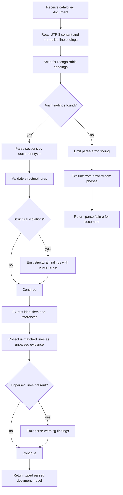
```mermaid
flowchart TD
    A[Receive cataloged document] --> B[Read UTF-8 content and normalize line endings]
    B --> C[Scan for recognizable headings]
    C --> D{Any headings found?}
    D -- no --> E[Emit parse-error finding]
    E --> F[Exclude from downstream phases]
    D -- yes --> G[Parse sections by document type]
    G --> H[Validate structural rules]
    H --> I{Structural violations?}
    I -- yes --> J[Emit structural findings with provenance]
    I -- no --> K[Continue]
    J --> K
    K --> L[Extract identifiers and references]
    L --> M[Collect unmatched lines as unparsed evidence]
    M --> N{Unparsed lines present?}
    N -- yes --> O[Emit parse-warning findings]
    N -- no --> P[Continue]
    O --> P
    P --> Q[Return typed parsed document model]
    F --> R[Return parse failure for document]
```

Contract notes:
- Every input line is either classified or preserved as unparsed evidence.
- Structural findings include the exact line or heading where the violation occurred.
- The parser never mutates input files.

#### Claim Graph Construction

Primary modules: `src/domain/claim-graph.ts`, `src/domain/findings.ts`.

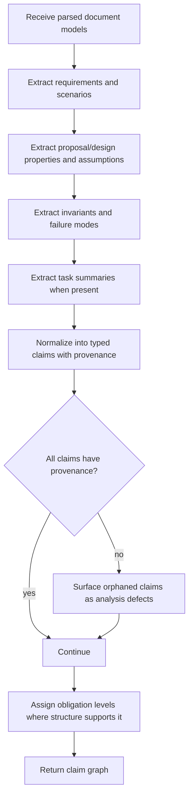
```mermaid
flowchart TD
    A[Receive parsed document models] --> B[Extract requirements and scenarios]
    B --> C[Extract proposal/design properties and assumptions]
    C --> D[Extract invariants and failure modes]
    D --> E[Extract task summaries when present]
    E --> F[Normalize into typed claims with provenance]
    F --> G{All claims have provenance?}
    G -- no --> H[Surface orphaned claims as analysis defects]
    G -- yes --> I[Continue]
    H --> I
    I --> J[Assign obligation levels where structure supports it]
    J --> K[Return claim graph]
```

Contract notes:
- Claims without provenance are defects, not valid inputs.
- Obligation levels are derived from source structure, not guessed.

#### Qualitative Analysis

Primary modules: `src/domain/spec-forward/qualitative.ts`, `src/adapters/opencode.ts`.

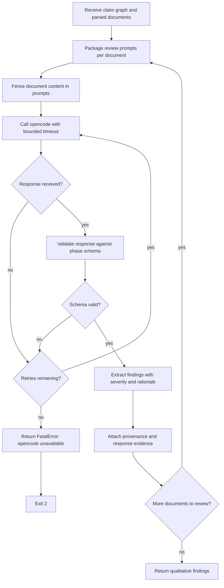
```mermaid
flowchart TD
    A[Receive claim graph and parsed documents] --> B[Package review prompts per document]
    B --> C[Fence document content in prompts]
    C --> D[Call opencode with bounded timeout]
    D --> E{Response received?}
    E -- no --> F{Retries remaining?}
    F -- yes --> D
    F -- no --> G[Return FatalError: opencode unavailable]
    E -- yes --> H[Validate response against phase schema]
    H --> I{Schema valid?}
    I -- no --> F
    I -- yes --> J[Extract findings with severity and rationale]
    J --> K[Attach provenance and response evidence]
    K --> L{More documents to review?}
    L -- yes --> B
    L -- no --> M[Return qualitative findings]
    G --> N[Exit 2]
```

Contract notes:
- Each `opencode` call has a bounded timeout and bounded retry count (default 3).
- Invalid responses consume a retry attempt.
- Prompt construction must fence document content to prevent injection.
- Full response content is preserved as evidence.

#### Coverage Analysis

Primary modules: `src/domain/spec-forward/coverage.ts`, `src/domain/claim-graph.ts`.

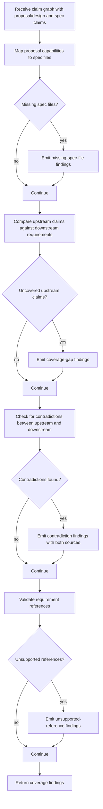
```mermaid
flowchart TD
    A[Receive claim graph with proposal/design and spec claims] --> B[Map proposal capabilities to spec files]
    B --> C{Missing spec files?}
    C -- yes --> D[Emit missing-spec-file findings]
    C -- no --> E[Continue]
    D --> E
    E --> F[Compare upstream claims against downstream requirements]
    F --> G{Uncovered upstream claims?}
    G -- yes --> H[Emit coverage-gap findings]
    G -- no --> I[Continue]
    H --> I
    I --> J[Check for contradictions between upstream and downstream]
    J --> K{Contradictions found?}
    K -- yes --> L[Emit contradiction findings with both sources]
    K -- no --> M[Continue]
    L --> M
    M --> N[Validate requirement references]
    N --> O{Unsupported references?}
    O -- yes --> P[Emit unsupported-reference findings]
    O -- no --> Q[Continue]
    P --> Q
    Q --> R[Return coverage findings]
```

Contract notes:
- Coverage analysis is deterministic given the same claim graph.
- Both sides of any contradiction are preserved in the finding.

#### Formalization Sampling

Primary modules: `src/domain/formal/formalize.ts`, `src/domain/formal/validate.ts`, `src/adapters/opencode.ts`.

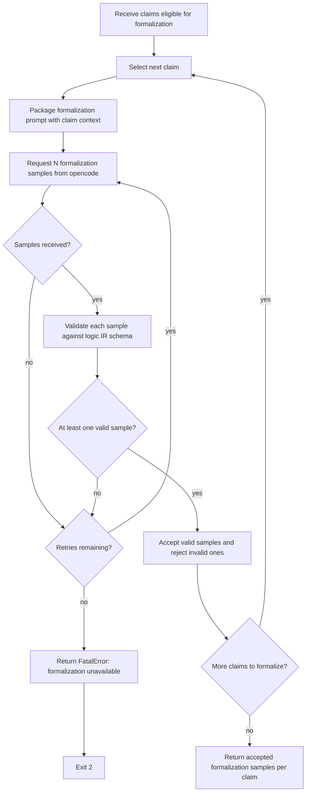
```mermaid
flowchart TD
    A[Receive claims eligible for formalization] --> B[Select next claim]
    B --> C[Package formalization prompt with claim context]
    C --> D[Request N formalization samples from opencode]
    D --> E{Samples received?}
    E -- no --> F{Retries remaining?}
    F -- yes --> D
    F -- no --> G[Return FatalError: formalization unavailable]
    E -- yes --> H[Validate each sample against logic IR schema]
    H --> I{At least one valid sample?}
    I -- no --> F
    I -- yes --> J[Accept valid samples and reject invalid ones]
    J --> K{More claims to formalize?}
    K -- yes --> B
    K -- no --> L[Return accepted formalization samples per claim]
    G --> M[Exit 2]
```

Contract notes:
- Bounded retries apply per claim, not globally.
- Invalid samples are rejected, not silently admitted.
- All samples (valid and invalid) are preserved as evidence.

#### Equivalence Clustering

Primary modules: `src/domain/formal/clustering.ts`, `src/adapters/z3.ts`.

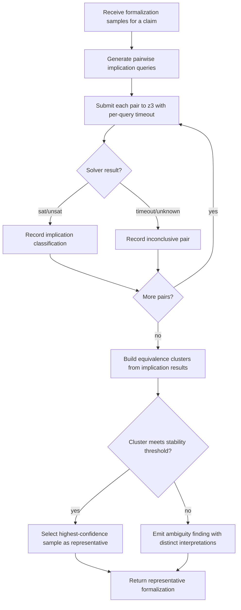
```mermaid
flowchart TD
    A[Receive formalization samples for a claim] --> B[Generate pairwise implication queries]
    B --> C[Submit each pair to z3 with per-query timeout]
    C --> D{Solver result?}
    D -- sat/unsat --> E[Record implication classification]
    D -- timeout/unknown --> F[Record inconclusive pair]
    E --> G{More pairs?}
    F --> G
    G -- yes --> C
    G -- no --> H[Build equivalence clusters from implication results]
    H --> I{Cluster meets stability threshold?}
    I -- yes --> J[Select highest-confidence sample as representative]
    I -- no --> K[Emit ambiguity finding with distinct interpretations]
    J --> L[Return representative formalization]
    K --> L
```

Contract notes:
- Inconclusive pairs are preserved as evidence.
- Stability threshold is configurable.
- Ambiguity is a finding, not a failure.

#### Obligation-Aware Solver Analysis

Primary modules: `src/domain/formal/logic-analysis.ts`, `src/domain/formal/smtlib.ts`, `src/adapters/z3.ts`.

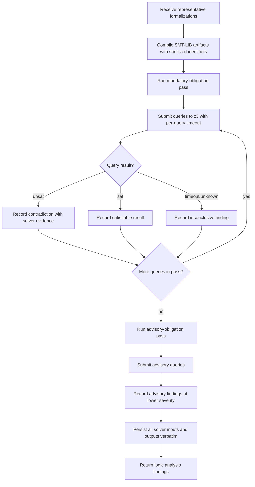
```mermaid
flowchart TD
    A[Receive representative formalizations] --> B[Compile SMT-LIB artifacts with sanitized identifiers]
    B --> C[Run mandatory-obligation pass]
    C --> D[Submit queries to z3 with per-query timeout]
    D --> E{Query result?}
    E -- unsat --> F[Record contradiction with solver evidence]
    E -- sat --> G[Record satisfiable result]
    E -- timeout/unknown --> H[Record inconclusive finding]
    F --> I{More queries in pass?}
    G --> I
    H --> I
    I -- yes --> D
    I -- no --> J[Run advisory-obligation pass]
    J --> K[Submit advisory queries]
    K --> L[Record advisory findings at lower severity]
    L --> M[Persist all solver inputs and outputs verbatim]
    M --> N[Return logic analysis findings]
```

Contract notes:
- Mandatory contradictions produce higher-severity findings than advisory contradictions.
- Solver inputs and outputs are persisted verbatim regardless of result.
- Sanitized identifiers include reversible mapping comments in SMT-LIB files.

#### Source Traceability

Primary modules: `src/domain/code-backwards/trace.ts`, `src/adapters/fs.ts`.

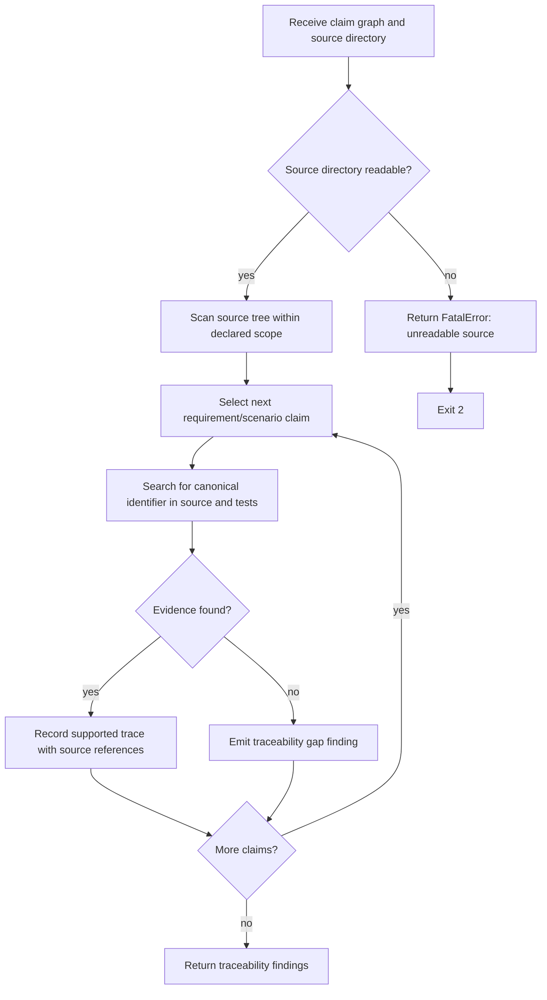
```mermaid
flowchart TD
    A[Receive claim graph and source directory] --> B{Source directory readable?}
    B -- no --> C[Return FatalError: unreadable source]
    B -- yes --> D[Scan source tree within declared scope]
    D --> E[Select next requirement/scenario claim]
    E --> F[Search for canonical identifier in source and tests]
    F --> G{Evidence found?}
    G -- yes --> H[Record supported trace with source references]
    G -- no --> I[Emit traceability gap finding]
    H --> J{More claims?}
    I --> J
    J -- yes --> E
    J -- no --> K[Return traceability findings]
    C --> L[Exit 2]
```

Contract notes:
- Source scanning is confined to the declared source directory.
- Traceability uses canonical identifiers to link claims to source evidence.
- Source files are never mutated.

#### Code-Backwards Comparison

Primary modules: `src/domain/code-backwards/derive.ts`, `src/domain/code-backwards/blind-compare.ts`, `src/adapters/opencode.ts`.

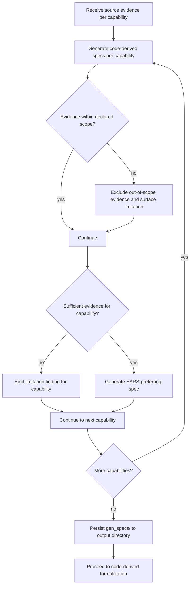
```mermaid
flowchart TD
    A[Receive source evidence per capability] --> B[Generate code-derived specs per capability]
    B --> C{Evidence within declared scope?}
    C -- no --> D[Exclude out-of-scope evidence and surface limitation]
    C -- yes --> E[Continue]
    D --> E
    E --> F{Sufficient evidence for capability?}
    F -- no --> G[Emit limitation finding for capability]
    F -- yes --> H[Generate EARS-preferring spec]
    G --> I[Continue to next capability]
    H --> I
    I --> J{More capabilities?}
    J -- yes --> B
    J -- no --> K[Persist gen_specs/ to output directory]
    K --> L[Proceed to code-derived formalization]
```

Contract notes:
- Generation is blind to original requirement text.
- EARS format is preferred; structured prose is acceptable when code semantics resist EARS decomposition.
- Insufficient evidence produces a limitation finding, not a fatal error.

#### Code-Derived Formalization

Primary modules: `src/domain/code-backwards/gen-formal.ts`, `src/domain/formal/formalize.ts`, `src/domain/formal/clustering.ts`, `src/adapters/opencode.ts`, `src/adapters/z3.ts`.

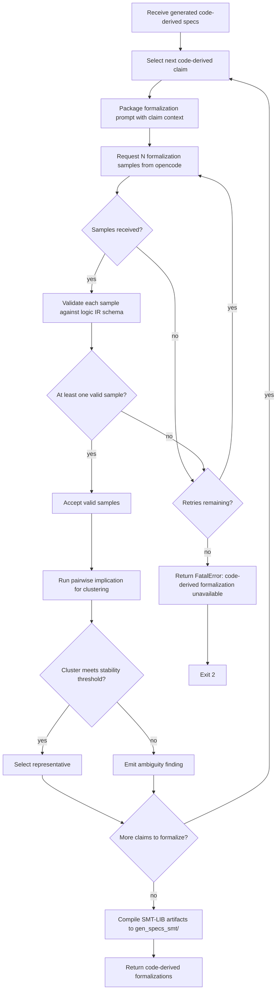
```mermaid
flowchart TD
    A[Receive generated code-derived specs] --> B[Select next code-derived claim]
    B --> C[Package formalization prompt with claim context]
    C --> D[Request N formalization samples from opencode]
    D --> E{Samples received?}
    E -- no --> F{Retries remaining?}
    F -- yes --> D
    F -- no --> G[Return FatalError: code-derived formalization unavailable]
    E -- yes --> H[Validate each sample against logic IR schema]
    H --> I{At least one valid sample?}
    I -- no --> F
    I -- yes --> J[Accept valid samples]
    J --> K[Run pairwise implication for clustering]
    K --> L{Cluster meets stability threshold?}
    L -- yes --> M[Select representative]
    L -- no --> N[Emit ambiguity finding]
    M --> O{More claims to formalize?}
    N --> O
    O -- yes --> B
    O -- no --> P[Compile SMT-LIB artifacts to gen_specs_smt/]
    P --> Q[Return code-derived formalizations]
    G --> R[Exit 2]
```

Contract notes:
- Same pipeline as specs-forward formalization: bounded retries, schema validation, clustering.
- SMT-LIB artifacts are persisted in `gen_specs_smt/` under the output directory.
- Failure to formalize any code-derived claim is fatal.

#### Code-Derived Solver Analysis

Primary modules: `src/domain/code-backwards/gen-logic.ts`, `src/domain/formal/logic-analysis.ts`, `src/adapters/z3.ts`.

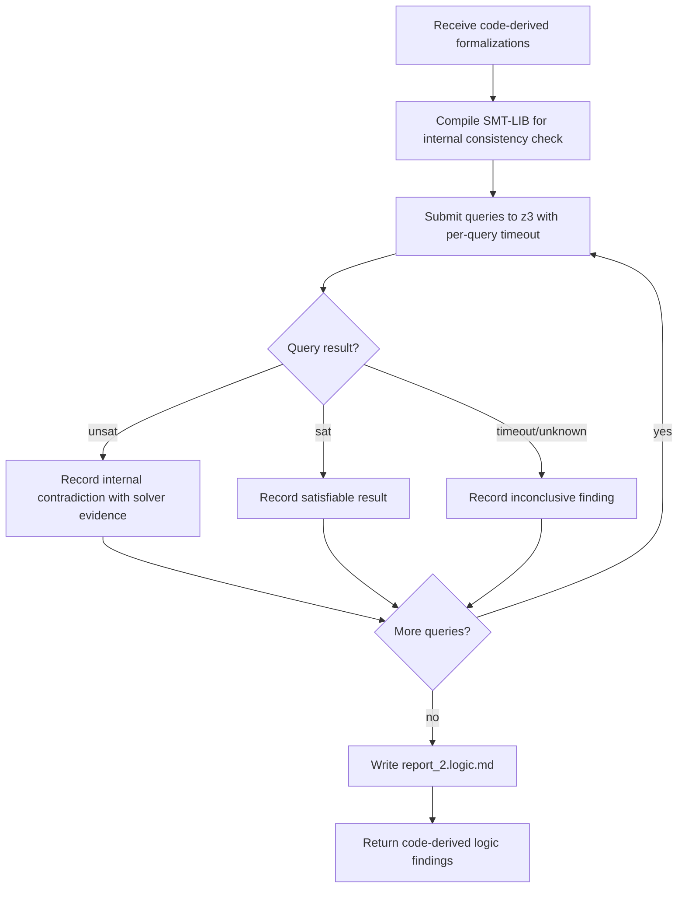
```mermaid
flowchart TD
    A[Receive code-derived formalizations] --> B[Compile SMT-LIB for internal consistency check]
    B --> C[Submit queries to z3 with per-query timeout]
    C --> D{Query result?}
    D -- unsat --> E[Record internal contradiction with solver evidence]
    D -- sat --> F[Record satisfiable result]
    D -- timeout/unknown --> G[Record inconclusive finding]
    E --> H{More queries?}
    F --> H
    G --> H
    H -- yes --> C
    H -- no --> I[Write report_2.logic.md]
    I --> J[Return code-derived logic findings]
```

Contract notes:
- Checks internal consistency of what the code guarantees before cross-side comparison.
- Solver inputs and outputs are persisted verbatim.
- Inconclusive results are evidence, not failure.

#### Cross-Side Implication Analysis

Primary modules: `src/domain/code-backwards/cross-implication.ts`, `src/adapters/z3.ts`.

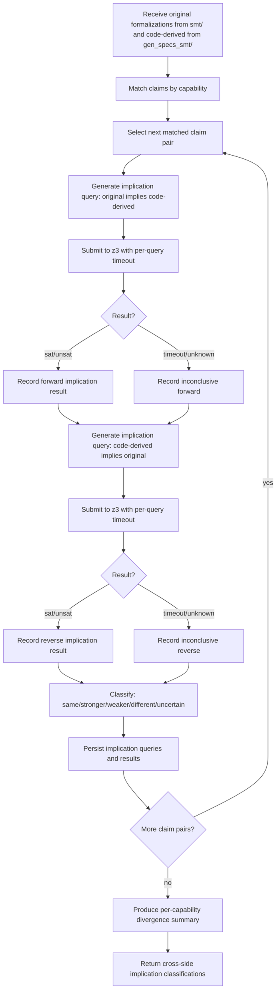
```mermaid
flowchart TD
    A[Receive original formalizations from smt/ and code-derived from gen_specs_smt/] --> B[Match claims by capability]
    B --> C[Select next matched claim pair]
    C --> D[Generate implication query: original implies code-derived]
    D --> E[Submit to z3 with per-query timeout]
    E --> F{Result?}
    F -- sat/unsat --> G[Record forward implication result]
    F -- timeout/unknown --> H[Record inconclusive forward]
    G --> I[Generate implication query: code-derived implies original]
    H --> I
    I --> J[Submit to z3 with per-query timeout]
    J --> K{Result?}
    K -- sat/unsat --> L[Record reverse implication result]
    K -- timeout/unknown --> M[Record inconclusive reverse]
    L --> N[Classify: same/stronger/weaker/different/uncertain]
    M --> N
    N --> O[Persist implication queries and results]
    O --> P{More claim pairs?}
    P -- yes --> C
    P -- no --> Q[Produce per-capability divergence summary]
    Q --> R[Return cross-side implication classifications]
```

Contract notes:
- Classification rules: both directions hold = same; only code→original = stronger; only original→code = weaker; neither = different; any inconclusive = uncertain.
- All implication queries and results are persisted verbatim.
- Cross-side implication is the primary classifier; blind comparison adds rationale.

#### Blind Comparison (Explanatory Layer)

Primary modules: `src/domain/code-backwards/blind-compare.ts`, `src/adapters/opencode.ts`.

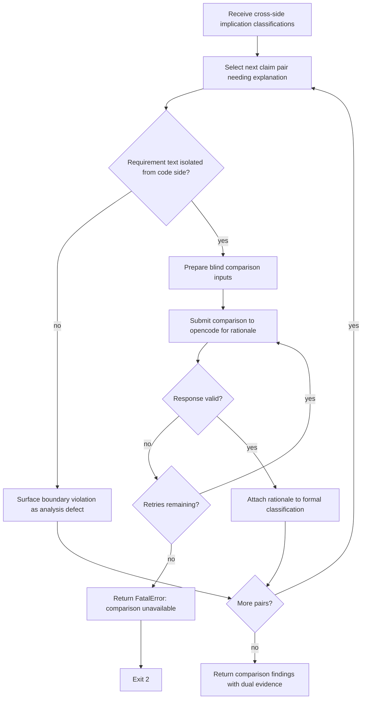
```mermaid
flowchart TD
    A[Receive cross-side implication classifications] --> B[Select next claim pair needing explanation]
    B --> C{Requirement text isolated from code side?}
    C -- no --> D[Surface boundary violation as analysis defect]
    C -- yes --> E[Prepare blind comparison inputs]
    E --> F[Submit comparison to opencode for rationale]
    F --> G{Response valid?}
    G -- no --> H{Retries remaining?}
    H -- yes --> F
    H -- no --> I[Return FatalError: comparison unavailable]
    G -- yes --> J[Attach rationale to formal classification]
    J --> K{More pairs?}
    D --> K
    K -- yes --> B
    K -- no --> L[Return comparison findings with dual evidence]
    I --> M[Exit 2]
```

Contract notes:
- The blind comparison boundary is enforced structurally: the code-derived side never receives original requirement text.
- When solver implication produced a classification, blind comparison adds rationale.
- When solver implication was uncertain, blind comparison serves as fallback classifier.
- Boundary violations are analysis defects, not silent degradation.

#### Report Synthesis and Manifest

Primary modules: `src/domain/reporting/render.ts`, `src/domain/reporting/manifest.ts`, `src/adapters/fs.ts`.

```mermaid
flowchart TD
    A[Receive all phase findings and evidence] --> B[Render phase-specific reports]
    B --> C{All findings have provenance?}
    C -- no --> D[Suppress unsupported verdicts as defects]
    C -- yes --> E[Continue]
    D --> E
    E --> F{Optional phases skipped?}
    F -- yes --> G[Include skipped-scope explanations]
    F -- no --> H[Continue]
    G --> H
    H --> I[Render synthesized summary report]
    I --> J[Write all reports atomically to output directory]
    J --> K{All writes succeeded?}
    K -- no --> L[Return FatalError: output write failure]
    K -- yes --> M[Compute checksums for all output files]
    M --> N[Write manifest last]
    N --> O{Manifest written?}
    O -- no --> P[Return FatalError: manifest write failure]
    O -- yes --> Q[Return success or findings-present exit]
    L --> R[Exit 2]
    P --> R
```

Contract notes:
- Reports never contain findings without provenance.
- The manifest is always the last file written.
- Interrupted runs are identifiable by manifest absence.

### Data Design

- Input artifacts are read as UTF-8 text with line ending normalization to LF for internal processing.
- Parsed document records carry document type, source path, recognized sections, extracted identifiers, and unmatched lines.
- Findings use a stable shape with severity, category, provenance, description, evidence, and optional suggestion.
- Claims represent normalized semantic units and carry origin metadata plus obligation level where relevant.
- Logic artifacts are emitted as ASCII-safe SMT-LIB files with sanitized identifiers and reversible mapping comments.
- Code-derived specifications are persisted as UTF-8 Markdown files in `gen_specs/` under the output directory, one per capability with sufficient source evidence.
- Code-derived SMT-LIB artifacts are persisted in `gen_specs_smt/` under the output directory, following the same format and sanitization rules as specs-forward SMT-LIB files.
- Cross-side implication queries and solver results are persisted verbatim under the output directory alongside other solver artifacts.
- The manifest is UTF-8 JSON and is written last to mark completed output.

### Interface Contracts

- **CLI contract**: Accepts positional input files and optional `--output`, `--src`, `--caps`, `--z3`, `--config`, `--help`, and `--version` flags.
- **CLI exit codes**:
  - `0`: Analysis completed without findings.
  - `1`: Analysis completed and surfaced one or more findings.
  - `2`: Fatal error prevented successful analysis completion, such as invalid arguments, unreadable inputs, unavailable required dependencies, invalid external-tool output after retries, or unrecoverable output failure.
- **LLM adapter contract**: Executes `opencode --prompt <text> --model <name>` and accepts only schema-valid JSON output.
- **Solver adapter contract**: Executes `z3` with SMT-LIB over stdin and records stdout/stderr plus timeout and unknown states.
- **Traceability contract**: Canonical requirement and scenario identifiers are bracketed uppercase kebab-case identifiers and align with traced verification workflows.
- **Reporting contract**: All reports and intermediate artifacts live under the configured output directory; manifest presence marks successful run completion. When `--src` is enabled, the output includes `gen_specs/` (code-derived Markdown specs), `gen_specs_smt/` (code-derived SMT-LIB artifacts), `report_2.logic.md` (code-derived formal analysis), and `report_2.compare.md` (cross-side comparison with dual-layer evidence).

### Code Map

The repository is organized so each phase has a visible home and boundary. All functions use TSDoc to document preconditions, postconditions, invariants, failures, and safety requirements.

General structure:

```text
src/
  index.ts
  cli/
    parse-argv.ts
    config.ts
    run-cli.ts
  domain/
    model.ts
    findings.ts
    claim-graph.ts
    logic-ir.ts
    clustering.ts
    errors.ts
    run-state.ts
    parser/
      shared.ts
      catalog.ts
      proposal.ts
      design.ts
      spec.ts
      task.ts
    spec-forward/
      qualitative.ts
      coverage.ts
    formal/
      formalize.ts
      validate.ts
      clustering.ts
      smtlib.ts
      logic-analysis.ts
    code-backwards/
      trace.ts
      derive.ts
      gen-formal.ts
      gen-logic.ts
      cross-implication.ts
      blind-compare.ts
    tasks-analysis.ts
    reporting/
      render.ts
      manifest.ts
  adapters/
    fs.ts
    process.ts
    opencode.ts
    z3.ts
build/
  esbuild.ts
dist/
  spec-check.js
test/
  contract/
  property/
  integration/
  determinism/
  fixtures/
```

Code/component responsibilities:

- **`src/index.ts`**: CLI entrypoint and top-level process exit mapping. Maps domain results to exit codes `0`, `1`, `2`.
- **`src/cli/parse-argv.ts`**: Validates raw CLI inputs including positional paths, `--output`, `--src`, `--caps`, `--z3`, `--config`, `--help`, and `--version` flags. Returns typed configuration or fatal error.
- **`src/cli/config.ts`**: Loads and validates optional JSON config file. Merges config values with CLI flags (CLI flags take precedence).
- **`src/cli/run-cli.ts`**: Orchestrates the full pipeline run: catalog, parse, claim graph, analysis phases, reporting, and manifest. Coordinates exit behavior and progress event emission.
- **`src/domain/model.ts`**: Core type definitions for documents, parsed structures, document classifications, and section metadata.
- **`src/domain/findings.ts`**: Finding type definitions with severity levels (error, warning, info), category taxonomy, provenance shape, and evidence attachment rules.
- **`src/domain/claim-graph.ts`**: Claim normalization, typed claim records with obligation levels (mandatory, advisory, informational), provenance attachment, and orphaned-claim detection.
- **`src/domain/logic-ir.ts`**: Typed logic intermediate representation for formalized claims, including sort declarations, function symbols, assertions, and obligation metadata.
- **`src/domain/clustering.ts`**: Equivalence cluster construction from pairwise implication results, stability threshold evaluation, and representative sample selection.
- **`src/domain/errors.ts`**: Tagged error categories and fatal/non-fatal classification. Maps domain errors to exit codes.
- **`src/domain/run-state.ts`**: Immutable run-state accumulator that tracks pipeline progress, collected findings, and phase completion status.
- **`src/domain/parser/shared.ts`**: Common parsing utilities: heading detection, identifier extraction (`[UPPER-KEBAB-CASE]` format), line classification, and unparsed-line collection with provenance.
- **`src/domain/parser/catalog.ts`**: Input discovery, document classification, active capability resolution, archived-change exclusion, and delta conflict detection.
- **`src/domain/parser/proposal.ts`**: Line-oriented proposal parsing: motivation, scope, context, domain model, preconditions/postconditions/invariants, failure modes, quality attributes, and capabilities sections.
- **`src/domain/parser/design.ts`**: Line-oriented design parsing: context, goals, proposed design, component design, data design, interface contracts, code map, failure analysis, security, risks, verification strategy, and open questions sections.
- **`src/domain/parser/spec.ts`**: Line-oriented spec parsing: EARS-pattern requirement extraction, scenario extraction, identifier validation, references extraction, and delta section handling (ADDED/MODIFIED/REMOVED/RENAMED).
- **`src/domain/parser/task.ts`**: Task file parsing: task group extraction, subtask extraction, completion status, and change summary sections.
- **`src/domain/spec-forward/qualitative.ts`**: Packages parsed content for LLM-backed review passes. Constructs fenced prompts per document, validates response schemas, and extracts typed findings.
- **`src/domain/spec-forward/coverage.ts`**: Deterministic coverage analysis: proposal-to-spec mapping, missing-spec-file detection, uncovered-claim identification, contradiction detection, and reference validation.
- **`src/domain/formal/formalize.ts`**: Packages claims for LLM-backed formalization sampling. Constructs prompts with claim context and validates returned formalization samples against logic IR schema.
- **`src/domain/formal/validate.ts`**: Schema validation for formalization samples including sort consistency, assertion well-formedness, and identifier format checks.
- **`src/domain/formal/clustering.ts`**: Pairwise implication query generation, equivalence cluster construction, stability threshold evaluation, and ambiguity finding emission.
- **`src/domain/formal/smtlib.ts`**: Compiles logic IR into SMT-LIB artifacts. Handles identifier sanitization (replacing unsafe characters with `_` plus hex escape), reversible mapping comments, and obligation-annotated query generation.
- **`src/domain/formal/logic-analysis.ts`**: Obligation-aware solver pass coordination. Runs mandatory-obligation queries first, then advisory queries. Classifies results by severity and preserves counterexamples, models, and inconclusive outcomes.
- **`src/domain/code-backwards/trace.ts`**: Source traceability: scans declared source directory for canonical identifiers in implementation files, test files, and verified contracts. Reports supported and missing traces.
- **`src/domain/code-backwards/derive.ts`**: Generates EARS-preferring code-derived specifications per capability from source evidence. Operates blind to original requirement text. Persists output as Markdown files in `gen_specs/` under the output directory.
- **`src/domain/code-backwards/gen-formal.ts`**: Applies the formalization pipeline (LLM sampling, schema validation, equivalence clustering) to code-derived specifications. Persists SMT-LIB artifacts in `gen_specs_smt/` under the output directory.
- **`src/domain/code-backwards/gen-logic.ts`**: Runs obligation-aware solver analysis on code-derived formalizations for internal consistency. Produces `report_2.logic.md`.
- **`src/domain/code-backwards/cross-implication.ts`**: Bidirectional solver-backed implication checks between original (`smt/`) and code-derived (`gen_specs_smt/`) formalizations. Classifies each claim pair as same, stronger, weaker, different, or uncertain. Persists all implication queries and results. Produces per-capability divergence summary.
- **`src/domain/code-backwards/blind-compare.ts`**: Maintains the no-requirement-text boundary. Prepares blind comparison inputs where code-derived side receives only code artifacts. Provides explanatory rationale for cross-side implication classifications. Serves as fallback classifier when solver implication is inconclusive.
- **`src/domain/tasks-analysis.ts`**: Task-summary extraction, completed-task evidence analysis, and consistency checking against the claim graph.
- **`src/domain/reporting/render.ts`**: Renders phase-specific Markdown reports (`report_1.1.md` through `report_2.*`) and synthesized summary reports. Includes skipped-scope explanations for optional phases not enabled.
- **`src/domain/reporting/manifest.ts`**: Computes file checksums, assembles manifest JSON, and writes it as the atomic completion marker.
- **`src/adapters/fs.ts`**: Filesystem operations: path resolution and confinement to output directory, atomic file writes (temp file + rename), directory creation, file reading with UTF-8 and LF normalization.
- **`src/adapters/process.ts`**: Generic child-process execution with argv arrays, timeout handling, exit-code capture, and stdout/stderr collection. No shell interpolation.
- **`src/adapters/opencode.ts`**: `opencode` subprocess adapter. Builds argv (`opencode --prompt <text> --model <name>`), executes with bounded timeout, validates JSON response against phase-specific schemas, and returns typed results or retry-eligible failures.
- **`src/adapters/z3.ts`**: `z3` subprocess adapter. Pipes SMT-LIB content via stdin, captures stdout/stderr, handles per-query timeout, and classifies exit into sat/unsat/timeout/unknown/error.
- **`build/esbuild.ts`**: Single-file bundle production targeting Node.js 20+ with `#!/usr/bin/env node` shebang.

This layout follows a code-map style where the important question is not only what modules exist, but where a reader should go to understand parsing, formalization, source comparison, and evidence production.

## Failure and Reliability

### Failure Mode Analysis

- **Unsafe inputs**: Malformed identifiers, missing sections, unreadable files, invalid config, and malformed task content can produce incorrect assumptions unless rejected or surfaced deterministically.
- **Fragile formats**: OpenSpec files are close to structured prose. Minor heading or identifier drift can silently distort meaning unless the parser is loss-aware and validates structure explicitly.
- **Inadequate control actions**: Continuing after invalid LLM responses, missing solver binaries, or provenance-free claims would create misleading output.
- **Process model flaws**: The largest risks are false negatives, nondeterministic divergence between runs, and blind trust in opaque heuristics.
- **Coordination failures**: Timeouts, retries, and optional phases can produce confusing results unless phase boundaries and skipped-scope reporting are explicit.

### Control and Recovery

- Validate early: reject invalid paths, malformed config, missing dependencies, and empty input conditions before deeper processing.
- Retry bounded external calls with explicit timeouts and fail hard when required evidence-producing phases remain unavailable.
- Preserve inconclusive states such as timeouts or unknown solver responses as findings rather than treating them as success.
- Treat parser loss, unsupported references, and provenance gaps as surfaced defects rather than invisible degradation.
- Use atomic writes plus manifest-last semantics so interrupted runs cannot impersonate complete output.

## Operational Concerns

### Observability

- Emit phase progress events so operators can see where the run is spending time.
- Preserve per-phase reports instead of collapsing everything into one opaque summary.
- Keep provenance, identifiers, and evidence references visible in report output.

### Deployment and Rollout

- Ship as a local npm/npx-installable CLI and as a bundled JavaScript executable.
- Rollout is repository-local and does not require feature flags in v1.
- Rollback is operationally simple: revert to an earlier package or bundled file version because the tool does not mutate repository inputs.

### Capacity and Scaling

- v1 is intentionally scoped to small repositories with up to 10 spec files and low hundreds of total requirements and scenarios.
- The primary scaling costs are LLM call count, clustering pair checks, and source-backed scanning breadth.
- Future scaling work should be specified separately rather than hidden behind vague performance claims in the initial design.

## Security

The tool has no end-user authentication or authorization model because it is a local CLI, but it still has meaningful security boundaries.

- Prevent subprocess injection by using explicit argv arrays and avoiding shell interpolation.
- Prevent prompt injection escalation by fencing analyzed document content and never promoting it to a higher-trust prompt channel.
- Prevent filesystem overreach by confining writes to `--output` and resolving output paths up front.
- Prevent solver syntax collisions by sanitizing user-derived identifiers before writing SMT-LIB artifacts.
- Preserve evidence of security-relevant boundary failures as surfaced findings where applicable.

## Risks / Trade-offs

- [LLM dependence can block required phases] -> Bound retries, validate schemas, and fail hard when evidence-producing phases cannot complete correctly.
- [Strict failure posture may frustrate users who want partial results] -> Preserve intermediate diagnostics and make failure causes explicit so reruns are actionable.
- [Specialized parsing may need maintenance as schema usage evolves] -> Keep parser logic modular and loss-aware so drift is surfaced early.
- [Evidence preservation increases disk output and implementation complexity] -> Accept the cost because retained evidence is central to the product value.
- [Source-backed comparison can overstate confidence if evidence boundaries are loose] -> Keep declared source scope explicit and enforce the blind-comparison boundary.
- [Code-derived formalization doubles the LLM and solver cost when --src is enabled] -> The symmetric formal pipeline is necessary for solver-backed classification; the cost is bounded by capability count and claim count.
- [Cross-side implication may be inconclusive for complex claims] -> Preserve uncertainty honestly and fall back to blind comparison as the explanatory layer; do not fabricate formal confidence.

## Migration Plan

1. Scaffold the TypeScript package and strict tooling needed for the CLI.
2. Implement the deterministic catalog, parser, domain models, and reporting skeleton.
3. Add qualitative analysis, coverage analysis, formalization, solver integration, and evidence persistence incrementally.
4. Add source-backed traceability after the base specs-forward pipeline is stable.
5. Add code-derived spec generation, code-derived formalization, and code-derived solver analysis.
6. Add cross-side implication analysis and blind comparison integration (two-layer classification).
7. Add verification harnesses and determinism checks before treating the tool as ready for broader use.

Rollback is version-based rather than data-migration-based because the tool does not own persistent mutable state in v1.

## Verification Strategy

The evidence stack follows the repository lightweight-formal-methods guidance with emphasis on deterministic core behavior and explicit boundary testing.

Overview:

- **Contract tests**: Validate CLI argument handling, parser structural checks, LLM schema validation, manifest semantics, and blind-comparison import boundaries.
- **Property tests**: Exercise parser invariants, claim extraction invariants, clustering determinism, and implication classification symmetry. All state machines, state transitions, failure modes, liveness/safety claims, edge cases and global invariants are exercised by property-based tests.
- **Integration tests**: Run end-to-end analyses with fixture specs plus fake `opencode` and fake `z3` adapters.
- **Determinism tests**: Re-run with fixed inputs and cached responses, then diff outputs byte-for-byte.
- **Formalization oracle tests**: Compare known EARS-to-logic fixtures against generated logic and solver equivalence checks.
- **Traceability tests**: Verify canonical identifier handling, traced-test linkage, and unknown-identifier failure behavior.
- **Regression fixtures**: Preserve every discovered ambiguity pattern, counterexample, and parser-loss issue as a permanent fixture.

### Unit and Contract Tests

1. CLI argv parsing accepts valid flag combinations and rejects invalid arguments with exit code `2`
2. CLI `--help` prints help and exits `0` without running analysis
3. CLI `--version` prints version and exits `0` without running analysis
4. Config loading accepts valid JSON config and rejects malformed config with exit code `2`
5. Config flag merge: CLI flags override config file values
6. Catalog discovery classifies proposal, design, spec, and task files correctly
7. Catalog excludes archived change specs from active analysis
8. Catalog detects conflicting in-development deltas for the same capability and emits findings
9. Proposal parser extracts all documented sections with provenance
10. Design parser extracts all documented sections with provenance
11. Spec parser extracts EARS-pattern requirements with bracketed identifiers
12. Spec parser extracts scenarios with bracketed identifiers and postconditions
13. Spec parser extracts requirement references
14. Spec parser handles delta sections (ADDED, MODIFIED, REMOVED, RENAMED)
15. Task parser extracts task groups, subtasks, completion status, and change summaries
16. Parser preserves unmatched lines with file and line provenance
17. Parser emits structural findings for malformed identifiers
18. Parser emits parse-error finding for files with no recognizable headings
19. Claim graph attaches provenance to every derived claim
20. Claim graph detects and surfaces orphaned claims (claims without provenance)
21. Claim graph assigns obligation levels from source structure
22. Coverage analysis detects missing spec files for declared capabilities
23. Coverage analysis detects uncovered upstream claims
24. Coverage analysis detects contradictions between upstream and downstream claims
25. Coverage analysis detects unsupported requirement references
26. `opencode` adapter constructs argv arrays without shell interpolation
27. `opencode` adapter validates response JSON against phase-specific schemas
28. `opencode` adapter retries on invalid response up to bounded retry limit
29. `opencode` adapter fails with FatalError after all retries exhausted
30. `z3` adapter pipes SMT-LIB via stdin and captures stdout/stderr
31. `z3` adapter classifies exit into sat/unsat/timeout/unknown/error
32. `z3` adapter enforces per-query timeout
33. SMT-LIB identifier sanitization replaces unsafe characters and includes reversible mapping comments
34. Formalization sample validation rejects samples that violate logic IR schema
35. Clustering selects representative when one cluster meets stability threshold
36. Clustering emits ambiguity finding when no cluster meets stability threshold
37. Logic analysis classifies mandatory contradictions at higher severity than advisory
38. Logic analysis preserves counterexamples, models, unsat cores, and inconclusive results
39. Source traceability reports supported traces with source references
40. Source traceability reports traceability gap findings for untraced claims
41. Source traceability confines scanning to declared source directory
42. Code-derived spec generation produces EARS-preferring output per capability
43. Code-derived spec generation operates blind to original requirement text
44. Code-derived spec generation excludes out-of-scope evidence
45. Code-derived spec generation emits limitation finding for insufficient evidence
46. Code-derived formalization applies same schema validation as specs-forward
47. Code-derived formalization applies same clustering and stability threshold as specs-forward
48. Code-derived formalization persists SMT-LIB artifacts to gen_specs_smt/
49. Code-derived solver analysis checks internal consistency of code-derived formalizations
50. Cross-side implication classifies mutual implication as same
51. Cross-side implication classifies one-way (code→original only) as stronger
52. Cross-side implication classifies one-way (original→code only) as weaker
53. Cross-side implication classifies neither direction as different
54. Cross-side implication classifies solver timeout/unknown as uncertain
55. Cross-side implication persists all queries and results verbatim
56. Blind comparison provides explanatory rationale for formal classification
57. Blind comparison serves as fallback classifier when implication is uncertain
58. Blind comparison prevents original requirement text from reaching code-derived side
59. Report rendering includes skipped-scope explanations for disabled optional phases
60. Report rendering suppresses findings without provenance as defects
61. Manifest lists all produced files with checksums
62. Manifest is written after all other output files
63. Interrupted run leaves no manifest
64. Stdout progress events include phase, status, and timestamp fields
65. Exit code `0` when no findings, `1` when findings present, `2` on fatal error
66. Package metadata supports standard `npm` installation of the CLI
67. Bundled `dist/spec-check.js` begins with `#!/usr/bin/env node` shebang

### Property-Based Tests

1. Parser state machine: generated document inputs with valid and invalid structure preserve the invariant that every input line is either classified or preserved as unparsed evidence
2. Parser determinism: the same input content always produces the same parsed output
3. Claim graph state machine: generated parsed documents produce claims where every claim has provenance, and no claim exists without a traceable source heading
4. Claim graph obligation assignment: generated requirement structures with varying EARS patterns produce consistent obligation levels
5. Coverage analysis determinism: the same claim graph always produces the same coverage findings
6. Clustering state machine: generated pairwise implication results produce clusters where representative selection is deterministic given the same inputs
7. Clustering symmetry: if sample A implies sample B, and B implies A, then A and B are in the same cluster
8. SMT-LIB compilation: generated logic IR with arbitrary identifiers produces valid SMT-LIB syntax after sanitization
9. Manifest integrity: generated output file sets produce manifests where every listed file exists and has the correct checksum
10. Run-state accumulation: generated phase completion sequences preserve the invariant that findings are never removed by later phases
11. Blind comparison boundary: generated comparison inputs never expose original requirement text to the code-derived side
12. Cross-side implication classification: given same solver results, classification is deterministic and symmetric (swapping directions produces the inverse strength label)
13. Code-derived formalization determinism: the same code-derived specs with the same clustering results produce identical representative selections
14. Code-derived generation boundary: generated prompts for code-derived spec generation never include original requirement, proposal, or design text

### Global Invariant and Property Checks

1. Input files are never mutated by any phase
2. Every finding in the final report has provenance linking it to a source file and heading
3. Every LLM response used in the pipeline was schema-validated before acceptance
4. Solver inputs and outputs are persisted verbatim under the output directory
5. No final verdict rests on an unpreserved LLM response
6. Findings are never silently removed by later phases
7. All writes are confined to the configured output directory
8. Manifest presence implies all listed files are finalized
9. Manifest absence implies the run did not complete successfully
10. Re-running with identical inputs and cached LLM responses produces byte-identical outputs
11. Prompts fence document content and never elevate analyzed text into system instruction position
12. SMT-LIB files use only sanitized identifiers derived from user content
13. Cross-side implication queries and results are persisted verbatim under the output directory
14. Code-derived spec generation never receives original requirement text
15. Solver implication classification takes precedence over blind comparison classification when both are available

### Safety and Liveness Properties

1. Safety: no analysis phase proceeds with an incomplete or ambiguous input catalog
2. Safety: no claim enters the graph without provenance
3. Safety: no formalization sample enters clustering without schema validation
4. Safety: no solver conclusion is produced from an unvalidated formalization
5. Safety: no blind comparison exposes original requirement text to the code-derived side
6. Safety: no code-derived spec generation exposes original requirement text to the generation process
7. Safety: no cross-side implication classification is produced from unvalidated code-derived formalizations
8. Safety: no manifest is written before all selected output files are finalized
9. Safety: no unsupported verdict reaches the final report
10. Liveness: if `opencode` responds with valid output within retry bounds, qualitative analysis eventually completes
11. Liveness: if `opencode` responds with valid output within retry bounds, code-derived spec generation and formalization eventually complete
12. Liveness: if `z3` responds within per-query timeout, solver analysis eventually completes
13. Liveness: if `z3` responds within per-query timeout, cross-side implication analysis eventually completes
14. Liveness: if all required phases complete, the manifest is written and the run exits with code `0` or `1`

### Integration Tests with Fixture Specs

1. End-to-end specs-forward analysis with fixture proposal, design, and spec files using fake `opencode` adapter
2. End-to-end analysis with fixture containing known structural violations produces expected structural findings
3. End-to-end analysis with fixture containing known coverage gaps produces expected coverage findings
4. End-to-end analysis with fixture containing known contradictions produces expected contradiction findings
5. End-to-end formalization with fixture claims using fake `opencode` and fake `z3` adapters
6. End-to-end clustering with fixture producing ambiguity findings for genuinely ambiguous claims
7. End-to-end source traceability with fixture source tree containing traced and untraced requirements
8. End-to-end code-backwards comparison with fixture source tree using fake `opencode` adapter
9. End-to-end code-derived spec generation produces gen_specs/ files per capability using fake `opencode` adapter
10. End-to-end code-derived formalization produces gen_specs_smt/ artifacts using fake `opencode` and fake `z3` adapters
11. End-to-end code-derived solver analysis produces report_2.logic.md with fake `z3` adapter
12. End-to-end cross-side implication with fixture producing same/stronger/weaker/different classifications using fake `z3` adapter
13. End-to-end two-layer comparison: solver implication classification with blind comparison rationale attached
14. End-to-end run with missing `opencode` binary fails with exit code `2` and no manifest
15. End-to-end run with missing `z3` binary when formalization is required fails with exit code `2` and no manifest
16. End-to-end run with invalid `opencode` responses after all retries fails with exit code `2`
17. Interrupted run (simulated kill during report writing) leaves no manifest
18. Manifest checksums match actual file content for completed runs

### Determinism Tests

1. Two runs with identical inputs and cached `opencode` responses produce byte-identical output directories
2. Two runs with identical inputs and cached `z3` responses produce byte-identical SMT-LIB artifacts and solver result files
3. Parser output is identical across runs for the same input file
4. Claim graph is identical across runs for the same parsed input
5. Coverage findings are identical across runs for the same claim graph
6. Code-derived spec generation produces identical gen_specs/ content across runs with cached `opencode` responses
7. Code-derived formalization produces identical gen_specs_smt/ content across runs with cached responses
8. Cross-side implication produces identical classifications across runs with cached `z3` responses

### Regression Fixtures

- Preserve every discovered ambiguity pattern, counterexample, parser-loss issue, and boundary violation as a permanent fixture in `test/fixtures/`

## Open Questions

- No blocking product questions remain for the initial change.

### Resolved Questions

- **Which exact JSON progress-event schema should stdout use in v1?** Resolved: each progress event is a single JSON line with required fields `phase` (string), `status` (one of `started`, `completed`, `failed`, `skipped`), and `timestamp` (ISO-8601 UTC). Phase completion events additionally include `duration_ms` (unsigned integer) and summary counts where applicable. The exact set of optional summary fields may be refined during implementation provided the required fields remain stable.
- **How much source-language structure beyond raw code, tests, and verified contracts should the first code-backwards pass interpret?** Resolved: the first code-backwards pass uses implementation source files, traced tests (files containing canonical identifiers), and verified contracts as primary evidence. Documentation files within the source tree serve as supporting evidence only. The tool does not perform deep AST analysis of source language structure in v1; it treats source files as text with identifier-based traceability.
- **Should the first implementation include a hard prompt-size limit in config, or should that remain an internal constant until real fixtures justify exposing it?** Resolved: the first implementation uses an internal constant for maximum prompt size. Exposing it as a config option is deferred until real fixtures demonstrate that the default is insufficient for practical use. The constant is centralized in the `opencode` adapter so it can be extracted to config later without changing the adapter interface.
